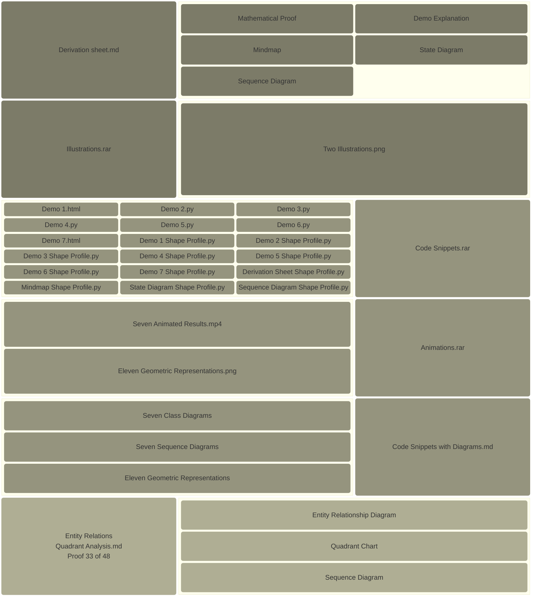
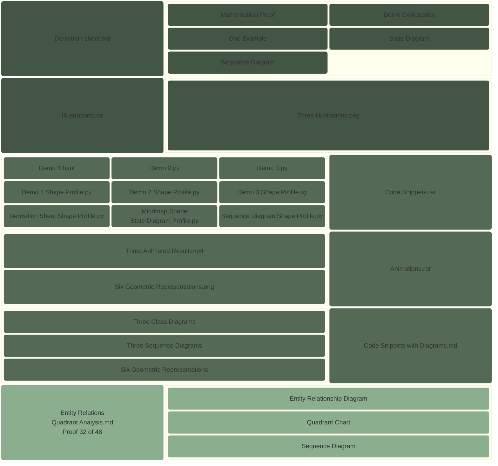

# Block Diagram

[E-Product Hub](https://payhip.com/CDP)

## Visualizing Vector Calculus: From Flow to Vorticity

> This pedagogical journey transforms abstract vector calculus into a tangible physical reality by guiding learners through a sequence that transitions from basic helical flow visualization to the complex dynamics of mass conservation and vorticity. Starting with an incompressible baseline where fluid maintains constant density and spacing, the progression introduces "sources" and "sinks" to illustrate how divergence physically dictates the thinning or concentration of a fluid as it moves. The sheet concludes by distinguishing between global orbital motion and local internal spin, utilizing a "paddlewheel test" to demonstrate that circular paths do not inherently imply local rotation. Ultimately, this structured approach verifies fundamental principles like the Divergence Theorem by converting mathematical results into visible physical behaviors, such as density shifts and irrotational vortices.  --- [Verification of the Divergence Theorem for a Rotating Fluid Flow](https://viadean.notion.site/Verification-of-the-Divergence-Theorem-for-a-Rotating-Fluid-Flow-DT-RFF-2571ae7b9a328091ad62deba6f8d1715?source=copy_link)

- Deliverables: https://payhip.com/b/Q9Zjy

## Boundary Equilibrium and the Calculus of Conservative Fields

> The fundamental concept explored is that when a specific influence or field remains perfectly uniform along the boundary of a surface, all internal forces effectively cancel each other out, resulting in a state of perfect equilibrium. This principle serves as the bedrock for understanding conservative forces in nature, such as gravity, where the energy spent moving an object is exactly reclaimed if it returns to its starting point, ensuring that no energy is created or lost within a closed system. Interactive simulations and visual tools further validate this theory by demonstrating how symmetric force arrangements collapse to zero and how motion along complex paths, like a figure-eight, results in a net balance of work. Ultimately, this demonstrates that boundary conditions dictate the global behavior of a system, providing a rigorous explanation for why certain physical fields are inherently stable and energy-conserving. -- [Using Stokes' Theorem with a Constant Scalar Field](https://viadean.notion.site/Using-Stokes-Theorem-with-a-Constant-Scalar-Field-ST-CSF-2561ae7b9a328056bcc5dc2e105a1c35?source=copy_link)

- Deliverables: https://payhip.com/b/io8GT

