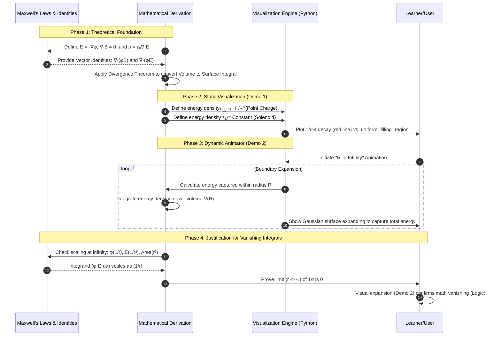
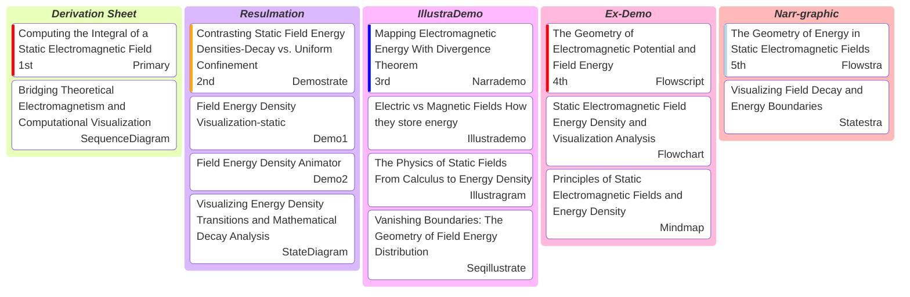
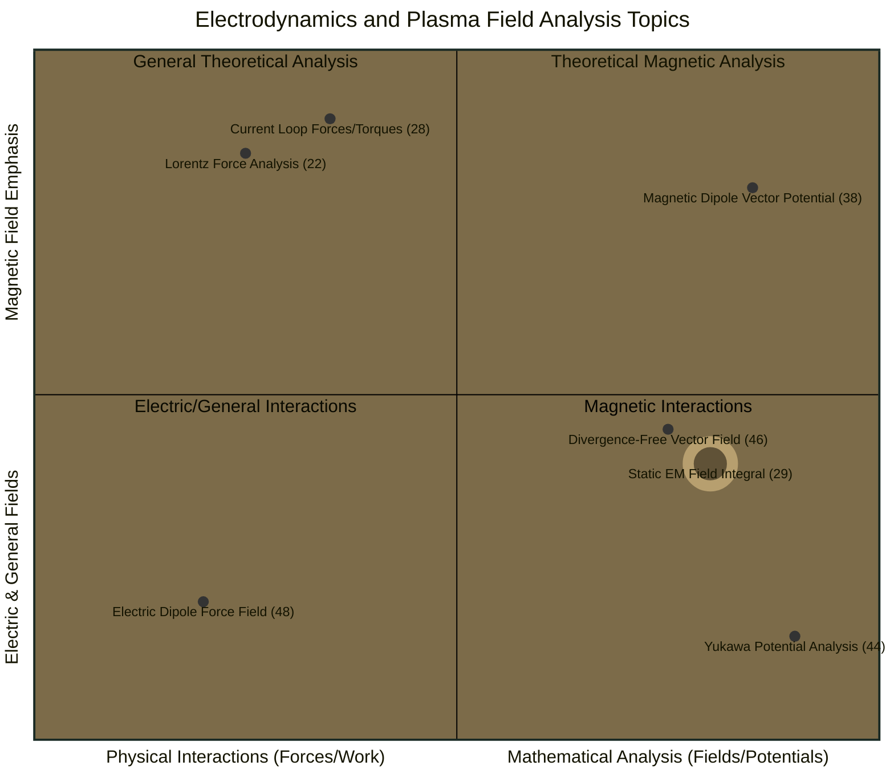
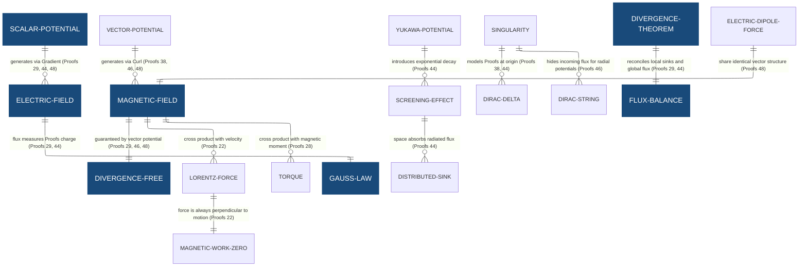
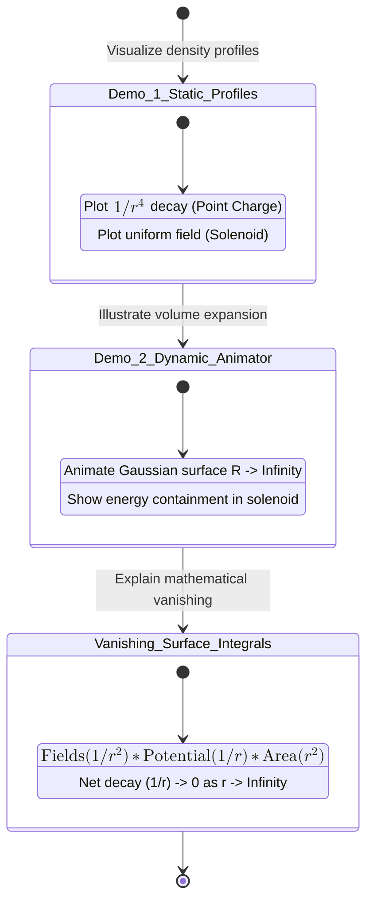
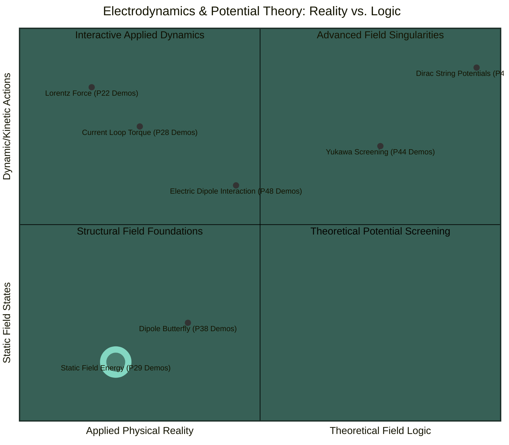
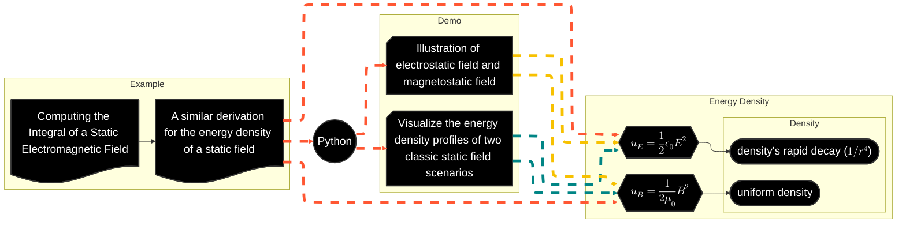
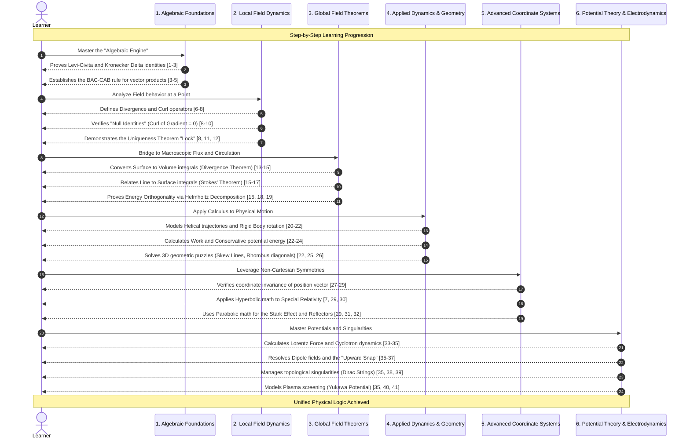

# Computing the Integral of a Static Electromagnetic Field

> A static electromagnetic system where the boundary is an equipotential surface, the total integrated parallel component of the fields $(E \cdot B)$ within that volume must be zero. This result stems from the fact that the electric field can be expressed as the gradient of a potential, allowing the integrand to be rewritten as the divergence of the quantity $\phi B$ (since $B$ is solenoidal). By applying the Divergence Theorem, the volume integral reduces to the magnetic flux through the boundary surface; because that surface is equipotential, the potential factors out, and Gauss's Law for Magnetism dictates that the total magnetic flux through any closed surface is null.

## Sequence Diagram: Bridging Theoretical Electromagnetism and Computational Visualization

This sequence diagram integrates the theoretical mathematical derivations with the practical demonstration steps found in the sources. It illustrates how physical laws and vector calculus identities provide the logic that the Python-based demos then visualize for the learner.



------

## Kanban: Visualizing Electromagnetic Field Energy Geometry

The Visual and Orchestra structure is a comprehensive framework that synchronizes video and imagery to explain technical systems. It blends motion-based content—ranging from simple demo compilations and narrated walkthroughs to process-driven guides—with complex composite illustrations that integrate flowcharts, sequence diagrams, and state diagrams. By categorizing assets into specific formats like the Narrademo for guidance or the Statestra for technical mapping, the structure provides a standardized vocabulary for delivering layered, high-fidelity technical demonstrations.



## **Quadrant 3: Integral of Static Field (29)**

Integral of Static Field (29): Computing the Integral of a Static Electromagnetic Field.



## **ERD: Potential-Field Generation | Solenoidal Nature | Energy and Integrals**

Proof 29: Computing the Integral of a Static Electromagnetic Field.



## Contrasting Static Field Energy Densities-Decay vs. Uniform Confinement

> The visualization effectively demonstrates the fundamental differences in static field energy distributions for two canonical systems. For the electrostatic case of a point charge, the energy density ( $u_E$ ) is shown to follow a steep inverse fourth power law ( $u_E \propto 1 / r^4$ ), illustrating that the vast majority of the field energy is critically concentrated in the immediate vicinity of the source charge. In contrast, the magneto-static demo simulating an ideal solenoid shows that its energy density ( $u_B$ ) is uniform and constant within the field's confinement region, emphasizing that magnetic field energy, when contained within devices like solenoids, is perfectly localized within a specific, well-defined volume.

### Narrated Video

[Contrasting Static Field Energy Densities Decay vs  Uniform Confinement](https://youtu.be/trVpJNasU7I)

------

## **State Diagram: Visualizing Energy Density Transitions and Mathematical Decay Analysis**

The state diagram illustrates the transition between the theoretical derivations and the practical demonstrations described in the sources. The progression moves from defining energy density to visualizing its spatial distribution, and finally to animating the mathematical conditions required for the surface integrals to vanish at infinity.



------

## **Quadrant 3: Static Field Energy (P29 Demos)**

Static Field Energy (P29 Demos): Contrasting Static Field Energy Densities-Decay vs. Uniform Confinement.



------

## Mapping Electromagnetic Energy With Divergence Theorem

> The sources differentiate the mathematical properties and physical energy distributions of static electromagnetic fields. Specifically, the sources demonstrate how to use the divergence theorem to calculate volume integrals involving the electric field’s scalar potential and the divergence-free magnetic field when bounded by a closed equipotential surface. Furthermore, they highlight a fundamental contrast in field energy localisation: while the energy density of an electrostatic point charge is highly concentrated near the source due to an inverse fourth power law, the energy density within an ideal solenoid is uniform and constant, demonstrating how magnetic energy can be perfectly confined within a specific, well-defined volume.

### Narrated Video

[Mapping Electromagnetic Energy With Divergence Theorem](https://youtu.be/_AGZeIMq-hw)

------

## Vanishing Boundaries: The Geometry of Field Energy Distribution

> ***Bridging Abstract Theory with Dynamic Reality: The Evolution of Field Energy Visualization*** The core of the derivation sheet lies in transforming complex vector identities into a clear physical story about how energy lives in space. This sheet is structured through two distinct logical frameworks: the state diagram, which maps the evolution of a learner's journey, and the sequence diagram, which illustrates the functional integration of mathematical logic with visual software.

### Narrated Video

[Vanishing Boundaries The Geometry of Field Energy Distribution](https://youtu.be/b8J9eWJPuxA)

------

## The Geometry of Electromagnetic Potential and Field Energy

> This derivation sheet explores the interaction of static electric and magnetic forces within a defined volume, focusing on the unique properties of boundaries known as equipotential surfaces. By utilizing the Divergence Theorem, the study shifts the analytical focus from the complex interior of a volume to its surface, simplifying the calculation of field interactions. It demonstrates a "vanishing act" where, due to the uniform potential of the surface and the fact that magnetic field lines always form closed loops, the net magnetic flow through the boundary— and thus the internal interaction—becomes zero.

### Static Electromagnetic Field Energy Density and Visualization Analysis

The flowchart illustrates the process of computing and visualizing the energy densities of static electromagnetic fields, transitioning from mathematical derivation to computational demonstration.



### Principles of Static Electromagnetic Fields and Energy Density

The mindmap provides a structured overview of the mathematical foundations, energy density formulas, and physical visualizations related to static electric and magnetic fields.

```markdown
# Static Electromagnetic Fields and Energy

## Volume Integral of E dot B

### Problem Definition

- **Static E and B fields**
- **Equipotential surface $S$**
- **Volume V enclosed by $S$**

### Mathematical Derivation

- $E=-\nabla \phi$
- $\nabla \cdot B=0$
- **Vector identity for $\nabla \cdot(\phi B)$**
- **Apply Divergence Theorem**

### Final Result

- **Constant $\phi$ on surface**
- **Gauss's Law for Magnetism**
- **Integral I = 0**

## Electrostatic Energy Density

### Source Relation

- **Gauss's Law**
- **Charge distribution $\rho$**

### Energy Formula

- $u_E = \frac{1}{2} \epsilon_0 E^2$

### Vanishing Surface Integral

- **$S$ at infinity**
- **$\phi$ decays as $\frac{1}{r}$**
- **$E$ decays as $\frac{1}{r^2}$**
- **Area grows as $r^2$**

## Magnetostatic Energy Density

### Source Relation

- **Ampere's Law**
- **Current distribution**

### Energy Formula

- $u_B = \frac{1}{2} \mu_0 B^2$

### Vanishing Surface Integral

- **$S$ at infinity**
- **A decays as $\frac{1}{r}$**
- **B decays as $\frac{1}{r^2}$**
- **Integrand A x H**

## Visualizations

### Point Charge ($u_E$)

- **Non-uniform field**
- **Decay as $1/r^4$**

### Solenoid ($u_B$)

- **Uniform field**
- **Contained region**
```

### Narrated Video

[The Geometry of Electromagnetic Potential and Field Energy](https://youtu.be/6tzdhbuTdk0)

------

## The Geometry of Energy in Static Electromagnetic Fields

> The analytical framework, as structured in the mindmap, begins with the mathematical derivation of the volume integral of $E \cdot B$, proving it evaluates to zero for static fields enclosed by an equipotential surface. This theoretical foundation defines the specific energy density formulas for electrostatics ($u_E = \frac{1}{2}\epsilon_0 E^2$) and magnetostatics ($u_B = \frac{1}{2\mu_0} B^2$), while explaining how surface integrals vanish at infinity due to the relative decay rates of potentials and fields.

### Illustration

https://pin.it/1yi2zT4V6

------

## Visualizing Field Decay and Energy Boundaries

> The state and sequence diagrams work together to bridge the gap between abstract field theory and physical reality by mapping a logical journey from mathematical proofs to dynamic demonstrations. While the state diagram focuses on the evolution of understanding—moving from the definition of energy density to visualizations of how it rapidly fades around a point charge or stays contained within a coil—the sequence diagram acts as the functional blueprint that links fundamental physical laws to the software’s animations. These animations depict an expanding boundary that reinforces the central concept of the derivation: the idea that as we move infinitely far from a source, the strength of the field drops so significantly that any energy "leaking" through the boundary eventually disappears. This visual and logical progression confirms that for localized systems, we can simplify our understanding of total energy by treating the effects of distant boundaries as zero.

### Illustration

https://pin.it/1yi2zT4V6

------

## [Downloadable Files](https://payhip.com/b/pRPQn): The Mechanics of Static Electromagnetic Field Independence

> These files examine the fundamental properties of static electromagnetic fields, focusing on a mathematical proof that the energy densities of electric and magnetic components remain independent within certain enclosed volumes. This theoretical framework demonstrates that the total interaction between these fields across a surface of constant potential is effectively zero, provided the fields weaken significantly as they extend toward infinity. To illustrate these concepts, the file contrasts the rapid dissipation of energy surrounding a single point charge with the steady and confined energy found inside a solenoid. These abstract relationships are brought to life through interactive web-based animations that visually track expanding boundaries and field growth, helping to clarify the balance between diminishing field strength and increasing spatial volume. Ultimately, this study is situated within a broader learning progression that bridges foundational vector mathematics with advanced theories regarding complex potentials and field interactions.

- Derivation sheet.md
  - Mathematical Proof
  - Demo Explanation
  - One Example
  - State Diagram
  - Sequence Diagram
- Illustrations.rar
  - Two Illustrations.png
- Code Snippets.rar
  - Field Energy Density Visualization-static.html | .py
  - Field Energy Density Animator.html | .py
  - Geometric Perspective
    - system_architecture_logic_stack.py
    - em_energy_geometric_interpretation.py
    - StaticEM_ProofLogic_EnergyDensity_Viz.py
    - em_theoretical_viz_demo.py
    - em_field_energy_convergence_animator.py
    - em_density_symmetry_profiles.py
- Animations.rar
  - One Animated Result.mp4
  - One Plotting.png
  - Six Geometric shapes.png
- Code Snippets with Diagrams.md
  - Two Class Diagrams
  - Two Sequence Diagrams
- Entity Relations & Quadrant Analysis.md
  - Entity Relationship Diagram
  - Quadrant Chart
  - Sequence Diagram

---

## Sequence Diagram: The Mathematical Architecture of Field Dynamics

The sequence diagram illustrates the step-by-step learning journey from fundamental algebraic rules to complex field simulations.


