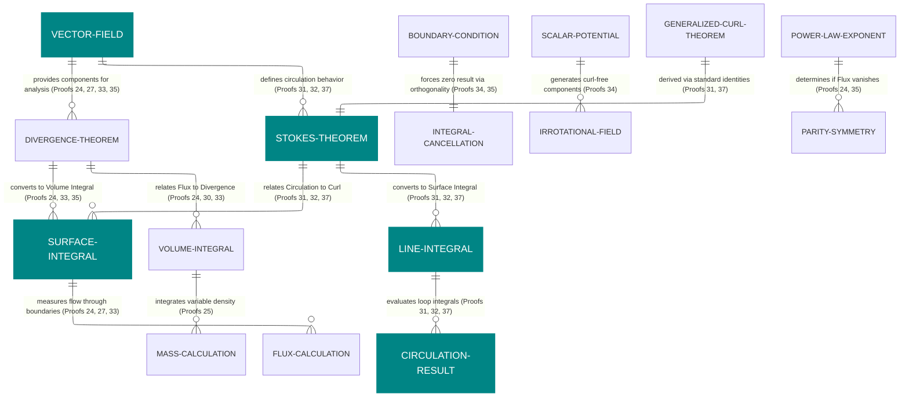

# Entity Relationship Diagram

## Cancellation and Orthogonality (Proof 32)

> - Proof 32: Using Stokes' Theorem with a Constant Scalar Field.
> - **Constant Scalars:** Proof 32 proves that if a scalar field is constant on a boundary, the resulting surface integral is **zero**.

- Deliverables: https://payhip.com/b/io8GT
- E-Product Hub: https://payhip.com/CDP

