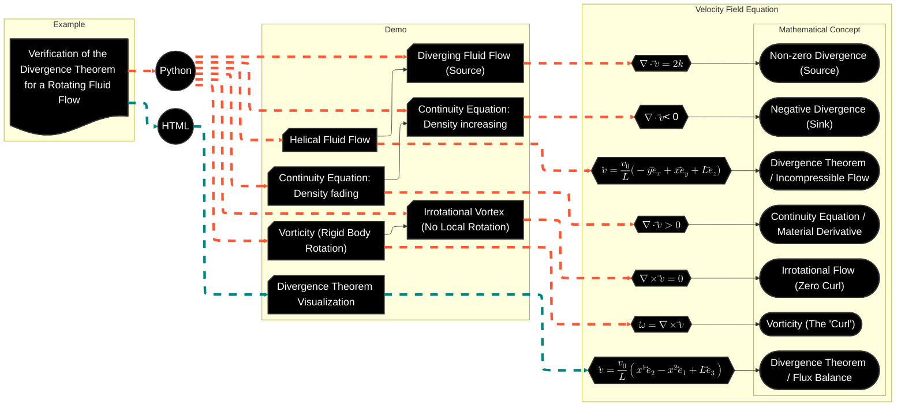

# Flowchart

[E-Product Hub](https://payhip.com/CDP)

## Fluid Dynamics and Divergence Verification

> The flowchart illustrates a structured workflow for the Verification of the Divergence Theorem for a Rotating Fluid Flow. It maps out how various fluid dynamics demonstrations are implemented through code and how they link to specific mathematical principles.

- [Verification of the Divergence Theorem for a Rotating Fluid Flow](https://viadean.notion.site/Verification-of-the-Divergence-Theorem-for-a-Rotating-Fluid-Flow-DT-RFF-2571ae7b9a328091ad62deba6f8d1715?source=copy_link)
- [Deliverables](https://payhip.com/b/Q9Zjy)

## Vector Calculus and Conservative Force Dynamics

> The flowchart illustrates the conceptual and technical workflow for proving mathematical identities and demonstrating physical principles through interactive simulations.

- [Using Stokes' Theorem with a Constant Scalar Field](https://viadean.notion.site/Using-Stokes-Theorem-with-a-Constant-Scalar-Field-ST-CSF-2561ae7b9a328056bcc5dc2e105a1c35?source=copy_link)
- Deliverables: https://payhip.com/b/io8GT

