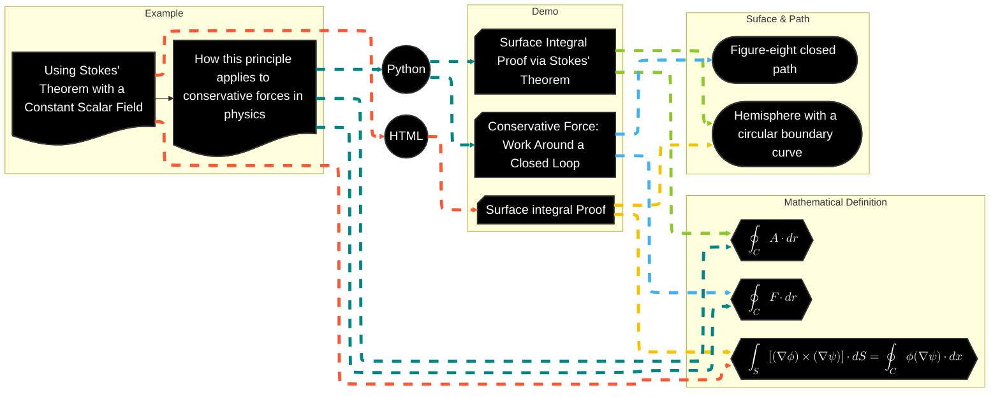

# Flowchart

## Vector Calculus and Conservative Force Dynamics

> The flowchart illustrates the conceptual and technical workflow for proving mathematical identities and demonstrating physical principles through interactive simulations.

- Deliverables: https://payhip.com/b/io8GT
- E-Product Hub: https://payhip.com/CDP

