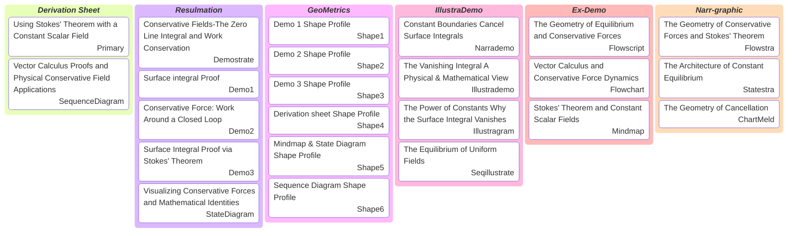

# Kanban

## Geometric Equilibrium: Mathematical Proofs and Physical Visualizations of Stokes' Theorem

> Visual and Orchestra blends technical architecture with creative media. It pairs video assets like Demostrate, Narrademo, Seqillustrate, and Flowscript with static components like Illustrademo, Illustragram, Flowstra, and Statestra. This unified ecosystem is governed by GeoMetrics' mathematical forms and ChartMeld's seamless blending of structured diagrams and creative illustrations.

- Deliverables: https://payhip.com/b/io8GT
- E-Product Hub: https://payhip.com/CDP

