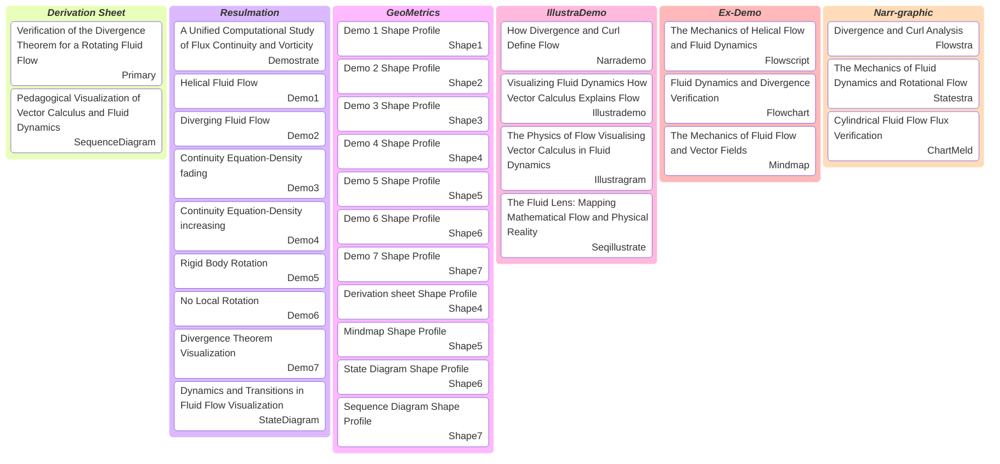
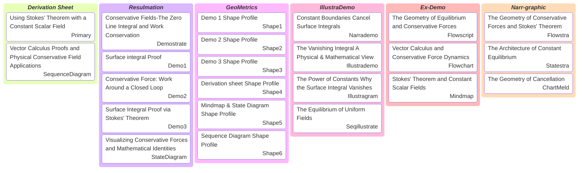

# Kanban

[E-Product Hub](https://payhip.com/CDP)

## The Mechanics of Fluid Divergence and Vorticity Dynamics

> The document serves as a comprehensive, modular blueprint for a pedagogical tool. It is designed to visually bridge the gap between abstract vector calculus theorems (like Divergence and Curl) and tangible fluid dynamics behaviors (such as vorticity, flux continuity, and helical flow).

- [Verification of the Divergence Theorem for a Rotating Fluid Flow](https://viadean.notion.site/Verification-of-the-Divergence-Theorem-for-a-Rotating-Fluid-Flow-DT-RFF-2571ae7b9a328091ad62deba6f8d1715?source=copy_link)

- [Deliverables](https://payhip.com/b/Q9Zjy)

## Geometric Equilibrium: Mathematical Proofs and Physical Visualizations of Stokes' Theorem

> The document serves as a master layout for an educational module. It seamlessly bridges advanced mathematical theory (**Stokes' Theorem, scalar fields, and surface integrals**) with physical realities (**conservative forces, work conservation, and equilibrium**) using a highly visual framework of charts, flowscripts, and shape profiles.

- [Using Stokes' Theorem with a Constant Scalar Field](https://viadean.notion.site/Using-Stokes-Theorem-with-a-Constant-Scalar-Field-ST-CSF-2561ae7b9a328056bcc5dc2e105a1c35?source=copy_link)
- [Deliverables](https://payhip.com/b/io8GT)

