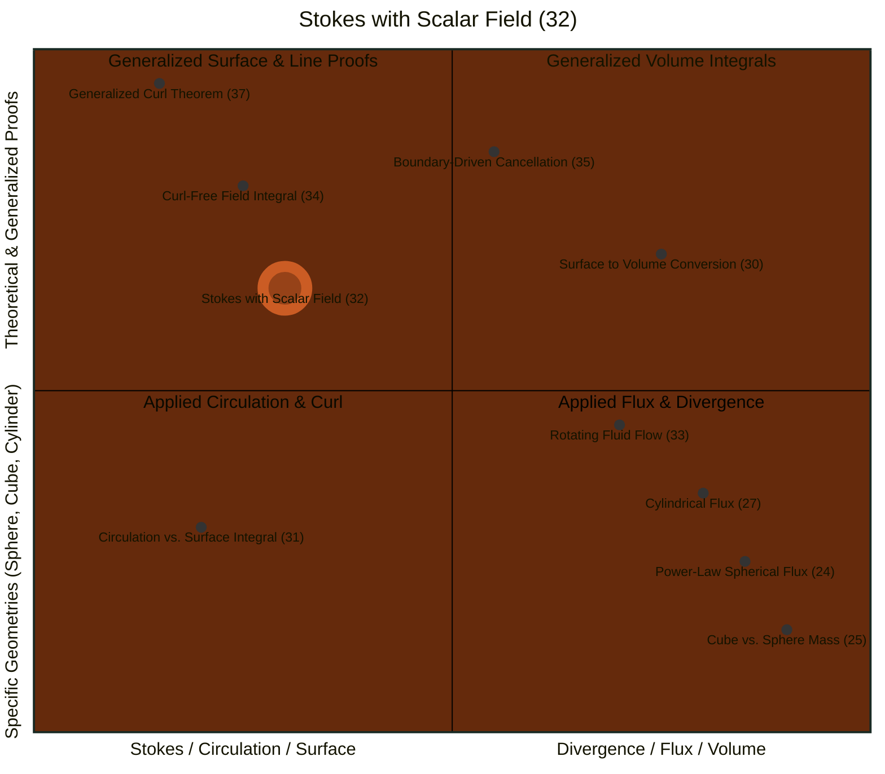
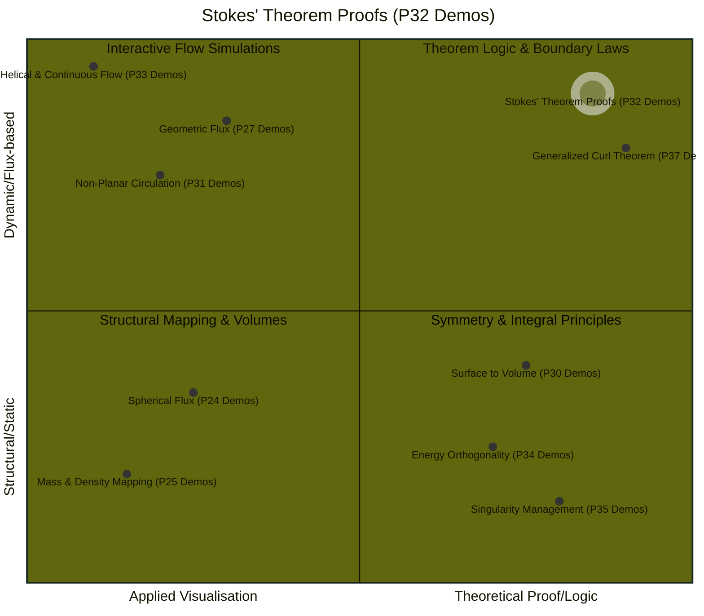

# Quadrant Chart

## Quadrant 2: Stokes with Scalar Field (P32)

> This proof is that the integral vanishes because the integrand can be rewritten as the curl of a vector field ($\phi \nabla \psi$). This allows the application of Stokes' Theorem, shifting the focus from the entire surface S to its boundary C. Since $\phi$ is constant on that boundary, it acts as a uniform scaling factor that can be moved outside the integral, leaving only the circulation of a gradient field ($$\nabla \psi$) around a closed loop. Because gradient fields are conservative, their path integral around any closed loop is identically zero, regardless of the complexity of the surface or the specific nature of the scalar fields involved.

- Deliverables: https://payhip.com/b/io8GT
- E-Product Hub: https://payhip.com/CDP

## Quadrant 1: Stokes' Theorem Proofs (P32 Demos)

> - Stokes' Theorem Proofs (P32 Demos): Conservative Fields-The Zero Line Integral and Work Conservation.
> - This quadrant contains the foundational proofs of integral calculus. Stokes' Theorem Proofs establish how work cancellation occurs in conservative forces, while the Generalized Curl Theorem provides the theoretical proof of topological independence, showing that results remain constant whether calculated over simple hemispheres or complex "rippled bowls".

- Deliverables: https://payhip.com/b/io8GT
- E-Product Hub: https://payhip.com/CDP

