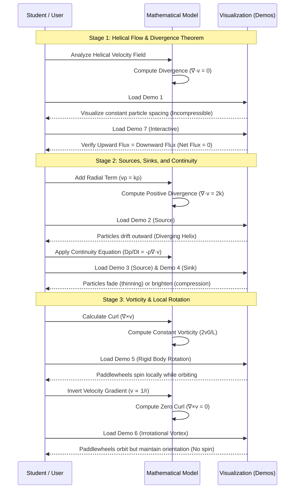
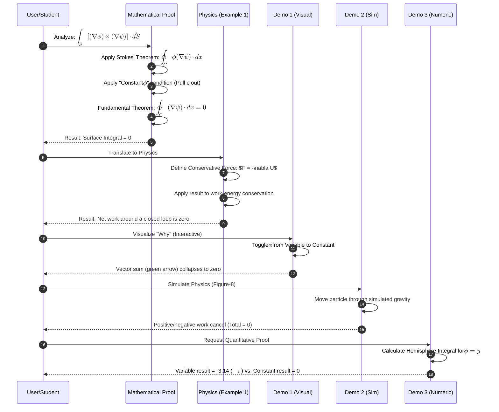

# Sequence Diagram

[E-Product Hub](https://payhip.com/CDP)

## Pedagogical Visualization of Vector Calculus and Fluid Dynamics

> The sequence diagram illustrates the pedagogical progression of the demonstrations, moving from basic helical flow visualization to the complex physical analysis of divergence, mass conservation, and vorticity. --- [Verification of the Divergence Theorem for a Rotating Fluid Flow](https://viadean.notion.site/Verification-of-the-Divergence-Theorem-for-a-Rotating-Fluid-Flow-DT-RFF-2571ae7b9a328091ad62deba6f8d1715)

- Deliverables: https://payhip.com/b/Q9Zjy

## Vector Calculus Proofs and Physical Conservative Field Applications

> This sequence diagram illustrates the logical progression from the initial vector calculus proof to its physical applications and the various interactive demonstrations used to validate the results.

- Deliverables: https://payhip.com/b/io8GT

