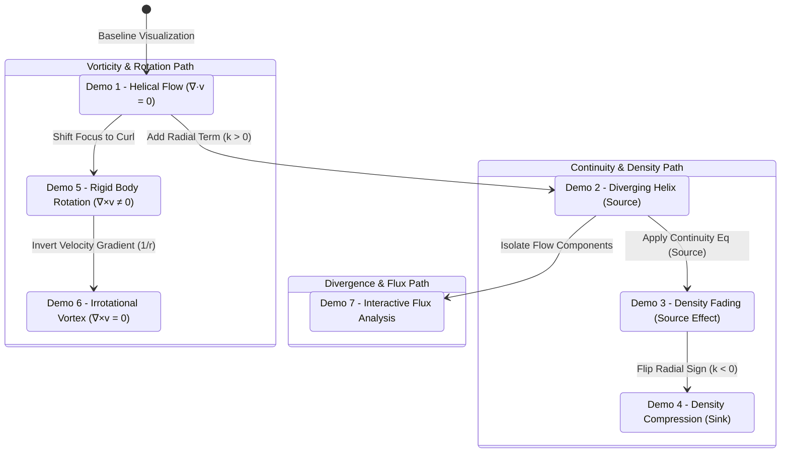
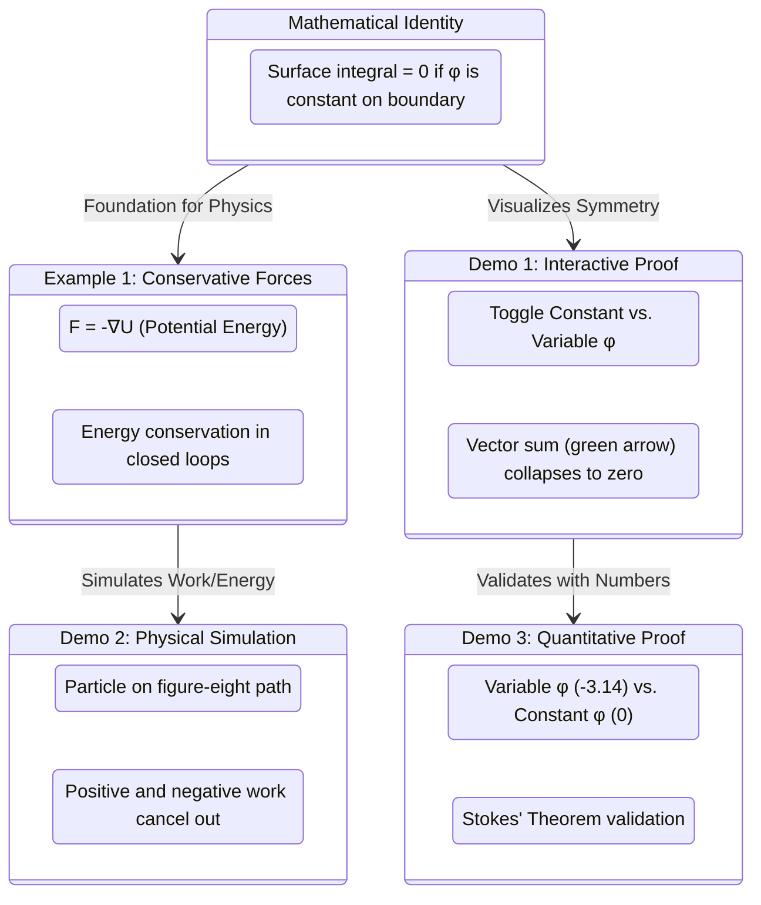

# State Diagram

[E-Product Hub](https://payhip.com/CDP)

## Dynamics and Transitions in Fluid Flow Visualization

> The state diagram demonstrations are structured to guide you from basic vector field visualization to complex physical interpretations of divergence, mass conservation, and vorticity.

- [Verification of the Divergence Theorem for a Rotating Fluid Flow](https://viadean.notion.site/Verification-of-the-Divergence-Theorem-for-a-Rotating-Fluid-Flow-DT-RFF-2571ae7b9a328091ad62deba6f8d1715?source=copy_link)
- [Deliverables](https://payhip.com/b/Q9Zjy)

## Visualizing Conservative Forces and Mathematical Identities

> This state diagram illustrates the purposeful flow from the core mathematical identity to its physical application in Example 1, and subsequently to the three interactive demonstrations that provide intuition, simulation, and numerical proof.

- [Using Stokes' Theorem with a Constant Scalar Field](https://viadean.notion.site/Using-Stokes-Theorem-with-a-Constant-Scalar-Field-ST-CSF-2561ae7b9a328056bcc5dc2e105a1c35?source=copy_link)
- [Deliverables](https://payhip.com/b/io8GT)

