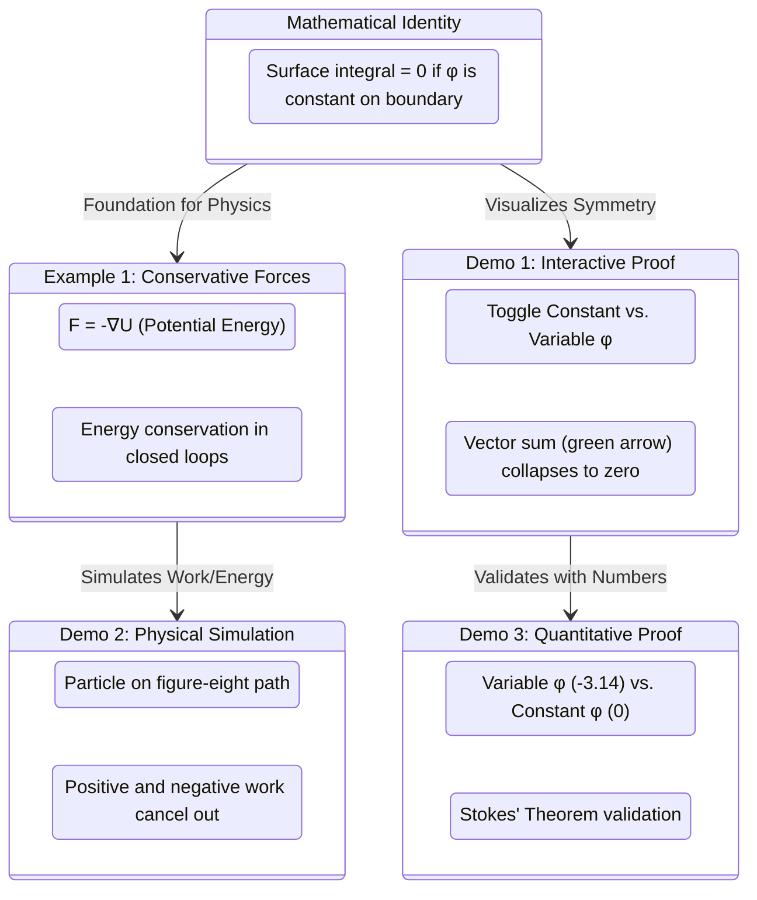

# State Diagram

## Visualizing Conservative Forces and Mathematical Identities

> This state diagram illustrates the purposeful flow from the core mathematical identity to its physical application in Example 1, and subsequently to the three interactive demonstrations that provide intuition, simulation, and numerical proof.

- Deliverables: https://payhip.com/b/io8GT
- E-Product Hub: https://payhip.com/CDP

