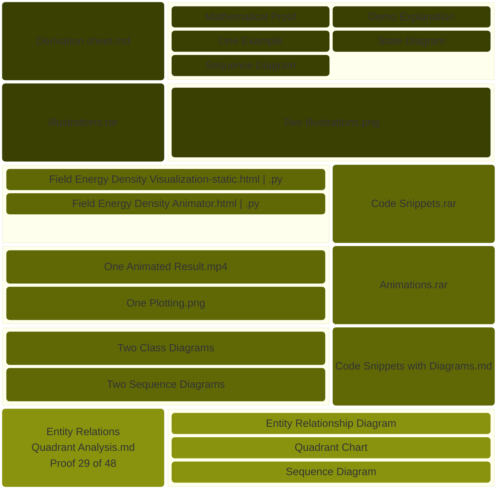

> These files examine the fundamental properties of static electromagnetic fields, focusing on a mathematical proof that the energy densities of electric and magnetic components remain independent within certain enclosed volumes. This theoretical framework demonstrates that the total interaction between these fields across a surface of constant potential is effectively zero, provided the fields weaken significantly as they extend toward infinity. To illustrate these concepts, the file contrasts the rapid dissipation of energy surrounding a single point charge with the steady and confined energy found inside a solenoid. These abstract relationships are brought to life through interactive web-based animations that visually track expanding boundaries and field growth, helping to clarify the balance between diminishing field strength and increasing spatial volume. Ultimately, this study is situated within a broader learning progression that bridges foundational vector mathematics with advanced theories regarding complex potentials and field interactions.

🔰[Downloadable Files](https://payhip.com/b/pRPQn)

