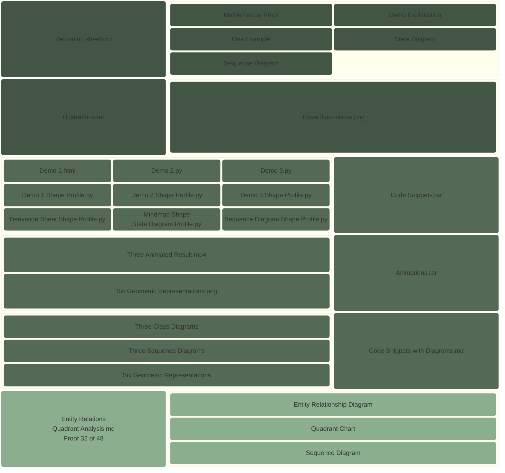

# Block Diagram

# Boundary Equilibrium and the Calculus of Conservative Fields

> The fundamental concept explored is that when a specific influence or field remains perfectly uniform along the boundary of a surface, all internal forces effectively cancel each other out, resulting in a state of perfect equilibrium. This principle serves as the bedrock for understanding conservative forces in nature, such as gravity, where the energy spent moving an object is exactly reclaimed if it returns to its starting point, ensuring that no energy is created or lost within a closed system. Interactive simulations and visual tools further validate this theory by demonstrating how symmetric force arrangements collapse to zero and how motion along complex paths, like a figure-eight, results in a net balance of work. Ultimately, this demonstrates that boundary conditions dictate the global behavior of a system, providing a rigorous explanation for why certain physical fields are inherently stable and energy-conserving.

- Deliverables: https://payhip.com/b/io8GT

- E-Product Hub: https://payhip.com/CDP

