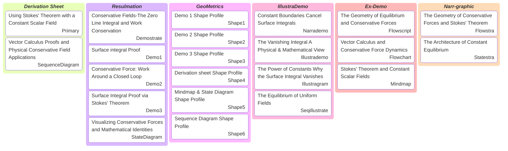

# Geometric Equilibrium: Mathematical Proofs and Physical Visualizations of Stokes' Theorem

> Visual and Orchestra is a comprehensive content suite that bridges technical precision with narrative clarity through a variety of specialized formats. The ecosystem ranges from high-energy video compilations like the Demostrate to deep-dive educational tools like Flowscript and Seqillustrate, which break down complex logic into digestible walkthroughs. This visual storytelling is supported by a series of integrated assets—including the Narrademo, Illustrademo, and Illustragram—culminating in "orchestrated" composite images like Flowstra and Statestra that merge diagrams, mindmaps, and live demos into a single reference point. Grounding the entire aesthetic is GeoMetrics, ensuring that every visual element is built on the purest mathematical essence for maximum structural clarity.

- Deliverables: https://payhip.com/b/io8GT
- E-Product Hub: https://payhip.com/CDP

- Demostrate: A video compilation featuring multiple demos.
- Narrademo: A narrated video walkthrough that combines live demos with a guiding illustration.
  - Illustrademo: The standalone illustrative image used within a Narrademo.
- Seqillustrate: A technical video explaining both Sequence and State diagrams.
  - Illustragram: The specific diagram-based illustration used as a reference in the video.
- Flowscript: A video guide mapping out complex processes through Flowcharts and Mindmaps.
- Flowstra: A composite image merging a flowchart, mindmap, illustration, and demo.
- Statestra: A composite image merging sequence diagrams, state diagrams, illustrations, and demos.
- GeoMetrics: Distilling complex forms into their purest mathematical essence.