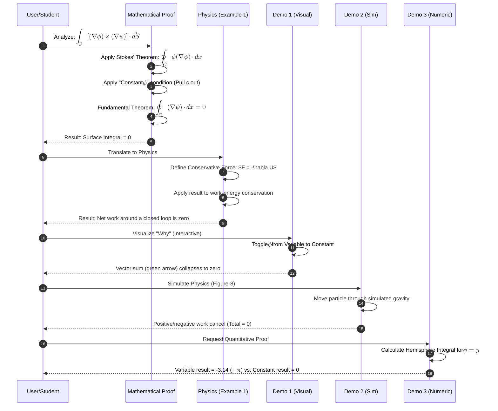

# Sequence Di

# Vector Calculus Proofs and Physical Conservative Field Applications

> This sequence diagram illustrates the logical progression from the initial vector calculus proof to its physical applications and the various interactive demonstrations used to validate the results.

- Deliverables: https://payhip.com/b/io8GT
- E-Product Hub: https://payhip.com/CDP

