# Block Diagram

[E-Product Hub](https://payhip.com/CDP)

---

## Field Divergence Framework

> These files provide a comprehensive pedagogical structure for investigating boundary-driven cancellation in vector field integrals, specifically addressing the mathematical challenges of power-law singularities. Through a series of four interconnected demonstrations, the project guides learners from analytical proofs—using the Divergence Theorem to identify scalar field potential—to advanced visual simulations that contrast finite, well-behaved flux against divergent "blow-up" scenarios. By establishing a state-machine architecture that enforces an "exclusion zone" around the origin, the framework ensures analytical stability while using dimensional projections and high-contrast heatmap visualizations to make complex gradient dynamics and potential wells intuitively accessible.

- [Boundary-Driven Cancellation in Vector Field Integrals](https://viadean.notion.site/Boundary-Driven-Cancellation-in-Vector-Field-Integrals-2571ae7b9a3280d9a9b3c8dafd8a5fe6?source=copy_link)
- [Deliverables](https://payhip.com/b/y3FbU)

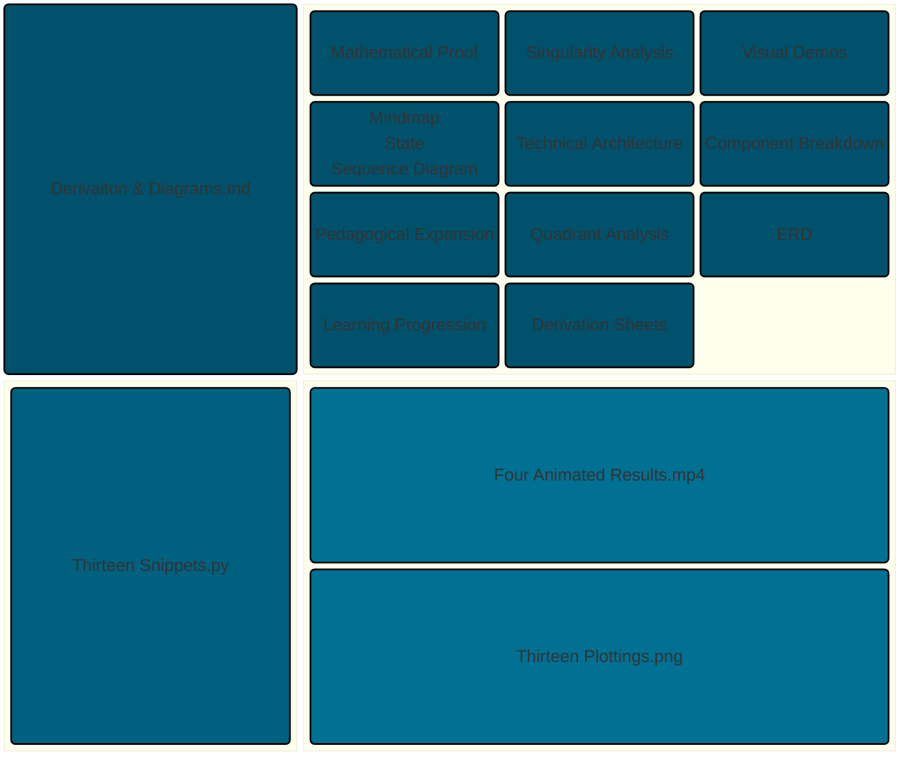

---

## Helmholtz Decomposition and Vector Field Orthogonality: Theoretical Frameworks and Simulations

> These files provide a comprehensive deep dive into the Helmholtz Decomposition Theorem and the energy-orthogonality of vector fields through three integrated resources. Derivation.md establishes the core mathematical proofs, demonstrating how irrotational and solenoidal fields remain energy-independent when boundary conditions are met, while also detailing the consequences of boundary leakage. Diagrams.md bridges theory and practice by providing the Python code and geometric visualizations necessary to simulate these fields, complete with class and sequence diagrams that map the logic of the animation engine. Finally, ERD & Quadrant.md offers the structural framework for the entire collection, categorizing all 48 proofs into quadrants based on mathematical domain—from fundamental tensor calculus to complex electrodynamics—and providing entity-relationship mapping to visualize how these field theorems connect to one another.

- [Integral of a Curl-Free Vector Field](https://viadean.notion.site/Integral-of-a-Curl-Free-Vector-Field-CVF-2571ae7b9a3280d8a368c3ffac5d0b26?source=copy_link)
- [Deliverables](https://payhip.com/b/tgrVH)

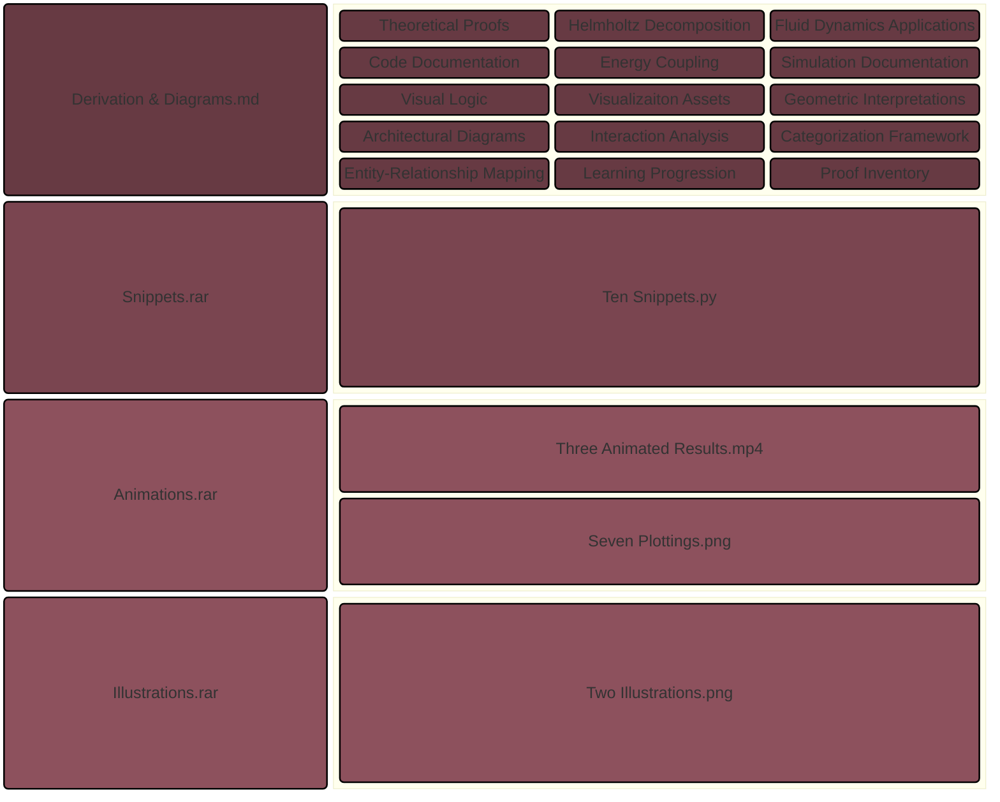

---

## Technical Diagnostics of the NHS-Palantir Integration

> These files offer a multifaceted diagnostic analysis of the NHS-Palantir Federated Data Platform (FDP) contract by utilizing data modeling, network analysis, and project management visualizations. It breaks down the partnership’s systemic risks through Gantt diagrams that map critical milestones—such as the 2027 break clause—against operational roll-out phases, while employing sequence diagrams and network topology models to visualize the power dynamics and frictions between the NHS, Palantir, and external stakeholders like Foxglove. Furthermore, the section applies geometric modeling and simulation code to illustrate how the pursuit of operational efficiency can create "systemic instability," ultimately serving as a structural warning that the project’s technical integration may be outpacing the capacity for long-term strategic autonomy and public accountability.

- [The Dissonance Protocol](https://viadean.notion.site/The-Dissonance-Protocol-3761ae7b9a3280a49d1ed234fc688619?source=copy_link)
- [Deliverables](https://payhip.com/b/TNhCX)

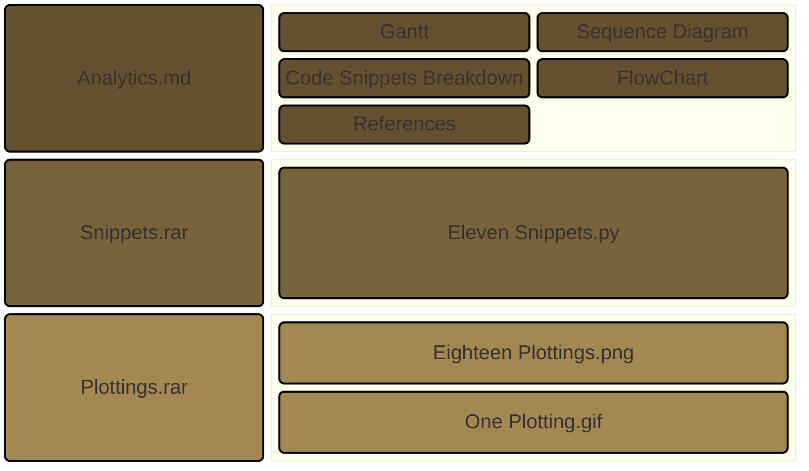

---

## Cognitive Manifold Dynamics

> These files bridge abstract psychological concepts with rigorous cognitive engineering by modeling the resilience process as a dynamic, measurable system. It utilizes geometric and physical metaphors—such as high-dimensional singularities, topological projections, and manifold traversals—to illustrate how writing acts as a neurological tool that reduces cognitive entropy. Through a series of simulation models, code snippets, and diagrams, the appendix demonstrates that resilience is not merely a static character trait, but an optimizable habit; it quantifies how the act of externalizing thoughts onto a page "smooths" neural pathways, reduces cognitive friction (energy cost), and increases data processing efficiency by leveraging the brain's natural ability to reorganize information, thereby transforming chaotic emotional distress into grounded, manageable clarity.

- [Entropy to Clarity (E2C)](https://viadean.notion.site/Entropy-to-Clarity-E2C-3741ae7b9a3280d38f27eb477cd04403?source=copy_link)
- [Deliverables](https://payhip.com/b/eSPQ7)

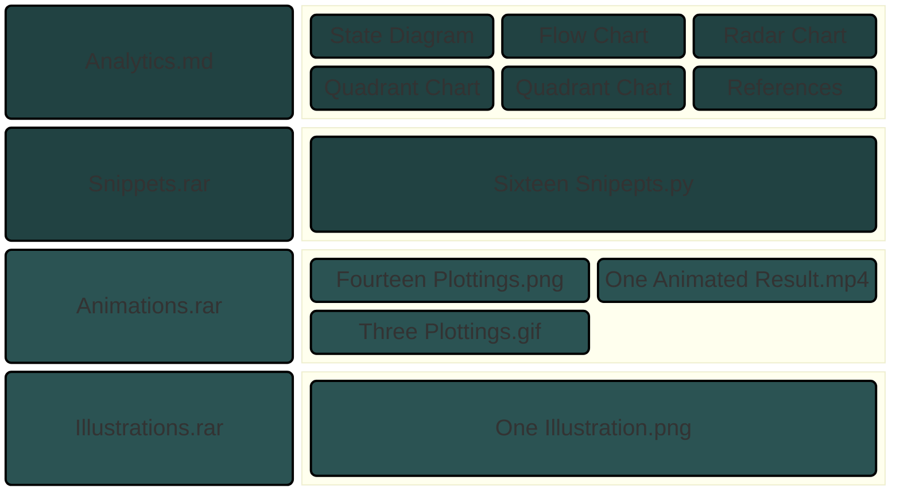

---

## The Male Parabola

> These files offer a comprehensive geometric and statistical analysis of human sexual desire, primarily centered on a large-scale population study. This material outlines the "architecture" of desire through concepts like the "Translation Vector," representing a robust and persistent gender gap, and "Non-Linear Age Manifolds," which contrast the "Male Parabola" (peaking around age 40) with the "Female Monotonic Descent". Additionally, the documents detail how socio-environmental factors—such as parenthood ("Parity Divergence") and education ("Academic Wedge")—act as coordinate shears that further widen the desire gap. Beyond these core findings, the sources include a suite of Python visualization scripts for generating 3D models and statistical plots, as well as a comparative quadrant chart summarizing four diverse research papers that range from macro-level demographic surveys to intensive daily diary and neurobiological studies.

- [The Wedge and the Abyss: Structural Forces Shaping Human Sexual Trajectories](https://viadean.notion.site/The-Wedge-and-the-Abyss-Structural-Forces-Shaping-Human-Sexual-Trajectories-3721ae7b9a328060967ed9d187423215?source=copy_link)
- [Deliverables](https://payhip.com/b/jkZrc)

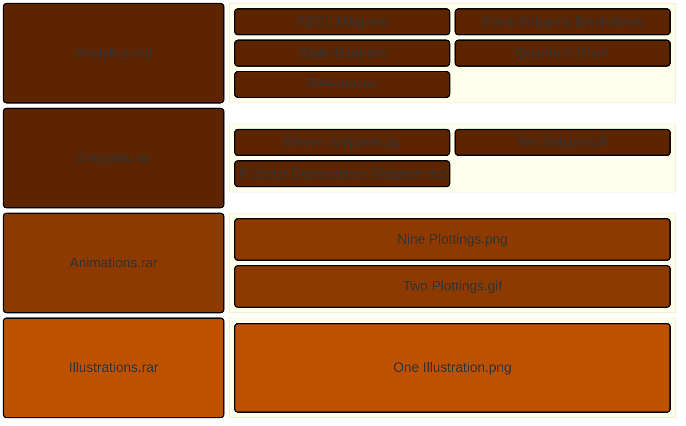

---

## The Topology of Infrastructure Risk: Mapping the AI Code Tsunami to 3D Geometry

> These files offer an interdisciplinary framework for analyzing cloud outages and infrastructure failures through three-dimensional geometric models rather than traditional linear logs. It details several specific models: a hub-and-spoke starburst for network topology, a hyper-expanding sphere representing the volumetric explosion of AI-generated data, a topological gravity well modeling the economic "stickiness" of vendor lock-in, and a disruption curve that tracks system collapse over time. For each conceptual model, the files provide comprehensive technical assets, including scripts for visualizations, class diagrams defining architectural responsibilities, and sequence diagrams illustrating operational flows such as workflow registration and 3D data rendering. Furthermore, it includes a risk multiplier analysis that uses animated 3D surfaces to simulate how blast radius, duration, and AI volatility compound to reach a geometric breaking point.

- [Warping the Infrastructure Plane](https://viadean.notion.site/Warping-the-Infrastructure-Plane-3701ae7b9a328061a6ffc1b8360c923e?source=copy_link)
- [Deliverables](https://payhip.com/b/sjaE5)

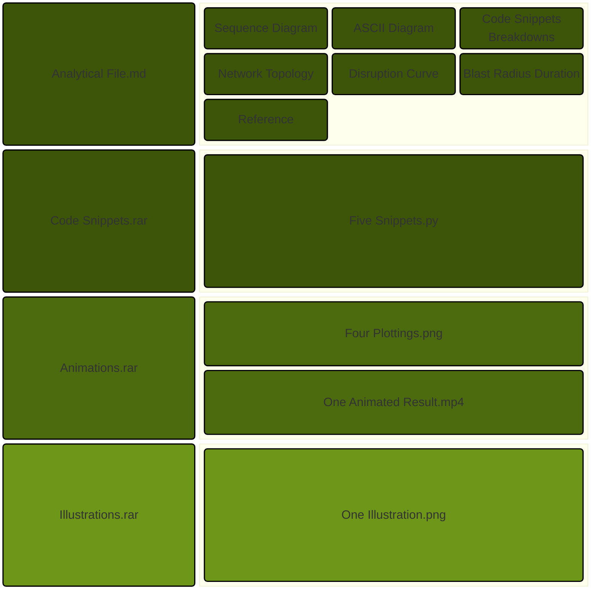

---

## The Geometric Evolution of Sifting Muddy Currents

> These files detail a multidisciplinary analysis of the poem "Sifting Muddy Currents," which synthesizes the English heroic couplet with Chinese *Lüshi* philosophy into a ten-line, 4-4-2 vertical block matrix. This structural evolution is interpreted through three distinct geometric frameworks: a mechanical meter that morphs from a rigid monolithic cube into an expanding sphere; a semantic arc that transitions from a restrictive funnel of linguistic refinement into a self-referential double-helix paradox and an infinite horizon; and a dialectic journey that ascends from a one-dimensional axis through a singularity point into a three-dimensional manifold. Sentiment analysis further characterises the poem’s emotional trajectory as an "Eastern Transcendent Arc," moving from high-friction tension and negative valence toward a state of expansive, low-arousal liberation, which is contrasted with the "U-shaped" crisis-and-resolution models typical of Western poetry. To formalize these concepts, the files provide technical architectures for Python-based animations using Matplotlib, employing particle systems, sigmoidal morphing, and parametric equations to visually simulate the poem's shift from material constraints to spiritual transcendence.

- [Sifting Muddy Currents](https://viadean.notion.site/Sifting-Muddy-Currents-3681ae7b9a3280c6a357c3b48d5c2f07?source=copy_link)
- [Deliverables](https://payhip.com/b/AnWsr)

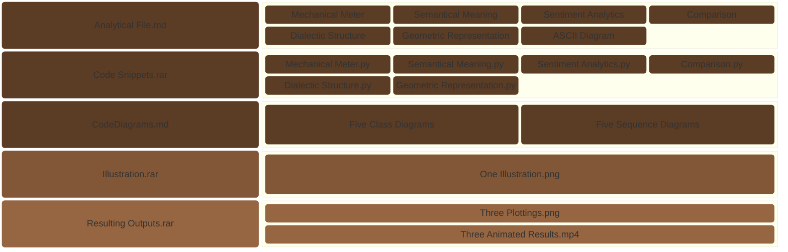

---

## The Human Engine Remains Single-Threaded

> The Agentic Pipeline Emulator (APE) illustrates a fundamental shift in knowledge work from a manual, single-threaded execution model to a scaled, parallel delegation architecture. Initially, workflows are depicted as being constrained by the Individual Execution Bottleneck, where workers must manually manage tasks from inception to completion, limiting production to the speed of individual human bandwidth. The emulator then visualizes a "Future State" where professionals transition into Supervisor roles, offloading abstract delegation packets into a centralized AI Agentic Harness. This harness acts as an orchestrator, instantly routing workloads across multiple parallel processing threads to scale output dramatically, effectively decoupling human input from the speed of execution.

- [The Agentic Pipeline Emulator](https://viadean.notion.site/The-Agentic-Pipeline-Emulator-APE-36c1ae7b9a32809eaab7ce1301e87818?source=copy_link)
- [Deliverables](https://payhip.com/b/CsrkH)

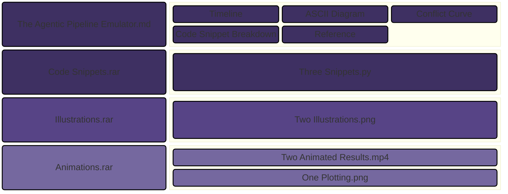

---

## Information Gain in the Multi-Dimensional Search Manifold

> The transition from traditional to generative AI search represents a shift from a flat 2D coordinate system to a multi-dimensional, warped manifold where the goal is no longer just ranking, but achieving a geometric intersection with user intent. While search intent itself remains a fixed directional vector, the AI system "warps" the information space, often swallowing commodity content that lacks unique depth and absorbing it into its baseline pattern recognition without providing a citation. To survive this "zero-click" era, brands must focus on Information Gain, which involves adding a unique "z-axis" of original research or proprietary data that cannot be mathematically compressed or flattened by the AI model. This unique dimensional volume forces the AI to draw a direct line to the creator, resulting in a citation and establishing the brand as a foundational pillar within the AI's synthesized response space.

- [The Dimension of Intent](https://viadean.notion.site/The-Dimension-of-Intent-36d1ae7b9a328066b121daac07a3225d?source=copy_link)
- [Deliverables](https://payhip.com/b/dlsiS)

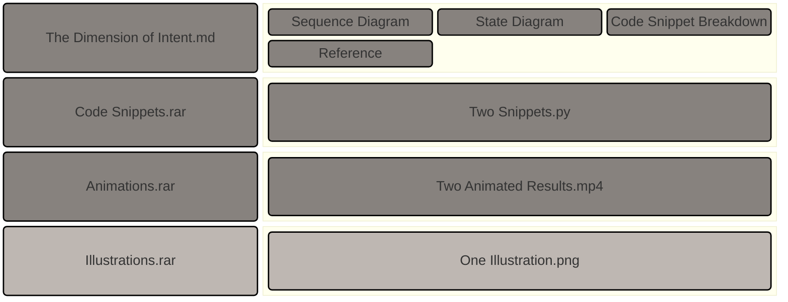

---

## Visualizing Vector Calculus: From Flow to Vorticity

> This pedagogical journey transforms abstract vector calculus into a tangible physical reality by guiding learners through a sequence that transitions from basic helical flow visualization to the complex dynamics of mass conservation and vorticity. Starting with an incompressible baseline where fluid maintains constant density and spacing, the progression introduces "sources" and "sinks" to illustrate how divergence physically dictates the thinning or concentration of a fluid as it moves. The sheet concludes by distinguishing between global orbital motion and local internal spin, utilizing a "paddlewheel test" to demonstrate that circular paths do not inherently imply local rotation. Ultimately, this structured approach verifies fundamental principles like the Divergence Theorem by converting mathematical results into visible physical behaviors, such as density shifts and irrotational vortices. 

- [Verification of the Divergence Theorem for a Rotating Fluid Flow](https://viadean.notion.site/Verification-of-the-Divergence-Theorem-for-a-Rotating-Fluid-Flow-DT-RFF-2571ae7b9a328091ad62deba6f8d1715?source=copy_link)

- [Deliverables](https://payhip.com/b/Q9Zjy)

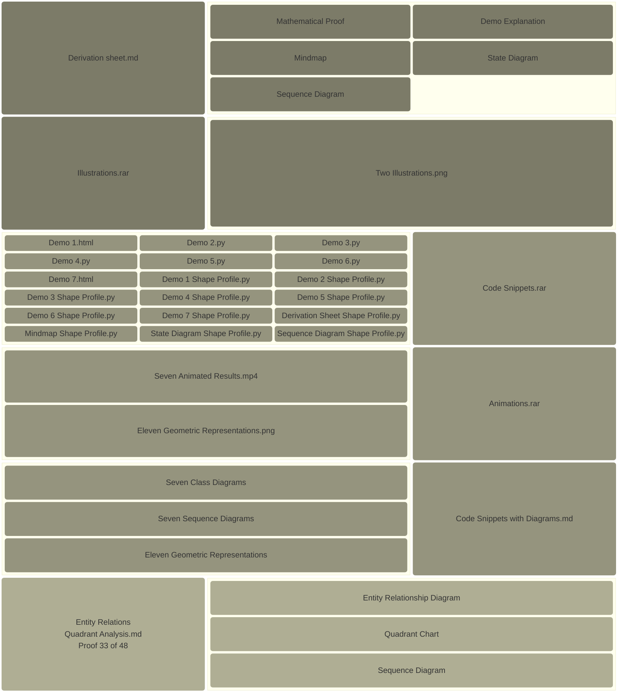

## Boundary Equilibrium and the Calculus of Conservative Fields

> The fundamental concept explored is that when a specific influence or field remains perfectly uniform along the boundary of a surface, all internal forces effectively cancel each other out, resulting in a state of perfect equilibrium. This principle serves as the bedrock for understanding conservative forces in nature, such as gravity, where the energy spent moving an object is exactly reclaimed if it returns to its starting point, ensuring that no energy is created or lost within a closed system. Interactive simulations and visual tools further validate this theory by demonstrating how symmetric force arrangements collapse to zero and how motion along complex paths, like a figure-eight, results in a net balance of work. Ultimately, this demonstrates that boundary conditions dictate the global behavior of a system, providing a rigorous explanation for why certain physical fields are inherently stable and energy-conserving.

- [Using Stokes' Theorem with a Constant Scalar Field](https://viadean.notion.site/Using-Stokes-Theorem-with-a-Constant-Scalar-Field-ST-CSF-2561ae7b9a328056bcc5dc2e105a1c35?source=copy_link)

- [Deliverables](https://payhip.com/b/io8GT)

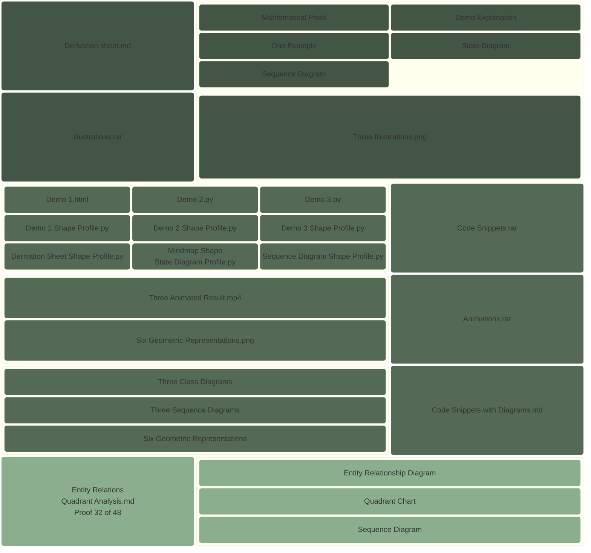