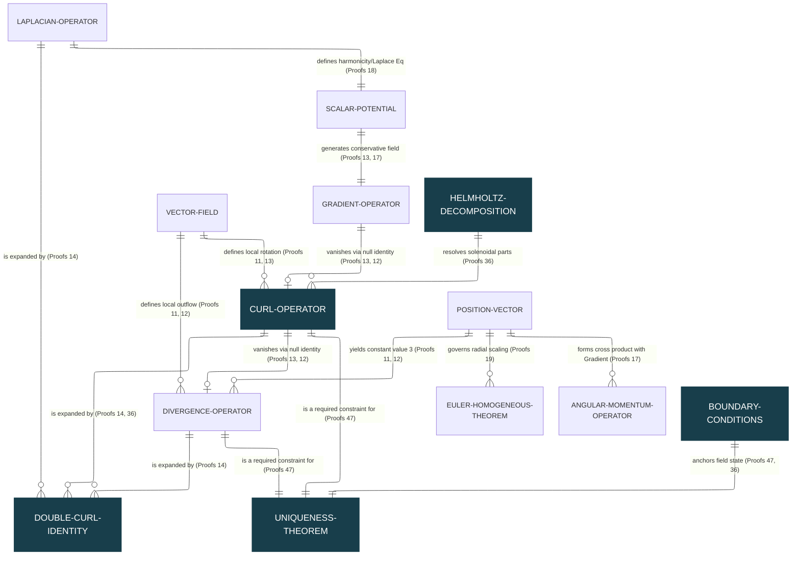
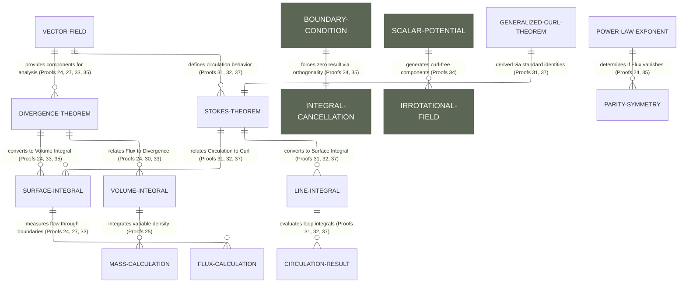
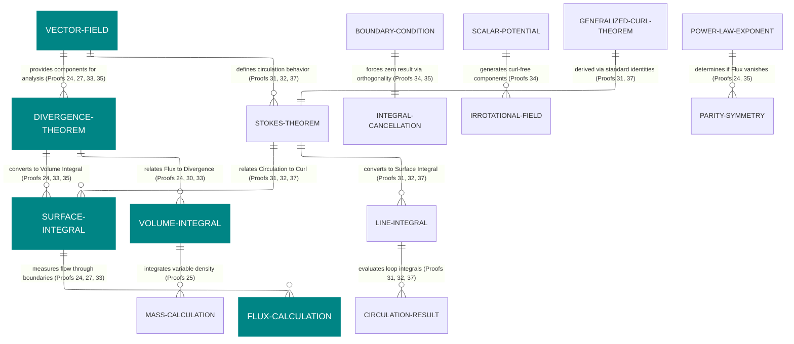
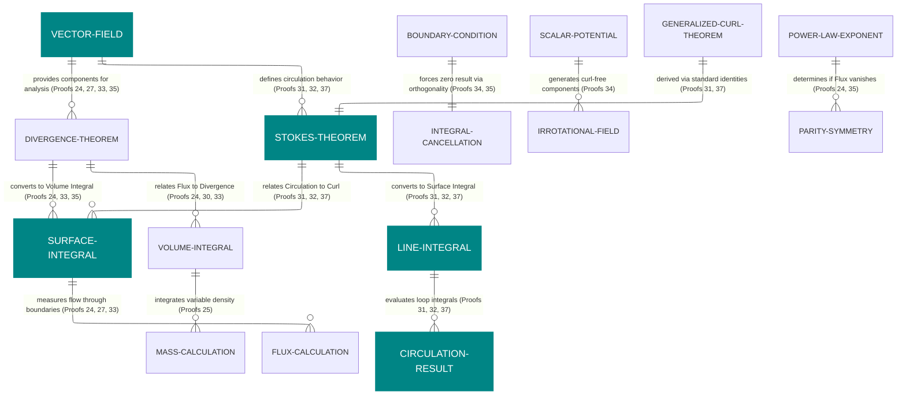

# Entity Relationship Diagram

[E-Product Hub](https://payhip.com/CDP)

## The Uniqueness "Lock"

### Architectural Mapping of the Uniqueness Theorem Synthesis

> The "Architectural Mapping of the Uniqueness Theorem Synthesis" organizes vector calculus into a three-layered hierarchy—Foundation, Intermediate, and Synthesis—to demonstrate how foundational identities evolve into system-wide theorems. At the foundational level, the framework establishes null identities (where the curl of a gradient and divergence of a curl equal zero) and the dynamics of position vectors, which serve as building blocks for complex relationships like the double curl identity and the conditions for harmonicity. The mapping culminates in the Uniqueness Theorem, presented as an emergent property that "locks" a vector field only when its divergence, curl, and boundary conditions (Neumann or Dirichlet) are specified. This structural approach highlights a "Critical Path" where high-level dependencies, such as Helmholtz Decomposition, unify to ensure a vector field is completely determined.

- [The Vanishing Curl Integral](https://viadean.notion.site/The-Vanishing-Curl-Integral-2581ae7b9a3280dc9fa6d8e97bba66e1?source=copy_link)
- [Deliverables](https://payhip.com/b/tj6sD)

## Vector Field Properties | Cancellation and Orthogonality 

> Proof 34: Integral of a Curl-Free Vector Field.

- [Integral of a Curl-Free Vector Field](https://viadean.notion.site/Integral-of-a-Curl-Free-Vector-Field-CVF-2571ae7b9a3280d8a368c3ffac5d0b26?source=copy_link)
- [Deliverables](https://payhip.com/b/tgrVH)

---

## Integral Conversion | Vector Field Properties | Geometric Geometry

> - Proof 33: Verification of the Divergence Theorem for a Rotating Fluid Flow.
> - Proof 33 serves as a bridge between microscopic differential properties and macroscopic boundary integrals by verifying field behavior within a specific spatial geometry.

- [Verification of the Divergence Theorem for a Rotating Fluid Flow](https://viadean.notion.site/Verification-of-the-Divergence-Theorem-for-a-Rotating-Fluid-Flow-DT-RFF-2571ae7b9a328091ad62deba6f8d1715?source=copy_link)
- [Deliverables](https://payhip.com/b/Q9Zjy)

## Cancellation and Orthogonality (Proof 32)

> - Proof 32: Using Stokes' Theorem with a Constant Scalar Field.
> - **Constant Scalars:** Proof 32 proves that if a scalar field is constant on a boundary, the resulting surface integral is **zero**.

- [Using Stokes' Theorem with a Constant Scalar Field](https://viadean.notion.site/Using-Stokes-Theorem-with-a-Constant-Scalar-Field-ST-CSF-2561ae7b9a328056bcc5dc2e105a1c35?source=copy_link)
- [Deliverables](https://payhip.com/b/io8GT)

