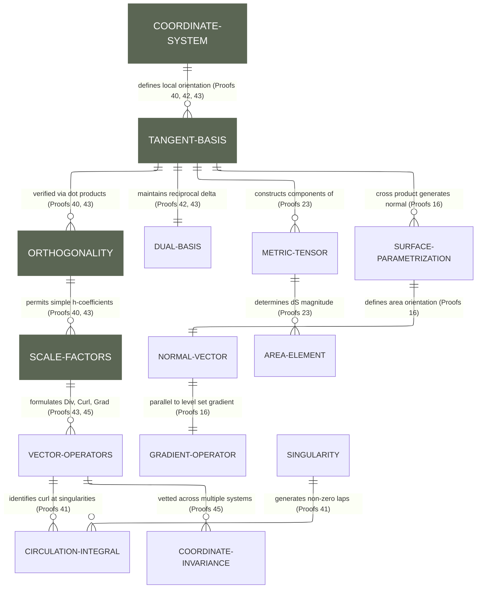
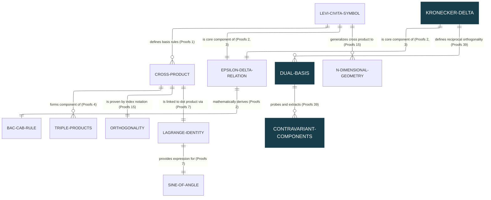
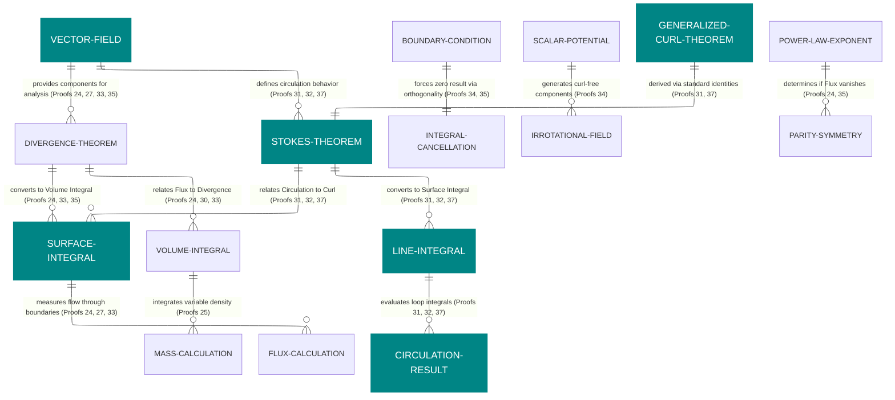
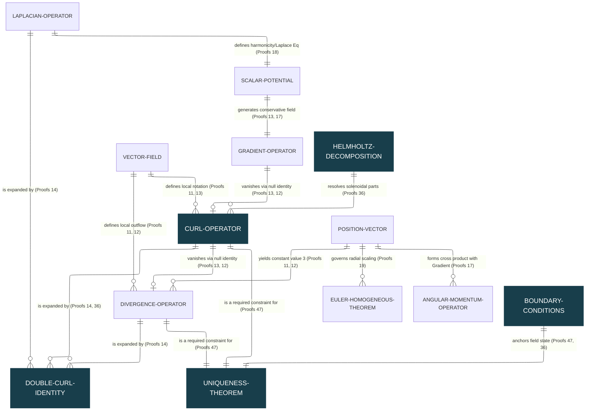
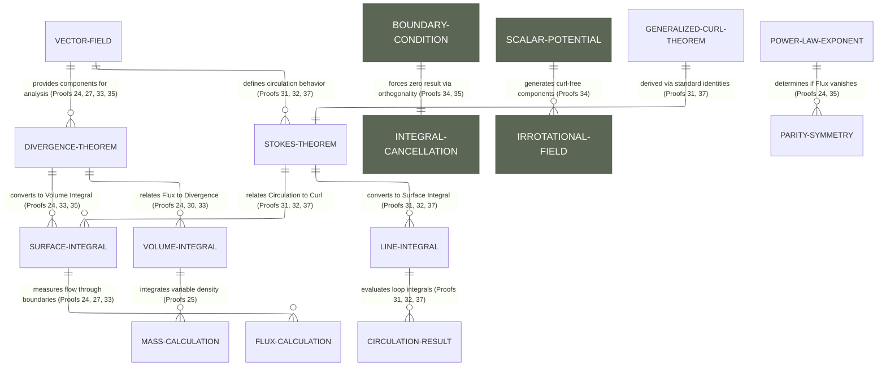
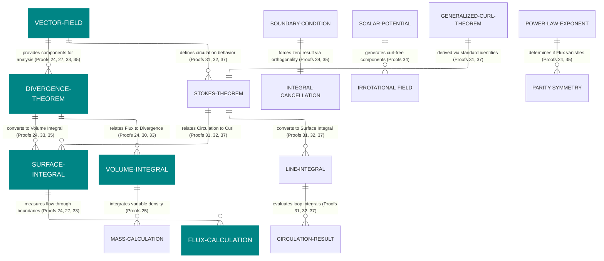
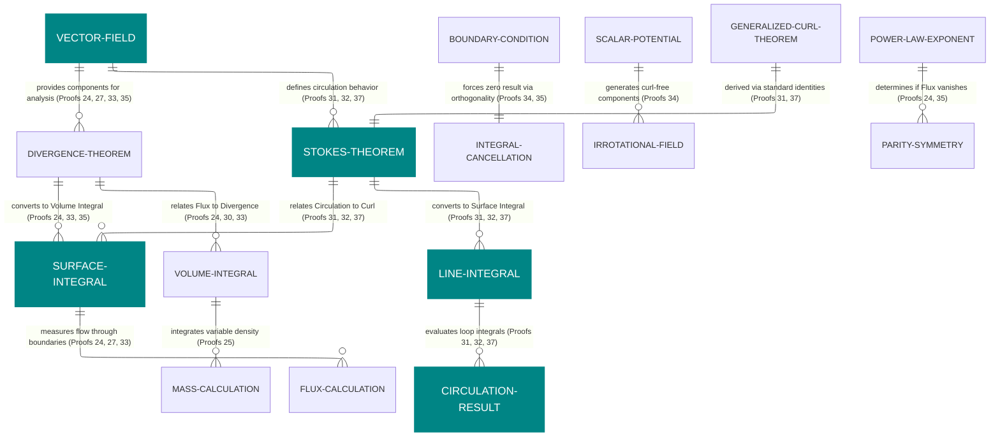

# Entity Relationship Diagram

[E-Product Hub](https://payhip.com/CDP)

## A Structural Blueprint for Curvilinear Coordinate Systems

> The Entity Relationship Diagram (ERD) for basis construction and verification serves as a comprehensive map linking foundational vector calculus proofs to advanced geometric and operational results. This framework categorizes coordinate systems based on their tangent bases, verifying orthogonality for cylindrical, spherical, and parabolic systems while identifying hyperbolic coordinates as non-orthogonal. To achieve precise component extraction in these non-orthogonal or complex systems, a dual basis is derived to satisfy the reciprocal relationship. Beyond basic verification, the ERD illustrates how surface geometry is linked to the gradient through cross-products of tangent vectors and how the metric tensor is used to calculate area elements for curved surfaces. Furthermore, it details the formulation of differential operators that maintain coordinate invariance and explains how local mathematical properties, such as zero curl, can still result in non-zero global integrals when the path encloses a coordinate singularity. Practical visualizations of hyperbolic coordinates confirm these findings, demonstrating that their grid lines intersect at variable angles—such as $47.5^\circ$—rather than the $90^\circ$ required for standard Euclidean orthogonality.

- [Verification of Orthogonal Tangent Vector Bases in Cylindrical and Spherical Coordinates](https://viadean.notion.site/Verification-of-Orthogonal-Tangent-Vector-Bases-in-Cylindrical-and-Spherical-Coordinates-2591ae7b9a3280e0a458cba31d94b7f0?source=copy_link)
- [Deliverables](https://payhip.com/b/axrmQ)

## The Dual Basis Mechanism for Contravariant Decomposition

> Proof 39 focuses on a systematic method for identifying contravariant vector components by utilizing a specialized dual basis as a framework. This process is governed by a fundamental reciprocal relationship between the primary tangent frame and its corresponding dual counterpart, a connection that ensures accuracy during measurement. In this context, the dual basis acts as a precise measuring stick, allowing for the isolated extraction of specific vector parts that might otherwise be difficult to distinguish. By applying these foundational governance rules, the proof demonstrates a logical flow that transforms basic identity principles into a practical tool for cataloging and understanding the internal structure of vectors.

- [Proving Contravariant Vector Components Using the Dual Basis](https://viadean.notion.site/Proving-Contravariant-Vector-Components-Using-the-Dual-Basis-2581ae7b9a3280f8a2eef1bd9b7ac8b4?source=copy_link)
- [Deliverables](https://payhip.com/b/QktBm)

## Unified Field Architectures and Singularity Resolution

> The Entity-Relationship Diagram (ERD) in Proof 38 serves as a comprehensive visual and mathematical architecture that bridges abstract potentials with physically consistent field models. It defines the two primary "engines" of electromagnetics: the gradient of a scalar potential for irrotational electric fields and the curl of a vector potential for solenoidal magnetic fields. A central focus of this framework is accounting for singularities, specifically the mathematical "blow-up" at the origin ($r=0$) of a magnetic dipole. By integrating a Dirac delta function term, the model achieves global consistency with Gauss’s Law for Magnetism, forcing field lines to perform an "upward snap" through the core to form the continuous closed loops required for a solenoidal system. This mathematical refinement has profound implications beyond classical physics, providing the physical basis for the Fermi contact interaction in quantum mechanics, which explains hyperfine splitting and the critical 21cm hydrogen line used by astronomers to map the universe. Furthermore, the framework extends to comparative analyses of advanced phenomena, such as the Yukawa potential, where a surrounding medium acts as a distributed sink that exponentially screens long-range fields.

- [Computing the Magnetic Field and its Curl from a Dipole Vector Potential](https://viadean.notion.site/Computing-the-Magnetic-Field-and-its-Curl-from-a-Dipole-Vector-Potential-2581ae7b9a3280fdab8ed775fb9fb3fb?source=copy_link)
- [Deliverables](https://payhip.com/b/Aozay)

## The Mechanics of Generalized Curl and Integral Conversion

> The Generalized Curl Theorem (Proof 37) serves as a specialized component of Integral Conversion, providing a fundamental link between dimensions by relating line integrals (circulation) to their "curl-like" surface counterparts. This theorem is part of a broader logical framework that includes the Divergence Theorem for converting surface flux to volume integration and Stokes' Theorem. The structural foundations of these proofs are categorized into four primary areas: Integral Conversion, Vector Field Properties (analyzing incompressibility and parity), Cancellation and Orthogonality (demonstrating Helmholtz Orthogonality and the energetic independence of flow types), and Geometric Geometry, which verifies these identities across diverse shapes such as cubes, spheres, and cylinders. Ultimately, the theorem simplifies complex 3D fields by establishing outcomes where specific integrals, such as those involving scalar constants on a boundary or orthogonal flows, vanish or result in zero values.

- [Proving the Generalized Curl Theorem](https://viadean.notion.site/Proving-the-Generalized-Curl-Theorem-2581ae7b9a32806a8612f6c0bdb7d004?source=copy_link)
- [Deliverables](https://payhip.com/b/GAy39)

## The Uniqueness "Lock"

### Architectural Mapping of the Uniqueness Theorem Synthesis

> The "Architectural Mapping of the Uniqueness Theorem Synthesis" organizes vector calculus into a three-layered hierarchy—Foundation, Intermediate, and Synthesis—to demonstrate how foundational identities evolve into system-wide theorems. At the foundational level, the framework establishes null identities (where the curl of a gradient and divergence of a curl equal zero) and the dynamics of position vectors, which serve as building blocks for complex relationships like the double curl identity and the conditions for harmonicity. The mapping culminates in the Uniqueness Theorem, presented as an emergent property that "locks" a vector field only when its divergence, curl, and boundary conditions (Neumann or Dirichlet) are specified. This structural approach highlights a "Critical Path" where high-level dependencies, such as Helmholtz Decomposition, unify to ensure a vector field is completely determined.

- [The Vanishing Curl Integral](https://viadean.notion.site/The-Vanishing-Curl-Integral-2581ae7b9a3280dc9fa6d8e97bba66e1?source=copy_link)
- [Deliverables](https://payhip.com/b/tj6sD)

## Vector Field Properties | Cancellation and Orthogonality 

> Proof 34: Integral of a Curl-Free Vector Field.

- [Integral of a Curl-Free Vector Field](https://viadean.notion.site/Integral-of-a-Curl-Free-Vector-Field-CVF-2571ae7b9a3280d8a368c3ffac5d0b26?source=copy_link)
- [Deliverables](https://payhip.com/b/tgrVH)

---

## Integral Conversion | Vector Field Properties | Geometric Geometry

> - Proof 33: Verification of the Divergence Theorem for a Rotating Fluid Flow.
> - Proof 33 serves as a bridge between microscopic differential properties and macroscopic boundary integrals by verifying field behavior within a specific spatial geometry.

- [Verification of the Divergence Theorem for a Rotating Fluid Flow](https://viadean.notion.site/Verification-of-the-Divergence-Theorem-for-a-Rotating-Fluid-Flow-DT-RFF-2571ae7b9a328091ad62deba6f8d1715?source=copy_link)
- [Deliverables](https://payhip.com/b/Q9Zjy)

## Cancellation and Orthogonality (Proof 32)

> - Proof 32: Using Stokes' Theorem with a Constant Scalar Field.
> - **Constant Scalars:** Proof 32 proves that if a scalar field is constant on a boundary, the resulting surface integral is **zero**.

- [Using Stokes' Theorem with a Constant Scalar Field](https://viadean.notion.site/Using-Stokes-Theorem-with-a-Constant-Scalar-Field-ST-CSF-2561ae7b9a328056bcc5dc2e105a1c35?source=copy_link)
- [Deliverables](https://payhip.com/b/io8GT)

