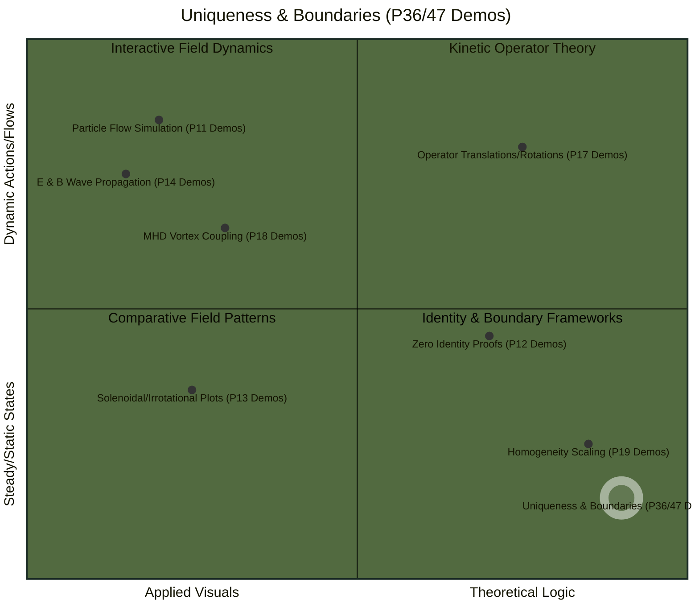
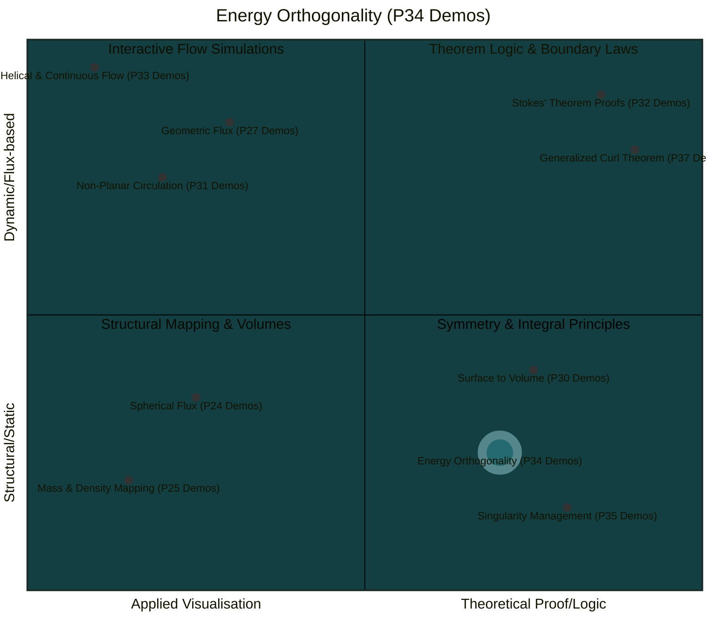
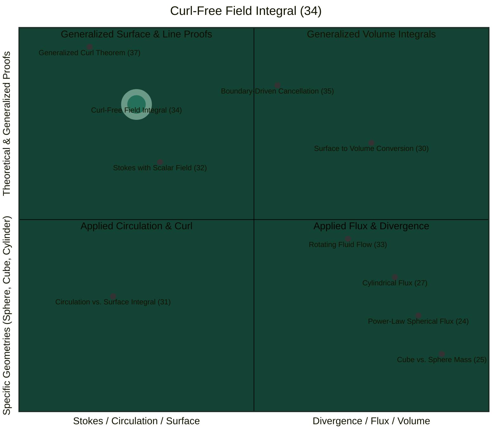
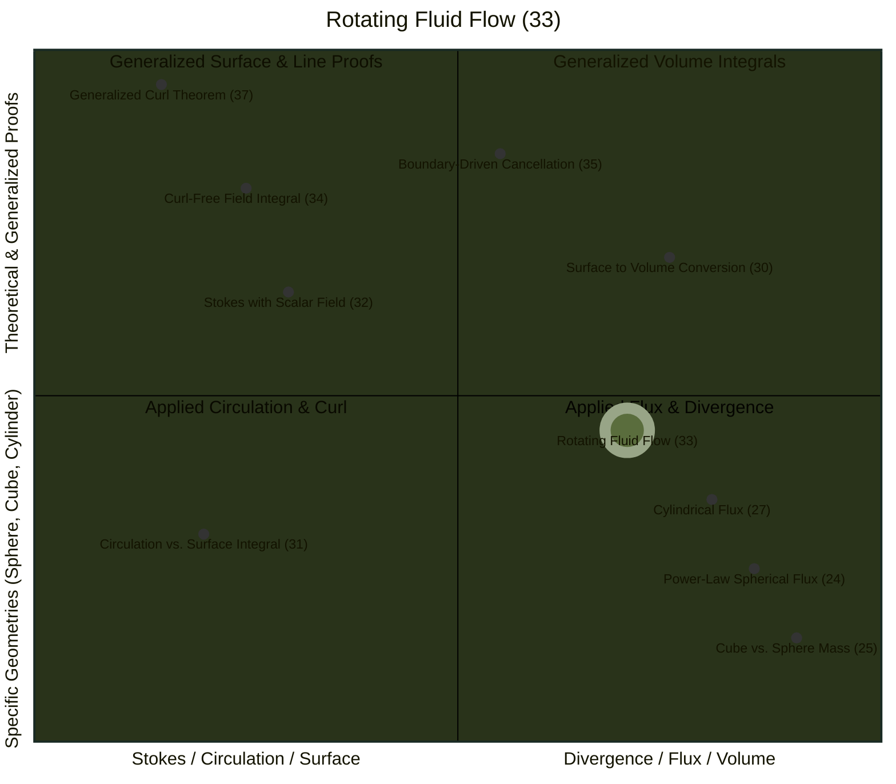
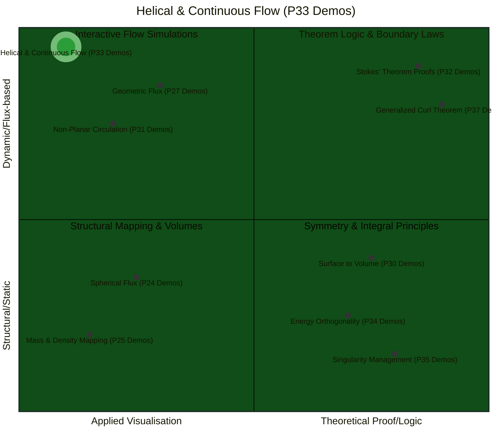
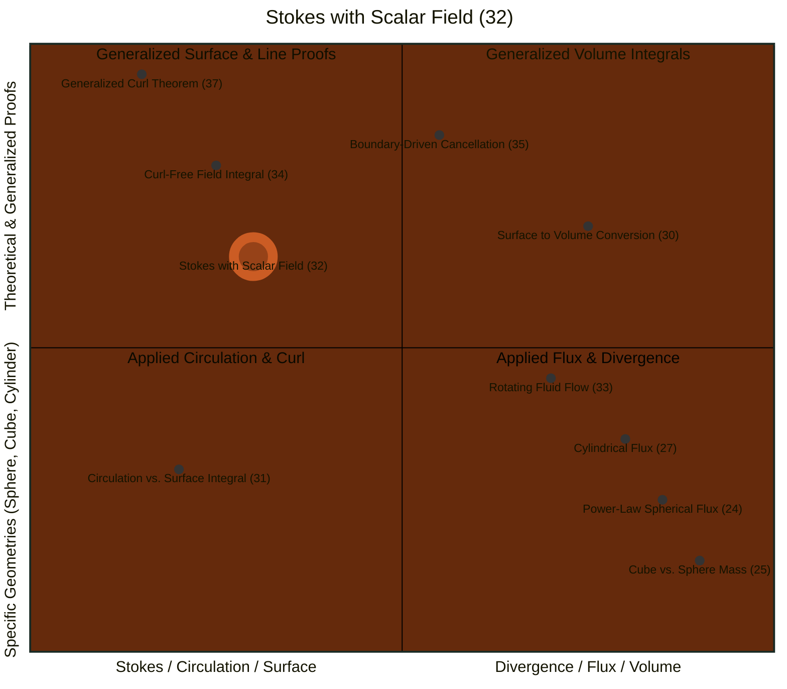
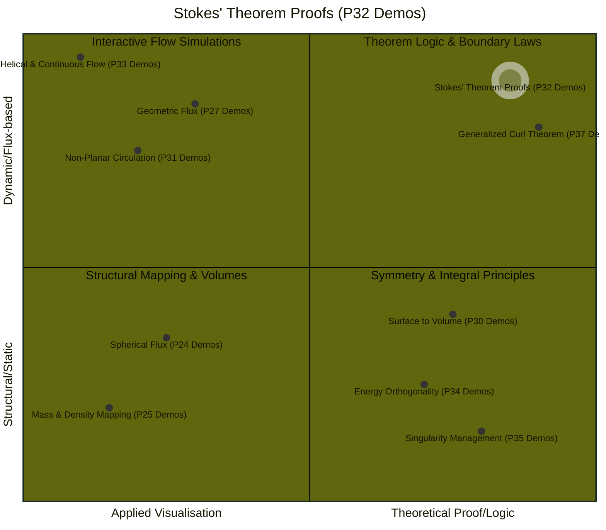

# Quadrant Chart

[E-Product Hub](https://payhip.com/CDP)

## Uniqueness & Boundaries (P36/47 Demos)

### The Uniqueness Lock Master Syntax

> The "Uniqueness Lock" framework establishes that physical vector fields are not arbitrary but are mathematically deterministic "slaves" to their specific sources and boundary conditions, leaving them with zero degrees of freedom. This methodology utilizes null identities to prove that any deviation from the predicted field is impossible without non-existent energy sources, a concept visualized by a "difference field" that identically collapses to zero. A strategic advantage of this framework is decoupling, which allows complex fields to be decomposed into independent irrotational and solenoidal "mathematical DNA" to simplify problem-solving through a "divide and conquer" strategy. Furthermore, the framework posits that the unique state is the global energy minimum of the system, meaning that any physical "noise" naturally dissipates as the field relaxes into its stable, calculated configuration. Ultimately, this approach provides a scale-invariant "master syntax" for physics, proving that the uniqueness of vector fields is a mathematical necessity rather than a physical assumption.

- [Static Sources vs. Dynamic Boundaries-The Uniqueness Principle](https://viadean.notion.site/Static-Sources-vs-Dynamic-Boundaries-The-Uniqueness-Principle-2e81ae7b9a32806da5d5eeb0746f478d?source=copy_link)
- [Deliverables](https://payhip.com/b/tj6sD)

## Quadrant 4: Energy Orthogonality (P34 Demos)

> P34 Demos: The Ideal Helmholtz Case and the Coupled Boundary Case.

- [Integral of a Curl-Free Vector Field](https://viadean.notion.site/Integral-of-a-Curl-Free-Vector-Field-CVF-2571ae7b9a3280d8a368c3ffac5d0b26?source=copy_link)
- [Deliverables](https://payhip.com/b/tgrVH)

---

## Quadrant 2: Curl-Free Field Integral (34)

> Curl-Free Field Integral (34): Integral of a Curl-Free Vector Field.

- [Integral of a Curl-Free Vector Field](https://viadean.notion.site/Integral-of-a-Curl-Free-Vector-Field-CVF-2571ae7b9a3280d8a368c3ffac5d0b26?source=copy_link)
- [Deliverables](https://payhip.com/b/tgrVH)

---

## Quadrant 4: Rotating Fluid Flow (33)

> - Rotating Fluid Flow (33): Verification of the Divergence Theorem for a Rotating Fluid Flow. 
> - Quadrant 4 is the most "hands-on" section, applying the **Divergence Theorem** to calculate mass and flux through specific shapes like spheres (24, 25), cubes (25), and cylinders (27), as well as physical systems like rotating fluids (33).

- [Verification of the Divergence Theorem for a Rotating Fluid Flow](https://viadean.notion.site/Verification-of-the-Divergence-Theorem-for-a-Rotating-Fluid-Flow-DT-RFF-2571ae7b9a328091ad62deba6f8d1715)
- [Deliverables](https://payhip.com/b/Q9Zjy)

---

## Quadrant 2: Helical & Continuous Flow (P33 Demos)

> - Helical & Continuous Flow (P33 Demos): A Unified Computational Study of Flux Continuity and Vorticity
> - **Helical and Continuous Flow** utilise **paddlewheel indicators** to distinguish between rigid-body rotation and irrotational vortices. **Geometric Flux** and **Non-Planar Circulation** provide interactive demos of mass flux and 3D "saddle" loops.

- [Verification of the Divergence Theorem for a Rotating Fluid Flow](https://viadean.notion.site/Verification-of-the-Divergence-Theorem-for-a-Rotating-Fluid-Flow-DT-RFF-2571ae7b9a328091ad62deba6f8d1715)
- [Deliverables](https://payhip.com/b/Q9Zjy)

## Quadrant 2: Stokes with Scalar Field (P32)

> This proof is that the integral vanishes because the integrand can be rewritten as the curl of a vector field ($\phi \nabla \psi$). This allows the application of Stokes' Theorem, shifting the focus from the entire surface S to its boundary C. Since $\phi$ is constant on that boundary, it acts as a uniform scaling factor that can be moved outside the integral, leaving only the circulation of a gradient field ($$\nabla \psi$) around a closed loop. Because gradient fields are conservative, their path integral around any closed loop is identically zero, regardless of the complexity of the surface or the specific nature of the scalar fields involved.

- [Using Stokes' Theorem with a Constant Scalar Field](https://viadean.notion.site/Using-Stokes-Theorem-with-a-Constant-Scalar-Field-ST-CSF-2561ae7b9a328056bcc5dc2e105a1c35?source=copy_link)
- [Deliverables](https://payhip.com/b/io8GT)

## Quadrant 1: Stokes' Theorem Proofs (P32 Demos)

> - Stokes' Theorem Proofs (P32 Demos): Conservative Fields-The Zero Line Integral and Work Conservation.
> - This quadrant contains the foundational proofs of integral calculus. Stokes' Theorem Proofs establish how work cancellation occurs in conservative forces, while the Generalized Curl Theorem provides the theoretical proof of topological independence, showing that results remain constant whether calculated over simple hemispheres or complex "rippled bowls".

- [Using Stokes' Theorem with a Constant Scalar Field](https://viadean.notion.site/Using-Stokes-Theorem-with-a-Constant-Scalar-Field-ST-CSF-2561ae7b9a328056bcc5dc2e105a1c35?source=copy_link)
- [Deliverables](https://payhip.com/b/io8GT)

