# Quadrant Chart

[E-Product Hub](https://payhip.com/CDP)

## The Geometry of the Dual Basis

> The P39 Demos illustrate the reciprocal relationship between a physical tangent basis and its corresponding dual basis, which serves as a specialized set of measuring sticks for extracting vector data. While the tangent basis is used for vector construction—physically assembling a vector by stepping along its grid lines—the dual basis functions as a measurement sieve designed to probe and isolate specific values. These dual vectors are strategically oriented to be perpendicular to the grid lines they are not intended to measure, a configuration that allows them to filter out interference from other directions. This geometric arrangement is crucial because it maintains orthogonality even in systems where the physical frame is distorted or nearly parallel, ensuring that the isolated measurements remain accurate and free from cross-contamination.

- [Reciprocal Geometry of Tangent and Dual Bases](https://viadean.notion.site/Reciprocal-Geometry-of-Tangent-and-Dual-Bases-2e91ae7b9a328052aa6ce63b07b0d03f?source=copy_link)
- [Deliverables](https://payhip.com/b/QktBm)

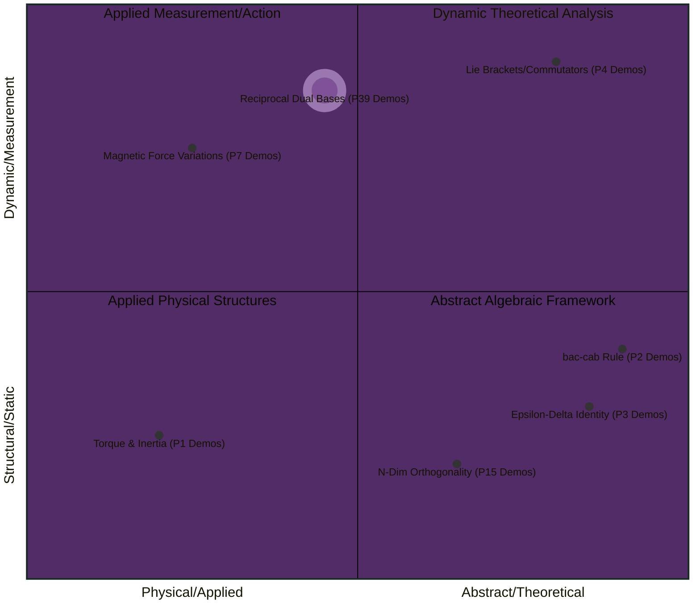
```mermaid
---
config:
  quadrantChart:
    chartWidth: 800
    chartHeight: 700
  themeVariables:
    quadrant1Fill: "#522C67"
    quadrant2Fill: "#522C67"
    quadrant3Fill: "#522C67"
    quadrant4Fill: "#522C67"
    quadrantInternalBorderStrokeFill: "#000"
    quadrantExternalBorderStrokeFill: "#192a24"
---
quadrantChart
    x-axis "Physical/Applied" --> "Abstract/Theoretical"
    y-axis "Structural/Static" --> "Dynamic/Measurement"
    quadrant-1 "Dynamic Theoretical Analysis"
    quadrant-2 "Applied Measurement/Action"
    quadrant-3 "Applied Physical Structures"
    quadrant-4 "Abstract Algebraic Framework"
    
    "Torque & Inertia (P1 Demos)": [0.20, 0.25]
    "N-Dim Orthogonality (P15 Demos)": [0.65, 0.20]
    "Epsilon-Delta Identity (P3 Demos)": [0.85, 0.30]
    "bac-cab Rule (P2 Demos)": [0.90, 0.40]
    "Magnetic Force Variations (P7 Demos)": [0.25, 0.75]
    "Reciprocal Dual Bases (P39 Demos)":::spot: [0.45, 0.85]
    "Lie Brackets/Commutators (P4 Demos)": [0.80, 0.90]

 classDef spot color: #7F5298, radius : 20, stroke-color: #9A77AF, stroke-width: 10px    
```

## The Solenoidal Foundation of Magnetic Dipoles and Hyperfine Splitting

> The evolution of the magnetic dipole model focuses on resolving the mathematical "blow-up" at the origin by transitioning from a flawed point-source idealization to a physically realistic current loop model. While classical formulas suggest field lines plunge into an infinite sink, the requirement for global flux continuity necessitates an "upward snap" of field lines through the core to satisfy Gauss's Law for Magnetism, ensuring that all field lines form closed, unbroken orbits. To maintain this divergence-free framework across all space, the classical equations must be appended with a Dirac delta function patch, which acts as a mathematical corrector at the singularity. This theoretical refinement has direct physical consequences, serving as the foundation for the Fermi contact interaction in quantum mechanics. This interaction, occurring when an s-orbital electron physically overlaps with the nucleus, triggers the hyperfine splitting responsible for the 21cm hydrogen line used by astronomers to map the structure of the universe. Finally, this solenoidal field geometry provides a direct geometric proof for the non-existence of magnetic monopoles in standard electrodynamics.

- [Visualizing the Dipole-Field Line Geometry and Singular Flow Dynamics](https://viadean.notion.site/Visualizing-the-Dipole-Field-Line-Geometry-and-Singular-Flow-Dynamics-2e91ae7b9a328028b336f90d010533f7?source=copy_link)
- [Deliverables](https://payhip.com/b/Aozay)

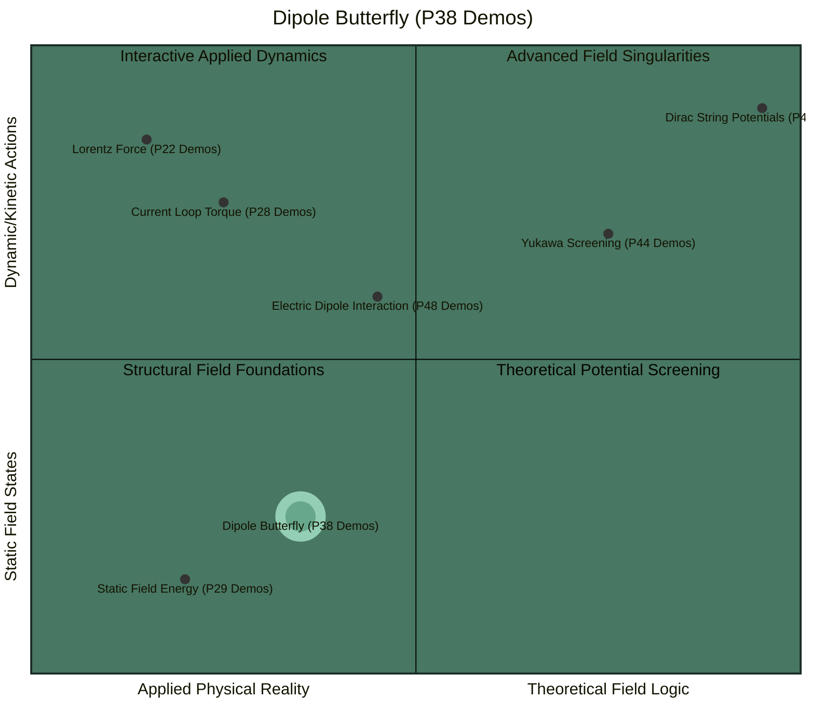
```mermaid
---
config:
  quadrantChart:
    chartWidth: 800
    chartHeight: 700
  themeVariables:
    quadrant1Fill: "#487763"
    quadrant2Fill: "#487763"
    quadrant3Fill: "#487763"
    quadrant4Fill: "#487763"
    quadrantInternalBorderStrokeFill: "#000"
    quadrantExternalBorderStrokeFill: "#192a24"
---
quadrantChart
    title Dipole Butterfly (P38 Demos)
    x-axis "Applied Physical Reality" --> "Theoretical Field Logic"
    y-axis "Static Field States" --> "Dynamic/Kinetic Actions"
    quadrant-1 "Advanced Field Singularities"
    quadrant-2 "Interactive Applied Dynamics"
    quadrant-3 "Structural Field Foundations"
    quadrant-4 "Theoretical Potential Screening"

    "Lorentz Force (P22 Demos)": [0.15, 0.85]
    "Current Loop Torque (P28 Demos)": [0.25, 0.75]
    "Static Field Energy (P29 Demos)": [0.20, 0.15]
    "Dipole Butterfly (P38 Demos)":::spot: [0.35, 0.25]
    "Electric Dipole Interaction (P48 Demos)": [0.45, 0.60]
    "Yukawa Screening (P44 Demos)": [0.75, 0.70]
    "Dirac String Potentials (P46 Demos)": [0.95, 0.90]
 
  classDef spot color: #67A88C, radius : 20, stroke-color: #94CEB4, stroke-width: 10px
```

## Singularity and Symmetry in Magnetic Dipole Vector Fields

> Quadrant 1 establishes the mathematical and physical foundations of electromagnetic fields, bisecting the study into physical interactions, such as the Lorentz Force and macro-loop torques, and the rigorous mathematical analysis of potentials. At the heart of this framework is the Magnetic Dipole Vector Potential, which serves as an "anchor" bridging macroscopic structures with abstract field theory. A critical component of this model is the application of a Dirac Delta correction at the origin to resolve mathematical singularities, ensuring the magnetic field remains divergence-free and physically consistent. This correction enables the "upward snap" of field lines through the core, visually proving flux conservation and completing the circuit required for a closed-loop system. While magnetic dipoles share a "butterfly" far-field geometry with electric dipoles, they are distinguished by their underlying mathematical generators—the curl of a vector potential versus the gradient of a scalar potential. Overall, this curriculum sequences these topics to track conceptual proficiency as it moves from foundational particle behavior to complex, localized point-source interactions.

- [Computing the Magnetic Field and its Curl from a Dipole Vector Potential](https://viadean.notion.site/Computing-the-Magnetic-Field-and-its-Curl-from-a-Dipole-Vector-Potential-2581ae7b9a3280fdab8ed775fb9fb3fb?source=copy_link)
- [Deliverables](https://payhip.com/b/Aozay)

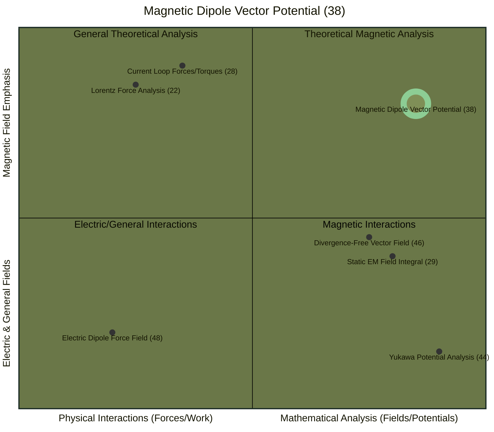
```mermaid
---
config:
  quadrantChart:
    chartWidth: 800
    chartHeight: 700
  themeVariables:
    quadrant1Fill: "#6A7748"
    quadrant2Fill: "#6A7748"
    quadrant3Fill: "#6A7748"
    quadrant4Fill: "#6A7748"
    quadrantInternalBorderStrokeFill: "#000"
    quadrantExternalBorderStrokeFill: "#192a24"
---
quadrantChart
    title Magnetic Dipole Vector Potential (38)
    x-axis "Physical Interactions (Forces/Work)" --> "Mathematical Analysis (Fields/Potentials)"
    y-axis "Electric & General Fields" --> "Magnetic Field Emphasis"
    quadrant-1 "Theoretical Magnetic Analysis"
    quadrant-2 "General Theoretical Analysis"
    quadrant-3 "Electric/General Interactions"
    quadrant-4 "Magnetic Interactions"
    "Lorentz Force Analysis (22)" : [0.25, 0.85]
    "Current Loop Forces/Torques (28)" : [0.35, 0.90]
    "Magnetic Dipole Vector Potential (38)":::spot : [0.85, 0.80]
    "Electric Dipole Force Field (48)" : [0.20, 0.20]
    "Yukawa Potential Analysis (44)" : [0.90, 0.15]
    "Divergence-Free Vector Field (46)" : [0.75, 0.45]
    "Static EM Field Integral (29)" : [0.80, 0.40]
    
 classDef spot color: #7F8F57, radius : 20, stroke-color: #8DCD94, stroke-width: 10px    
```

## The Invariant Geometry of the Generalized Curl Theorem

> The Generalized Curl Theorem is a foundational principle of integral calculus established as a topological identity where the "total twist" or surface integral is determined strictly by the values of a scalar function along the boundary $\Gamma$,. This property of topological independence ensures that the integral remains invariant even when calculated over complex, "jagged," or "rippled" surface geometries, provided the boundary curve remains fixed. Empirical tests using transcendental functions and stress-tested geometries confirm the theorem's numerical stability, demonstrating high-precision convergence with errors typically under 0.01%,,. Furthermore, the theorem operates via a "projection" principle, acting as a coordinate-dependent mapping that balances the line integral along specific axes with the localized "twists" of field gradients across the surface,,. Consequently, while the boundary serves as the absolute controller of the integral's value, the theorem provides a practical and robust mathematical bridge between a field's internal topological structure and its external boundary geometry.

- [Numerical Verification of the Generalized Curl Theorem](https://viadean.notion.site/Numerical-Verification-of-the-Generalized-Curl-Theorem-2e91ae7b9a3280369a24ee0798cd6173?source=copy_link)
- [Deliverables](https://payhip.com/b/GAy39)

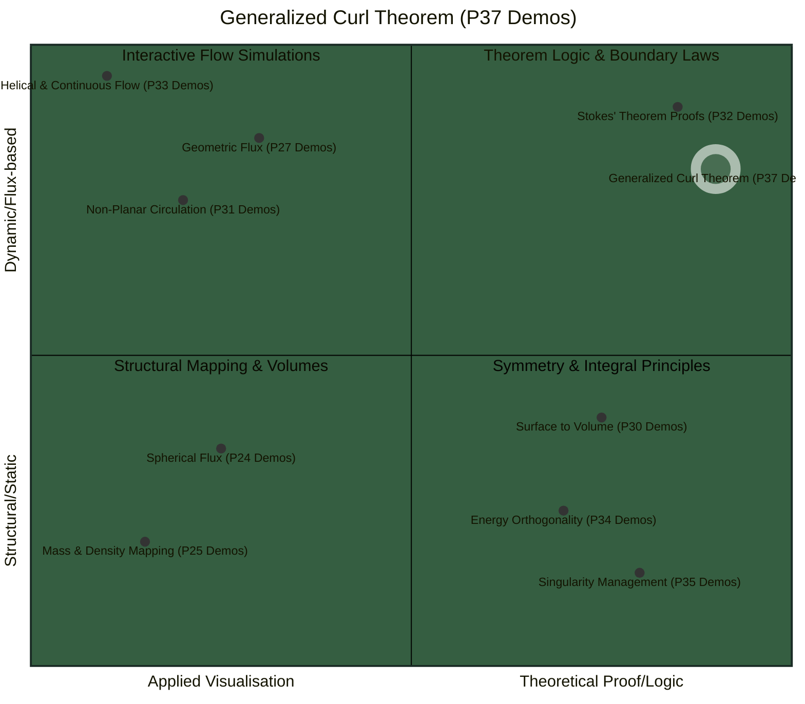
```mermaid
---
config:
  quadrantChart:
    chartWidth: 800
    chartHeight: 700
  themeVariables:
    quadrant1Fill: "#355E41"
    quadrant2Fill: "#355E41"
    quadrant3Fill: "#355E41"
    quadrant4Fill: "#355E41"
    quadrantInternalBorderStrokeFill: "#000"
    quadrantExternalBorderStrokeFill: "#192a24"
---
quadrantChart
    title Generalized Curl Theorem (P37 Demos)
    x-axis "Applied Visualisation" --> "Theoretical Proof/Logic"
    y-axis "Structural/Static" --> "Dynamic/Flux-based"
    quadrant-1 "Theorem Logic & Boundary Laws"
    quadrant-2 "Interactive Flow Simulations"
    quadrant-3 "Structural Mapping & Volumes"
    quadrant-4 "Symmetry & Integral Principles"

    "Spherical Flux (P24 Demos)": [0.25, 0.35]
    "Mass & Density Mapping (P25 Demos)": [0.15, 0.20]
    "Geometric Flux (P27 Demos)": [0.30, 0.85]
    "Surface to Volume (P30 Demos)": [0.75, 0.40]
    "Non-Planar Circulation (P31 Demos)": [0.20, 0.75]
    "Stokes' Theorem Proofs (P32 Demos)": [0.85, 0.90]
    "Helical & Continuous Flow (P33 Demos)": [0.10, 0.95]
    "Energy Orthogonality (P34 Demos)": [0.70, 0.25]
    "Singularity Management (P35 Demos)": [0.80, 0.15]
    "Generalized Curl Theorem (P37 Demos)":::spot: [0.90, 0.80]
    
  classDef spot color: #486D52, radius : 20, stroke-color: #AABCAE, stroke-width: 10px
```

## Bridging Boundaries: The Generalized Curl Theorem

> The Generalized Curl Theorem (37) serves as a cornerstone of your pedagogical curriculum, acting as the primary theoretical bridge between surface integrals and line integrals. Situated within the "Quadrant 2: Generalized Surface & Line Proofs" framework, this theorem formalizes the transition from discrete circulation calculations to a more comprehensive mathematical abstraction. By proving this generalized relationship, the curriculum moves beyond concrete geometric applications—such as those found in the flux-heavy calculations of Quadrants 3 and 4—to provide a rigorous, foundational understanding of how vector field behavior is intrinsically linked to boundary conditions.

- [Proving the Generalized Curl Theorem](https://viadean.notion.site/Proving-the-Generalized-Curl-Theorem-2581ae7b9a32806a8612f6c0bdb7d004?source=copy_link)
- [Deliverables](https://payhip.com/b/GAy39)

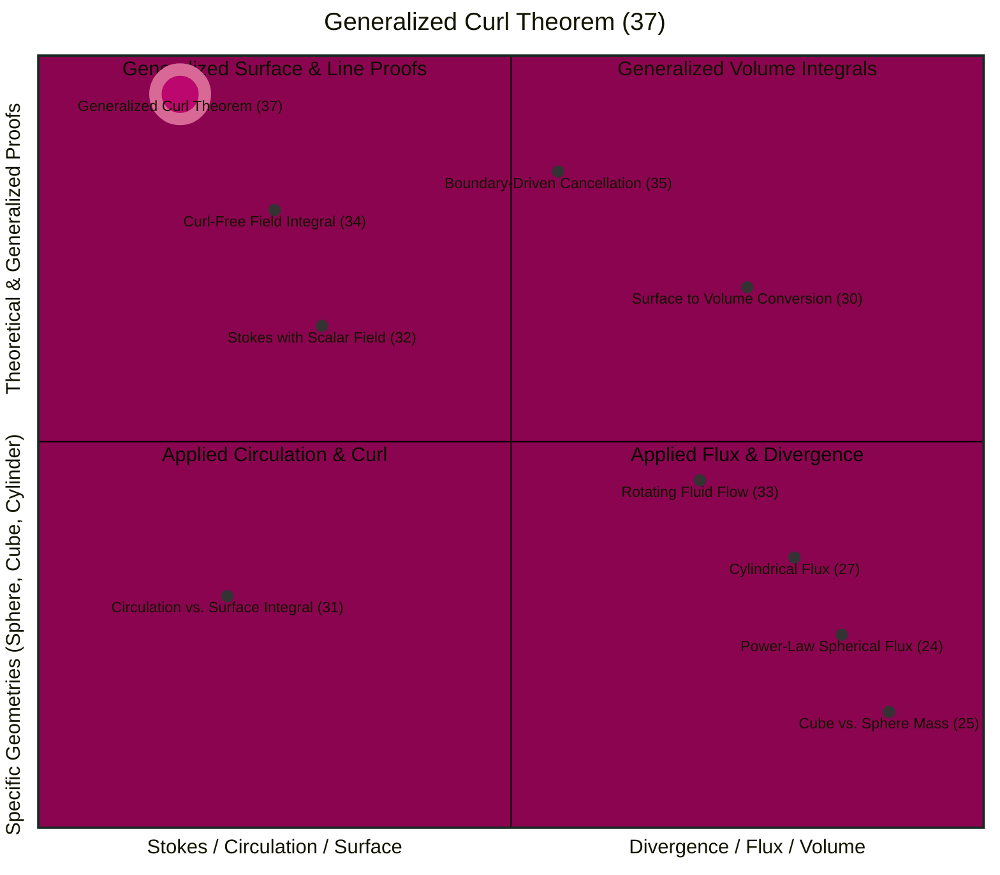
```mermaid
---
config:
  quadrantChart:
    chartWidth: 800
    chartHeight: 700
  themeVariables:
    quadrant1Fill: "#8B0450"
    quadrant2Fill: "#8B0450"
    quadrant3Fill: "#8B0450"
    quadrant4Fill: "#8B0450"
    quadrantInternalBorderStrokeFill: "#000"
    quadrantExternalBorderStrokeFill: "#192a24"
---
quadrantChart
    title Generalized Curl Theorem (37)
    x-axis "Stokes / Circulation / Surface" --> "Divergence / Flux / Volume"
    y-axis "Specific Geometries (Sphere, Cube, Cylinder)" --> "Theoretical & Generalized Proofs"
    quadrant-1 "Generalized Volume Integrals"
    quadrant-2 "Generalized Surface & Line Proofs"
    quadrant-3 "Applied Circulation & Curl"
    quadrant-4 "Applied Flux & Divergence"
    "Power-Law Spherical Flux (24)": [0.85, 0.25]
    "Cube vs. Sphere Mass (25)": [0.90, 0.15]
    "Cylindrical Flux (27)": [0.80, 0.35]
    "Surface to Volume Conversion (30)": [0.75, 0.70]
    "Circulation vs. Surface Integral (31)": [0.20, 0.30]
    "Stokes with Scalar Field (32)": [0.30, 0.65]
    "Rotating Fluid Flow (33)": [0.70, 0.45]
    "Curl-Free Field Integral (34)": [0.25, 0.80]
    "Boundary-Driven Cancellation (35)": [0.55, 0.85]
    "Generalized Curl Theorem (37)":::spot: [0.15, 0.95]

   classDef spot color: #BC076E, radius : 20, stroke-color: #D86997, stroke-width: 10px
```

## Uniqueness & Boundaries (P36/47 Demos)

### The Uniqueness Lock Master Syntax

> The "Uniqueness Lock" framework establishes that physical vector fields are not arbitrary but are mathematically deterministic "slaves" to their specific sources and boundary conditions, leaving them with zero degrees of freedom. This methodology utilizes null identities to prove that any deviation from the predicted field is impossible without non-existent energy sources, a concept visualized by a "difference field" that identically collapses to zero. A strategic advantage of this framework is decoupling, which allows complex fields to be decomposed into independent irrotational and solenoidal "mathematical DNA" to simplify problem-solving through a "divide and conquer" strategy. Furthermore, the framework posits that the unique state is the global energy minimum of the system, meaning that any physical "noise" naturally dissipates as the field relaxes into its stable, calculated configuration. Ultimately, this approach provides a scale-invariant "master syntax" for physics, proving that the uniqueness of vector fields is a mathematical necessity rather than a physical assumption.

- [Static Sources vs. Dynamic Boundaries-The Uniqueness Principle](https://viadean.notion.site/Static-Sources-vs-Dynamic-Boundaries-The-Uniqueness-Principle-2e81ae7b9a32806da5d5eeb0746f478d?source=copy_link)
- [Deliverables](https://payhip.com/b/tj6sD)

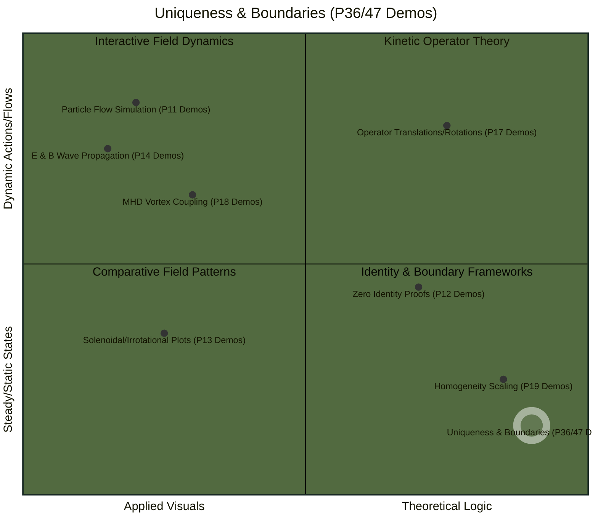
```mermaid
---
config:
  quadrantChart:
    chartWidth: 800
    chartHeight: 700
  themeVariables:
    quadrant1Fill: "#526a40"
    quadrant2Fill: "#526a40"
    quadrant3Fill: "#526a40"
    quadrant4Fill: "#526a40"
    quadrantInternalBorderStrokeFill: "#000"
    quadrantExternalBorderStrokeFill: "#192a24"
---
quadrantChart
    title Uniqueness & Boundaries (P36/47 Demos)
    x-axis "Applied Visuals" --> "Theoretical Logic"
    y-axis "Steady/Static States" --> "Dynamic Actions/Flows"
    quadrant-1 "Kinetic Operator Theory"
    quadrant-2 "Interactive Field Dynamics"
    quadrant-3 "Comparative Field Patterns"
    quadrant-4 "Identity & Boundary Frameworks"

    "Particle Flow Simulation (P11 Demos)": [0.20, 0.85]
    "E & B Wave Propagation (P14 Demos)": [0.15, 0.75]
    "MHD Vortex Coupling (P18 Demos)": [0.30, 0.65]
    "Operator Translations/Rotations (P17 Demos)": [0.75, 0.80]
    "Solenoidal/Irrotational Plots (P13 Demos)": [0.25, 0.35]
    "Zero Identity Proofs (P12 Demos)": [0.70, 0.45]
    "Homogeneity Scaling (P19 Demos)": [0.85, 0.25]
    "Uniqueness & Boundaries (P36/47 Demos)":::spot: [0.90, 0.15]
   
   classDef spot color: #627852, radius : 20, stroke-color: #A5B29C, stroke-width: 10px
```

## Quadrant 4: Energy Orthogonality (P34 Demos)

> P34 Demos: The Ideal Helmholtz Case and the Coupled Boundary Case.

- [Integral of a Curl-Free Vector Field](https://viadean.notion.site/Integral-of-a-Curl-Free-Vector-Field-CVF-2571ae7b9a3280d8a368c3ffac5d0b26?source=copy_link)
- [Deliverables](https://payhip.com/b/tgrVH)

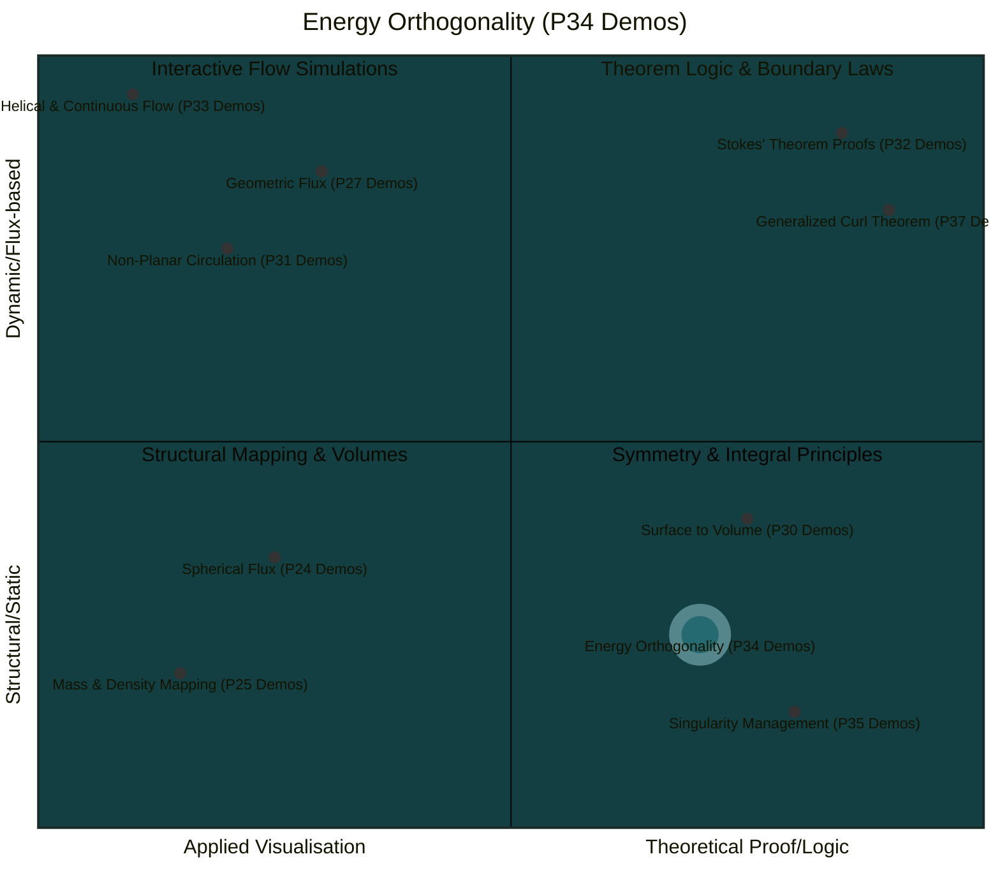
```mermaid
---
config:
  quadrantChart:
    chartWidth: 800
    chartHeight: 700
  themeVariables:
    quadrant1Fill: "#133f43"
    quadrant2Fill: "#133f43"
    quadrant3Fill: "#133f43"
    quadrant4Fill: "#133f43"
    quadrantInternalBorderStrokeFill: "#000"
    quadrantExternalBorderStrokeFill: "#192a24"
---
quadrantChart
    title Energy Orthogonality (P34 Demos)
    x-axis "Applied Visualisation" --> "Theoretical Proof/Logic"
    y-axis "Structural/Static" --> "Dynamic/Flux-based"
    quadrant-1 "Theorem Logic & Boundary Laws"
    quadrant-2 "Interactive Flow Simulations"
    quadrant-3 "Structural Mapping & Volumes"
    quadrant-4 "Symmetry & Integral Principles"

    "Spherical Flux (P24 Demos)": [0.25, 0.35]
    "Mass & Density Mapping (P25 Demos)": [0.15, 0.20]
    "Geometric Flux (P27 Demos)": [0.30, 0.85]
    "Surface to Volume (P30 Demos)": [0.75, 0.40]
    "Non-Planar Circulation (P31 Demos)": [0.20, 0.75]
    "Stokes' Theorem Proofs (P32 Demos)": [0.85, 0.90]
    "Helical & Continuous Flow (P33 Demos)": [0.10, 0.95]
    "Energy Orthogonality (P34 Demos)":::spot: [0.70, 0.25]
    "Singularity Management (P35 Demos)": [0.80, 0.15]
    "Generalized Curl Theorem (P37 Demos)": [0.90, 0.80]
    
 classDef spot color: #256a70, radius : 20, stroke-color: #54868b, stroke-width: 10px
```

---

## Quadrant 2: Curl-Free Field Integral (34)

> Curl-Free Field Integral (34): Integral of a Curl-Free Vector Field.

- [Integral of a Curl-Free Vector Field](https://viadean.notion.site/Integral-of-a-Curl-Free-Vector-Field-CVF-2571ae7b9a3280d8a368c3ffac5d0b26?source=copy_link)
- [Deliverables](https://payhip.com/b/tgrVH)

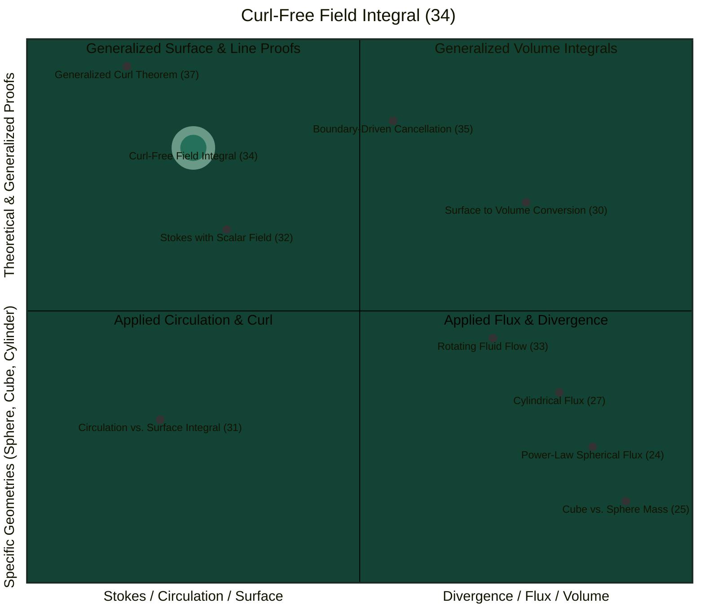
```mermaid
---
config:
  quadrantChart:
    chartWidth: 800
    chartHeight: 700
  themeVariables:
    quadrant1Fill: "#134335"
    quadrant2Fill: "#134335"
    quadrant3Fill: "#134335"
    quadrant4Fill: "#134335"
    quadrantInternalBorderStrokeFill: "#000"
    quadrantExternalBorderStrokeFill: "#192a24"
---
quadrantChart
    title Curl-Free Field Integral (34)
    x-axis "Stokes / Circulation / Surface" --> "Divergence / Flux / Volume"
    y-axis "Specific Geometries (Sphere, Cube, Cylinder)" --> "Theoretical & Generalized Proofs"
    quadrant-1 "Generalized Volume Integrals"
    quadrant-2 "Generalized Surface & Line Proofs"
    quadrant-3 "Applied Circulation & Curl"
    quadrant-4 "Applied Flux & Divergence"
    "Power-Law Spherical Flux (24)": [0.85, 0.25]
    "Cube vs. Sphere Mass (25)": [0.90, 0.15]
    "Cylindrical Flux (27)": [0.80, 0.35]
    "Surface to Volume Conversion (30)": [0.75, 0.70]
    "Circulation vs. Surface Integral (31)": [0.20, 0.30]
    "Stokes with Scalar Field (32)": [0.30, 0.65]
    "Rotating Fluid Flow (33)": [0.70, 0.45]
    "Curl-Free Field Integral (34)":::spot: [0.25, 0.80]
    "Boundary-Driven Cancellation (35)": [0.55, 0.85]
    "Generalized Curl Theorem (37)": [0.15, 0.95]

    classDef spot color: #25705a, radius : 20, stroke-color: #6a9988, stroke-width: 10px
```

---

## Quadrant 4: Rotating Fluid Flow (33)

> - Rotating Fluid Flow (33): Verification of the Divergence Theorem for a Rotating Fluid Flow. 
> - Quadrant 4 is the most "hands-on" section, applying the **Divergence Theorem** to calculate mass and flux through specific shapes like spheres (24, 25), cubes (25), and cylinders (27), as well as physical systems like rotating fluids (33).

- [Verification of the Divergence Theorem for a Rotating Fluid Flow](https://viadean.notion.site/Verification-of-the-Divergence-Theorem-for-a-Rotating-Fluid-Flow-DT-RFF-2571ae7b9a328091ad62deba6f8d1715)
- [Deliverables](https://payhip.com/b/Q9Zjy)

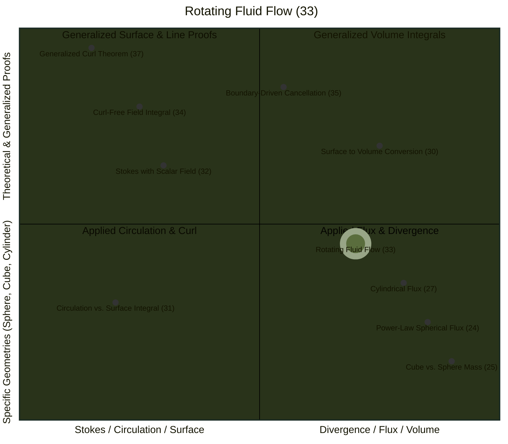
```mermaid
---
config:
  quadrantChart:
    chartWidth: 800
    chartHeight: 700
  themeVariables:
    quadrant1Fill: "#29331a"
    quadrant2Fill: "#29331a"
    quadrant3Fill: "#29331a"
    quadrant4Fill: "#29331a"
    quadrantInternalBorderStrokeFill: "#000"
    quadrantExternalBorderStrokeFill: "#192a24"
---
quadrantChart
    title Rotating Fluid Flow (33)
    x-axis "Stokes / Circulation / Surface" --> "Divergence / Flux / Volume"
    y-axis "Specific Geometries (Sphere, Cube, Cylinder)" --> "Theoretical & Generalized Proofs"
    quadrant-1 "Generalized Volume Integrals"
    quadrant-2 "Generalized Surface & Line Proofs"
    quadrant-3 "Applied Circulation & Curl"
    quadrant-4 "Applied Flux & Divergence"
    "Power-Law Spherical Flux (24)": [0.85, 0.25]
    "Cube vs. Sphere Mass (25)": [0.90, 0.15]
    "Cylindrical Flux (27)": [0.80, 0.35]
    "Surface to Volume Conversion (30)": [0.75, 0.70]
    "Circulation vs. Surface Integral (31)": [0.20, 0.30]
    "Stokes with Scalar Field (32)": [0.30, 0.65]
    "Rotating Fluid Flow (33)":::spot: [0.70, 0.45]
    "Curl-Free Field Integral (34)": [0.25, 0.80]
    "Boundary-Driven Cancellation (35)": [0.55, 0.85]
    "Generalized Curl Theorem (37)": [0.15, 0.95]

    classDef spot color: #5a6d3d, radius : 20, stroke-color: #98a587, stroke-width: 10px
```

---

## Quadrant 2: Helical & Continuous Flow (P33 Demos)

> - Helical & Continuous Flow (P33 Demos): A Unified Computational Study of Flux Continuity and Vorticity
> - **Helical and Continuous Flow** utilise **paddlewheel indicators** to distinguish between rigid-body rotation and irrotational vortices. **Geometric Flux** and **Non-Planar Circulation** provide interactive demos of mass flux and 3D "saddle" loops.

- [Verification of the Divergence Theorem for a Rotating Fluid Flow](https://viadean.notion.site/Verification-of-the-Divergence-Theorem-for-a-Rotating-Fluid-Flow-DT-RFF-2571ae7b9a328091ad62deba6f8d1715)
- [Deliverables](https://payhip.com/b/Q9Zjy)

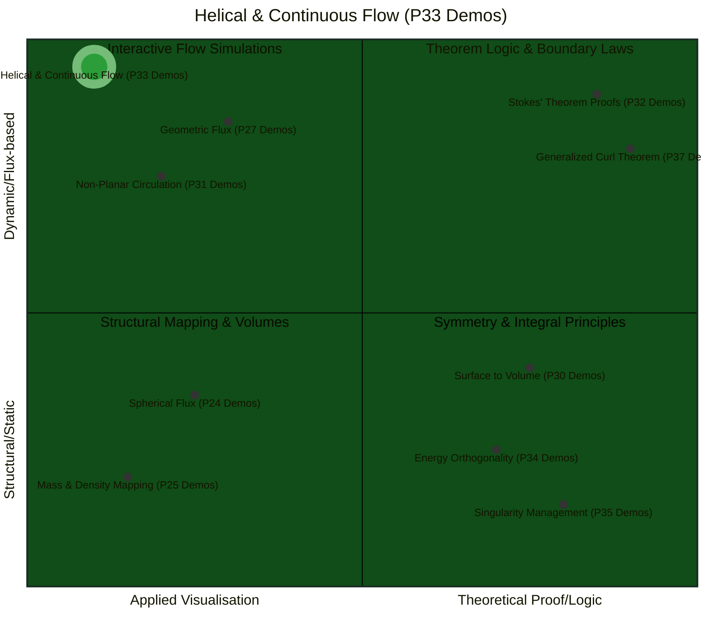
```mermaid
---
config:
  quadrantChart:
    chartWidth: 800
    chartHeight: 700
  themeVariables:
    quadrant1Fill: "#104d18"
    quadrant2Fill: "#104d18"
    quadrant3Fill: "#104d18"
    quadrant4Fill: "#104d18"
    quadrantInternalBorderStrokeFill: "#000"
    quadrantExternalBorderStrokeFill: "#192a24"
---
quadrantChart
    title Helical & Continuous Flow (P33 Demos)
    x-axis "Applied Visualisation" --> "Theoretical Proof/Logic"
    y-axis "Structural/Static" --> "Dynamic/Flux-based"
    quadrant-1 "Theorem Logic & Boundary Laws"
    quadrant-2 "Interactive Flow Simulations"
    quadrant-3 "Structural Mapping & Volumes"
    quadrant-4 "Symmetry & Integral Principles"

    "Spherical Flux (P24 Demos)": [0.25, 0.35]
    "Mass & Density Mapping (P25 Demos)": [0.15, 0.20]
    "Geometric Flux (P27 Demos)": [0.30, 0.85]
    "Surface to Volume (P30 Demos)": [0.75, 0.40]
    "Non-Planar Circulation (P31 Demos)": [0.20, 0.75]
    "Stokes' Theorem Proofs (P32 Demos)": [0.85, 0.90]
    "Helical & Continuous Flow (P33 Demos)":::spot: [0.10, 0.95]
    "Energy Orthogonality (P34 Demos)": [0.70, 0.25]
    "Singularity Management (P35 Demos)": [0.80, 0.15]
    "Generalized Curl Theorem (P37 Demos)": [0.90, 0.80]
 
classDef spot color: #2b9e3a, radius : 20, stroke-color: #75bc78, stroke-width: 10px
```

## Quadrant 2: Stokes with Scalar Field (P32)

> This proof is that the integral vanishes because the integrand can be rewritten as the curl of a vector field ($\phi \nabla \psi$). This allows the application of Stokes' Theorem, shifting the focus from the entire surface S to its boundary C. Since $\phi$ is constant on that boundary, it acts as a uniform scaling factor that can be moved outside the integral, leaving only the circulation of a gradient field ($$\nabla \psi$) around a closed loop. Because gradient fields are conservative, their path integral around any closed loop is identically zero, regardless of the complexity of the surface or the specific nature of the scalar fields involved.

- [Using Stokes' Theorem with a Constant Scalar Field](https://viadean.notion.site/Using-Stokes-Theorem-with-a-Constant-Scalar-Field-ST-CSF-2561ae7b9a328056bcc5dc2e105a1c35?source=copy_link)
- [Deliverables](https://payhip.com/b/io8GT)

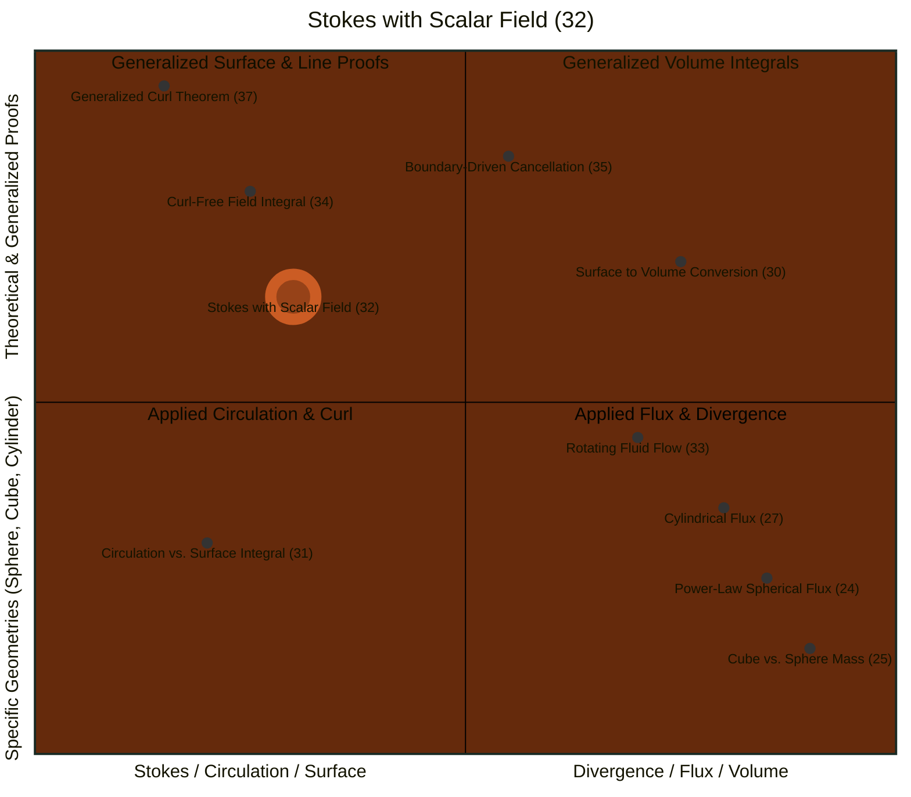
```mermaid
---
config:
  quadrantChart:
    chartWidth: 800
    chartHeight: 700
  themeVariables:
    quadrant1Fill: "#652a0c"
    quadrant2Fill: "#652a0c"
    quadrant3Fill: "#652a0c"
    quadrant4Fill: "#652a0c"
    quadrantInternalBorderStrokeFill: "#000"
    quadrantExternalBorderStrokeFill: "#192a24"
---
quadrantChart
    title Stokes with Scalar Field (32)
    x-axis "Stokes / Circulation / Surface" --> "Divergence / Flux / Volume"
    y-axis "Specific Geometries (Sphere, Cube, Cylinder)" --> "Theoretical & Generalized Proofs"
    quadrant-1 "Generalized Volume Integrals"
    quadrant-2 "Generalized Surface & Line Proofs"
    quadrant-3 "Applied Circulation & Curl"
    quadrant-4 "Applied Flux & Divergence"
    "Power-Law Spherical Flux (24)": [0.85, 0.25]
    "Cube vs. Sphere Mass (25)": [0.90, 0.15]
    "Cylindrical Flux (27)": [0.80, 0.35]
    "Surface to Volume Conversion (30)": [0.75, 0.70]
    "Circulation vs. Surface Integral (31)": [0.20, 0.30]
    "Stokes with Scalar Field (32)":::spot: [0.30, 0.65]
    "Rotating Fluid Flow (33)": [0.70, 0.45]
    "Curl-Free Field Integral (34)": [0.25, 0.80]
    "Boundary-Driven Cancellation (35)": [0.55, 0.85]
    "Generalized Curl Theorem (37)": [0.15, 0.95]

    classDef spot color: #964218, radius : 20, stroke-color: #cb5c24, stroke-width: 10px
```

## Quadrant 1: Stokes' Theorem Proofs (P32 Demos)

> - Stokes' Theorem Proofs (P32 Demos): Conservative Fields-The Zero Line Integral and Work Conservation.
> - This quadrant contains the foundational proofs of integral calculus. Stokes' Theorem Proofs establish how work cancellation occurs in conservative forces, while the Generalized Curl Theorem provides the theoretical proof of topological independence, showing that results remain constant whether calculated over simple hemispheres or complex "rippled bowls".

- [Using Stokes' Theorem with a Constant Scalar Field](https://viadean.notion.site/Using-Stokes-Theorem-with-a-Constant-Scalar-Field-ST-CSF-2561ae7b9a328056bcc5dc2e105a1c35?source=copy_link)
- [Deliverables](https://payhip.com/b/io8GT)

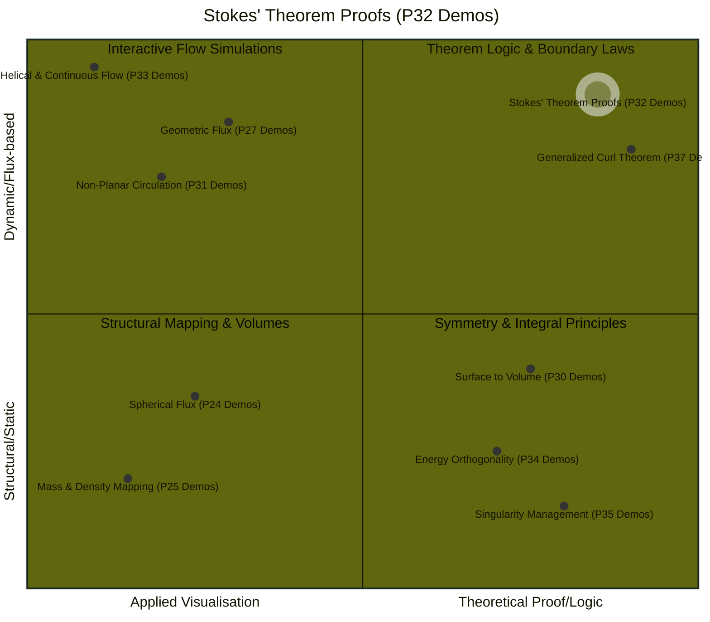
```mermaid
---
config:
  quadrantChart:
    chartWidth: 800
    chartHeight: 700
  themeVariables:
    quadrant1Fill: "#60660d"
    quadrant2Fill: "#60660d"
    quadrant3Fill: "#60660d"
    quadrant4Fill: "#60660d"
    quadrantInternalBorderStrokeFill: "#000"
    quadrantExternalBorderStrokeFill: "#192a24"
---
quadrantChart
    title Stokes' Theorem Proofs (P32 Demos)
    x-axis "Applied Visualisation" --> "Theoretical Proof/Logic"
    y-axis "Structural/Static" --> "Dynamic/Flux-based"
    quadrant-1 "Theorem Logic & Boundary Laws"
    quadrant-2 "Interactive Flow Simulations"
    quadrant-3 "Structural Mapping & Volumes"
    quadrant-4 "Symmetry & Integral Principles"

    "Spherical Flux (P24 Demos)": [0.25, 0.35]
    "Mass & Density Mapping (P25 Demos)": [0.15, 0.20]
    "Geometric Flux (P27 Demos)": [0.30, 0.85]
    "Surface to Volume (P30 Demos)": [0.75, 0.40]
    "Non-Planar Circulation (P31 Demos)": [0.20, 0.75]
    "Stokes' Theorem Proofs (P32 Demos)":::spot: [0.85, 0.90]
    "Helical & Continuous Flow (P33 Demos)": [0.10, 0.95]
    "Energy Orthogonality (P34 Demos)": [0.70, 0.25]
    "Singularity Management (P35 Demos)": [0.80, 0.15]
    "Generalized Curl Theorem (P37 Demos)": [0.90, 0.80]
    
classDef spot color: #7d8347, radius : 20, stroke-color: #abb08b, stroke-width: 10px
```

