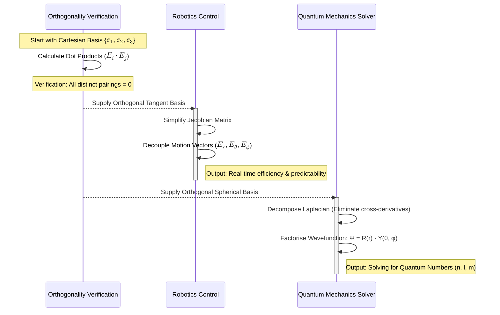
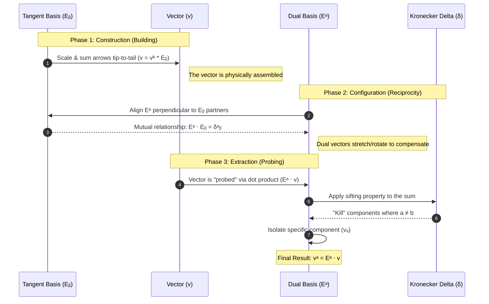
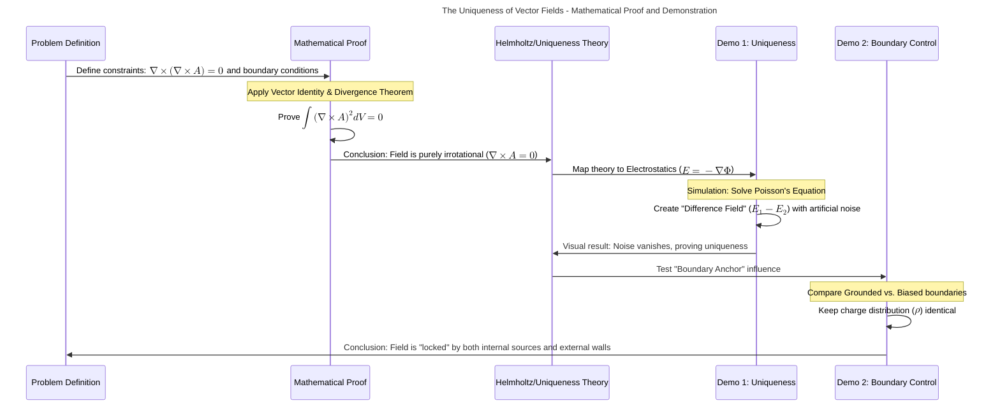
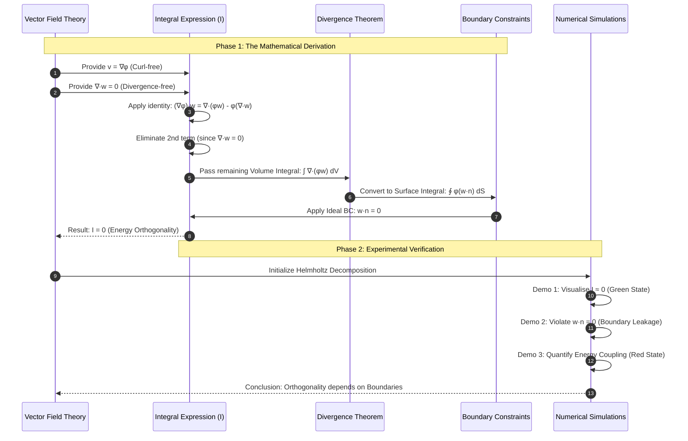
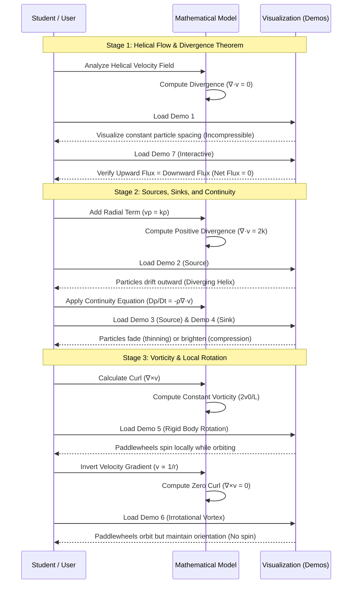
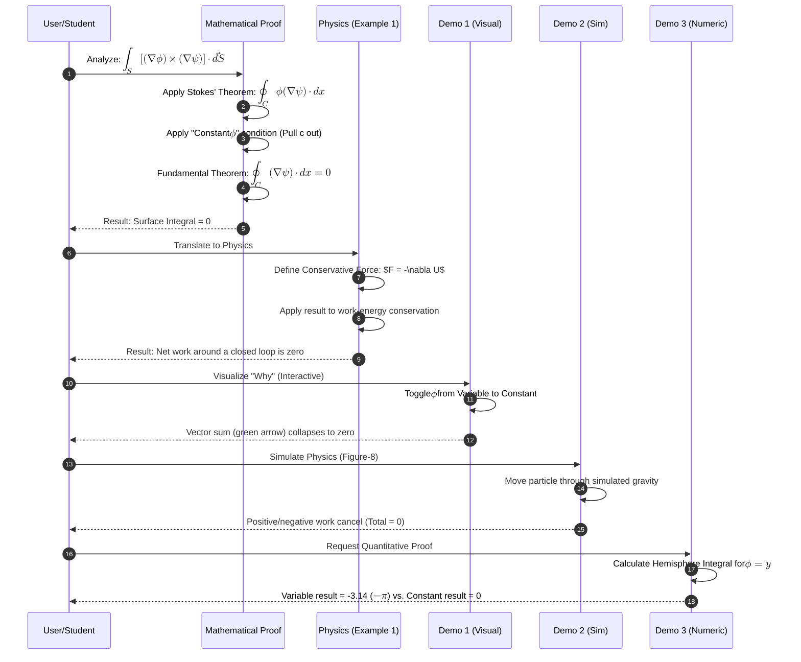

# Sequence Diagram

[E-Product Hub](https://payhip.com/CDP)

---

## Foundations and Applications of the Orthogonality Principle

> The orthogonality principle serves as a foundational mathematical framework that begins by confirming the dot product of any two distinct basis vectors is zero, effectively establishing the "un-mixing" of physical dimensions. In the field of robotics, this verification is used to simplify the Jacobian matrix into a sparse or diagonal structure, which drastically reduces mathematical overhead to enable real-time computer control while preventing unintended "parasitic" movements across different axes. For quantum mechanics, this same orthogonality ensures the Laplacian operator functions without cross-derivative terms, allowing for the separation of variables in the wavefunction to successfully derive quantum numbers. Beyond these core areas, the principle is applied to computer graphics through spherical harmonics, where the independence of orthogonal basis functions allows for massive data compression and zero cross-talk between lighting layers, permitting GPUs to render complex, realistic environments at high speeds.

- [Verification of Orthogonal Tangent Vector Bases in Cylindrical and Spherical Coordinates](https://viadean.notion.site/Verification-of-Orthogonal-Tangent-Vector-Bases-in-Cylindrical-and-Spherical-Coordinates-2591ae7b9a3280e0a458cba31d94b7f0?source=copy_link)
- [Deliverables](https://payhip.com/b/axrmQ)

## Geometry of Vector Measurements on Curved Surfaces

> The process of measuring vectors relies on a specialized relationship between physical building blocks and a corresponding measurement system that acts as a mathematical filter. For these measurements to remain accurate, the measurement tools must dynamically rotate and stretch to compensate for any distortions in the physical frame, a mechanism that ensures the resulting values stay constant despite physical changes. On complex, curved surfaces, these localized frames of reference are not static; they continuously tilt and twist as one moves across the surface, highlighting that a perfectly smooth arrangement of these frames across a sphere is impossible without creating points of collapse. This localized approach is highly efficient for computer graphics, where converting external data into an object's internal frame allows for simplified calculations. By treating the object's surface as a fixed reference point where the vertical direction is always constant, the system can calculate detailed visual effects like light and texture without needing to track every movement relative to the larger world.

- [Proving Contravariant Vector Components Using the Dual Basis](https://viadean.notion.site/Proving-Contravariant-Vector-Components-Using-the-Dual-Basis-2581ae7b9a3280f8a2eef1bd9b7ac8b4?source=copy_link)
- [Deliverables](https://payhip.com/b/QktBm)

## Resolving Singularity in Magnetic Dipole Models

> Theoretical models of magnetic dipoles often encounter a problem at their exact center where the field appears to break or become infinite, violating the physical requirement that magnetic field lines must form continuous, closed loops. To resolve this, a mathematical correction is applied to account for the field specifically at the origin, which ensures the total flow of magnetic flux remains balanced and consistent with the fundamental laws of magnetism. This refinement effectively transitions the model from an abstract point to a more realistic tiny current loop, allowing field lines to "snap" upward through the core and complete their circuit. In the realm of quantum mechanics, this same correction—known as the Fermi contact interaction—is vital for understanding how electrons in certain orbitals interact directly with the nucleus. This localized magnetic coupling shifts and splits atomic energy levels, resulting in observable phenomena like the twenty-one centimeter radiation emitted by hydrogen, which would be impossible to predict without accounting for the intense magnetic field at the very heart of the atom.

- [Computing the Magnetic Field and its Curl from a Dipole Vector Potential](https://viadean.notion.site/Computing-the-Magnetic-Field-and-its-Curl-from-a-Dipole-Vector-Potential-2581ae7b9a3280fdab8ed775fb9fb3fb?source=copy_link)
- [Deliverables](https://payhip.com/b/Aozay)

```mermaid

sequenceDiagram
    autonumber
    participant Math as Mathematical Model
    participant Viz as Visualization (Python Script)
    participant Phys as Physical Constraints (Gauss's Law)

    Math->>Math: Define Vector Potential A for r > 0
    Math->>Viz: Provide B-field formula (Butterfly pattern)
    Note over Viz: Animation 1: Point Dipole
    Viz-->>Phys: Result: Discontinuous lines at r = 0
    Phys->>Math: Alert: Non-zero divergence at origin ($$\nabla\cdot B \neq 0$$)
    
    rect rgb(25, 84, 92)
        Note right of Math: Addressing the Singularity
        Math->>Math: Add Dirac Delta term [$$\frac{2\mu_0}{3} \vec{m} \delta^3(\vec{x})$$]
        Math->>Math: Transition to Physical Loop Model (radius $$\ a$$)
    end

    Math->>Viz: Provide updated model (Physical Loop)
    Note over Viz: Animation 2: "Upward Snap"
    Viz->>Phys: Result: Closed loops and continuous flow
    Phys-->>Math: Requirement Satisfied: $$\ \nabla \times \vec{B}=0\ $$ globally
```

---

## The Uniqueness of Vector Fields: Mathematical Proof and Demonstration

> The architectural synthesis of the uniqueness lock transforms a linear sequence of mathematical proofs into a functional system where theoretical theorems and visual simulations converge to "lock" a vector field into a singular, unchangeable state. This process begins with a Mathematical Proof Engine that utilizes vector identities and the Divergence Theorem to establish a zero-rotational state, which is then refined by the Helmholtz Framework to eliminate any solenoidal components. A Python Simulation Engine provides visual validation of this internal consistency by demonstrating the collapse of "difference fields" and illustrating how the field is fundamentally constrained by its environmental boundary values. Ultimately, the system culminates in the "Uniqueness Lock," a final synthesis where the interplay of fixed internal sources and external logic ensures that the vector field remains a solved puzzle with no room for variation.

- [The Vanishing Curl Integral](https://viadean.notion.site/The-Vanishing-Curl-Integral-2581ae7b9a3280dc9fa6d8e97bba66e1?source=copy_link)
- [Deliverables](https://payhip.com/b/tj6sD)

## Derivation and Verification of Energy Orthogonality

> This sequence diagram outlines the logical flow of the mathematical derivation provided in the sources, followed by its verification through the three demonstrations.

- [Integral of a Curl-Free Vector Field](https://viadean.notion.site/Integral-of-a-Curl-Free-Vector-Field-CVF-2571ae7b9a3280d8a368c3ffac5d0b26?source=copy_link)
- [Deliverables](https://payhip.com/b/tgrVH)

---

## Pedagogical Visualization of Vector Calculus and Fluid Dynamics

> The sequence diagram illustrates the pedagogical progression of the demonstrations, moving from basic helical flow visualization to the complex physical analysis of divergence, mass conservation, and vorticity.

- [Verification of the Divergence Theorem for a Rotating Fluid Flow](https://viadean.notion.site/Verification-of-the-Divergence-Theorem-for-a-Rotating-Fluid-Flow-DT-RFF-2571ae7b9a328091ad62deba6f8d1715)
- [Deliverables](https://payhip.com/b/Q9Zjy)

## Vector Calculus Proofs and Physical Conservative Field Applications

> This sequence diagram illustrates the logical progression from the initial vector calculus proof to its physical applications and the various interactive demonstrations used to validate the results.

- Deliverables: https://payhip.com/b/io8GT

