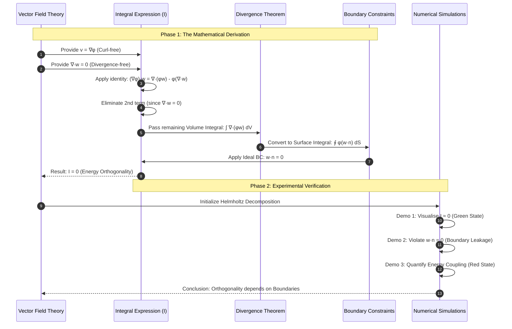
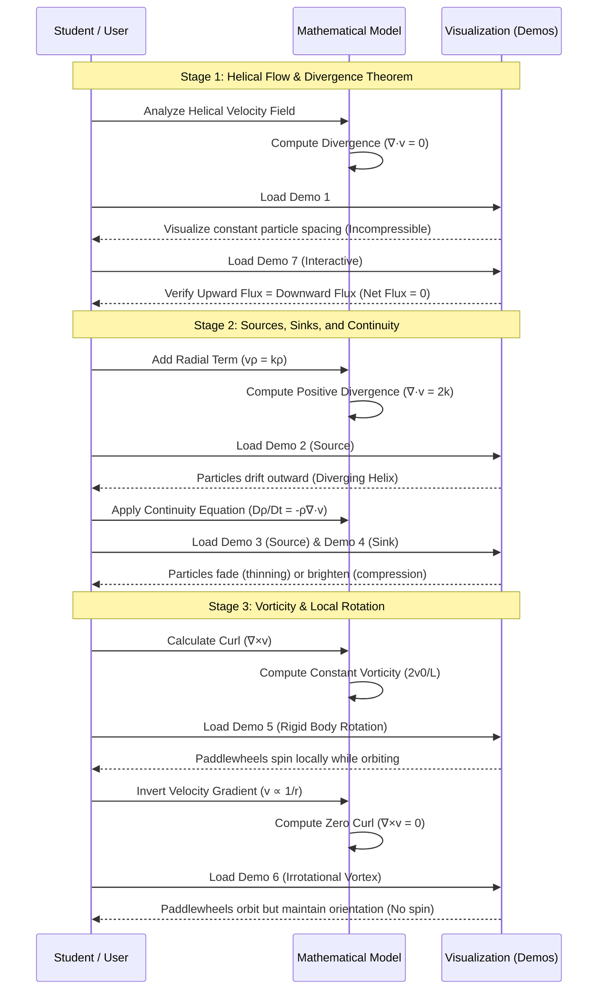
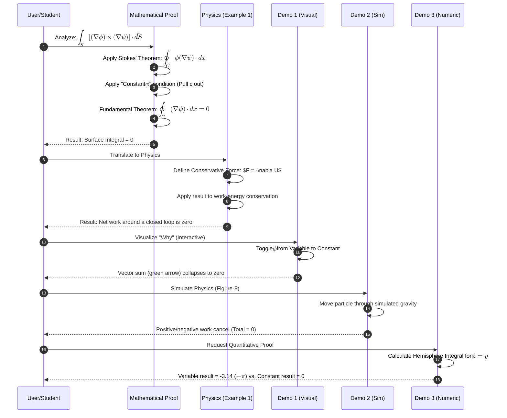

# Sequence Diagram

[E-Product Hub](https://payhip.com/CDP)

---

## Derivation and Verification of Energy Orthogonality

> This sequence diagram outlines the logical flow of the mathematical derivation provided in the sources, followed by its verification through the three demonstrations.

- [Integral of a Curl-Free Vector Field](https://viadean.notion.site/Integral-of-a-Curl-Free-Vector-Field-CVF-2571ae7b9a3280d8a368c3ffac5d0b26?source=copy_link)
- [Deliverables](https://payhip.com/b/tgrVH)

<svg xmlns="http://www.w3.org/2000/svg" xmlns:xlink="http://www.w3.org/1999/xlink" contentStyleType="text/css" data-diagram-type="DESCRIPTION" height="370px" preserveAspectRatio="none" style="width:517px;height:370px;background:#FFFFFF;" version="1.1" viewBox="0 0 517 370" width="517px" zoomAndPan="magnify"><defs/><g><!--cluster Helmholtz Orthogonality System--><g class="cluster" data-qualified-name="Helmholtz Orthogonality System" data-source-line="26" id="ent0003"><rect fill="#ADD8E6" height="220" rx="2.5" ry="2.5" style="stroke:#00008B;stroke-width:1;" width="504" x="7" y="144.5"/><text fill="#000000" font-family="sans-serif" font-size="14" font-weight="bold" lengthAdjust="spacing" textLength="257.4414" x="130.2793" y="159.4951">Helmholtz Orthogonality System</text></g><!--entity kernel--><g class="entity" data-qualified-name="Helmholtz Orthogonality System.kernel" data-source-line="27" id="ent0004"><polygon fill="#90EE90" points="22.5,312.5,32.5,302.5,207.2715,302.5,207.2715,338.7969,197.2715,348.7969,22.5,348.7969,22.5,312.5" style="stroke:#006400;stroke-width:0.5;"/><line style="stroke:#006400;stroke-width:0.5;" x1="197.2715" x2="207.2715" y1="312.5" y2="302.5"/><line style="stroke:#006400;stroke-width:0.5;" x1="22.5" x2="197.2715" y1="312.5" y2="312.5"/><line style="stroke:#006400;stroke-width:0.5;" x1="197.2715" x2="197.2715" y1="312.5" y2="348.7969"/><text fill="#000000" font-family="sans-serif" font-size="14" lengthAdjust="spacing" textLength="144.7715" x="37.5" y="335.4951">Mathematical Kernel</text></g><!--entity engine--><g class="entity" data-qualified-name="Helmholtz Orthogonality System.engine" data-source-line="28" id="ent0005"><polygon fill="#90EE90" points="146.5,189.5,156.5,179.5,313.5049,179.5,313.5049,215.7969,303.5049,225.7969,146.5,225.7969,146.5,189.5" style="stroke:#006400;stroke-width:0.5;"/><line style="stroke:#006400;stroke-width:0.5;" x1="303.5049" x2="313.5049" y1="189.5" y2="179.5"/><line style="stroke:#006400;stroke-width:0.5;" x1="146.5" x2="303.5049" y1="189.5" y2="189.5"/><line style="stroke:#006400;stroke-width:0.5;" x1="303.5049" x2="303.5049" y1="189.5" y2="225.7969"/><text fill="#000000" font-family="sans-serif" font-size="14" lengthAdjust="spacing" textLength="127.0049" x="161.5" y="212.4951">Simulation Engine</text></g><!--entity config--><g class="entity" data-qualified-name="Helmholtz Orthogonality System.config" data-source-line="29" id="ent0006"><path d="M265.5,313 C265.5,303 333.896,303 333.896,303 C333.896,303 402.292,303 402.292,313 L402.292,338.2969 C402.292,348.2969 333.896,348.2969 333.896,348.2969 C333.896,348.2969 265.5,348.2969 265.5,338.2969 L265.5,313" fill="#F08080" style="stroke:#8B0000;stroke-width:0.5;"/><path d="M265.5,313 C265.5,323 333.896,323 333.896,323 C333.896,323 402.292,323 402.292,313" fill="none" style="stroke:#8B0000;stroke-width:0.5;"/><text fill="#000000" font-family="sans-serif" font-size="14" lengthAdjust="spacing" textLength="116.792" x="275.5" y="339.9951">Boundary Config</text></g><!--entity user--><g class="entity" data-qualified-name="user" data-source-line="24" id="ent0002"><ellipse cx="229.7612" cy="14" fill="#FFD700" rx="8" ry="8" style="stroke:#181818;stroke-width:0.5;"/><path d="M229.7612,22 L229.7612,49 M216.7612,30 L242.7612,30 M229.7612,49 L216.7612,64 M229.7612,49 L242.7612,64" fill="none" style="stroke:#181818;stroke-width:0.5;"/><text fill="#000000" font-family="sans-serif" font-size="14" lengthAdjust="spacing" textLength="79.5225" x="190" y="78.4951">Researcher</text></g><!--link user to engine--><g class="link" data-entity-1="ent0002" data-entity-2="ent0005" data-link-type="dependency" data-source-line="33" id="lnk7"><path d="M230,81.71 C230,111.99 230,147.74 230,173.11" fill="none" id="user-to-engine" style="stroke:#0000FF;stroke-width:1;"/><polygon fill="#0000FF" points="230,179.11,234,170.11,230,174.11,226,170.11,230,179.11" style="stroke:#0000FF;stroke-width:1;"/><text fill="#000000" font-family="sans-serif" font-size="13" lengthAdjust="spacing" textLength="70.0654" x="231" y="124.5669">Configures</text></g><!--link engine to kernel--><g class="link" data-entity-1="ent0005" data-entity-2="ent0004" data-link-type="dependency" data-source-line="34" id="lnk8"><path d="M146.38,213.8 C121.25,221.25 96.31,233.94 81,255.5 C70.64,270.09 76.6024,283.6977 88.2924,297.7477" fill="none" id="engine-to-kernel" style="stroke:#008000;stroke-width:1;"/><polygon fill="#008000" points="92.13,302.36,89.4485,292.8832,88.932,298.5164,83.2988,297.9999,92.13,302.36" style="stroke:#008000;stroke-width:1;"/><text fill="#000000" font-family="sans-serif" font-size="13" lengthAdjust="spacing" textLength="130.0635" x="82" y="268.5669">Requests derivation</text></g><!--link engine to config--><g class="link" data-entity-1="ent0005" data-entity-2="ent0006" data-link-type="dependency" data-source-line="35" id="lnk9"><path d="M222.94,225.66 C219.74,240.07 218.35,258.68 227,272.5 C235.98,286.86 244.8305,294.6526 259.9905,302.2826" fill="none" id="engine-to-config" style="stroke:#FF0000;stroke-width:1;"/><polygon fill="#FF0000" points="265.35,304.98,259.1091,297.3609,260.8838,302.7322,255.5125,304.5069,265.35,304.98" style="stroke:#FF0000;stroke-width:1;"/><text fill="#000000" font-family="sans-serif" font-size="13" lengthAdjust="spacing" textLength="86.0806" x="228" y="268.5669">Reads/Writes</text></g><!--link config to engine--><g class="link" data-entity-1="ent0006" data-entity-2="ent0005" data-link-type="dependency" data-source-line="36" id="lnk10"><path d="M333.71,302.76 C332.52,288.17 328.94,269.19 319,255.5 C310.06,243.19 302.4274,236.3523 289.2974,228.6623" fill="none" id="config-to-engine" style="stroke:#FF0000;stroke-width:1;"/><polygon fill="#FF0000" points="284.12,225.63,289.8645,233.63,288.4345,228.1569,293.9076,226.7269,284.12,225.63" style="stroke:#FF0000;stroke-width:1;"/><text fill="#000000" font-family="sans-serif" font-size="13" lengthAdjust="spacing" textLength="135.7446" x="328" y="268.5669">Signals state change</text></g><?plantuml-src VPB1JiCm38RlUGgh73XDI1mvSEW6GmA4j1qu80wczTgeQJ9i5rGGxqwQbcr8qtAox2-_dT-HnlejChPGX7ORF7bTQ-y8kjPT6dCE2zfOJr1qec60N60nihl5L2ZwAbxuDX1FZaLJSUXyEHzGUB1LhRdhQAm6Bed7oWAvsHLkWzSndRkeO7xCGGyVofFoIoRoH_N7oZ-n4XNVK4uApWEZEoguelA_71OQIyUrbi4bUcIo5GaX5pLn1YZG2R4nU_-oEt9j7Pn-mHDh7QhWqLdjOTsBKfjDJP8PsIDgJIsgBT31FR4dbqIR51w0QzjsBdB1musluYOJHYbCsCwFB1ycH-vX7lp6LWaiKZWyOle9rbTnvwEYr7Ohy6cr_liNmvjWzd8sxFLrTZtrWQj9icCIC-KYbROpOEFK4LlHUqUY0j5q-v6Q7F3H_84UPqeqbdBnp5QZx9JTOxlUQrj59mL4KUD7hgFTz0i0?></g></svg>

---

## Pedagogical Visualization of Vector Calculus and Fluid Dynamics

> The sequence diagram illustrates the pedagogical progression of the demonstrations, moving from basic helical flow visualization to the complex physical analysis of divergence, mass conservation, and vorticity.

- [Verification of the Divergence Theorem for a Rotating Fluid Flow](https://viadean.notion.site/Verification-of-the-Divergence-Theorem-for-a-Rotating-Fluid-Flow-DT-RFF-2571ae7b9a328091ad62deba6f8d1715)
- [Deliverables](https://payhip.com/b/Q9Zjy)

## Vector Calculus Proofs and Physical Conservative Field Applications

> This sequence diagram illustrates the logical progression from the initial vector calculus proof to its physical applications and the various interactive demonstrations used to validate the results.

- Deliverables: https://payhip.com/b/io8GT

