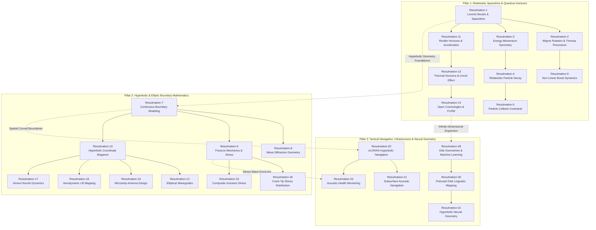

# Vector Field Singularities and Stokes' Theorem

## Deliverables

https://payhip.com/b/RpGbc

### E-Product Hub

https://payhip.com/CDP

## R1: The Geometry of Spacetime and Lorentz Transformations

---

### Lorentz Boost & Minkowski Spacetime Simulator

---

## R2: Visualizing Wigner Rotation and Thomas Precession

---

### Wigner Rotation & Thomas Precession Advanced Visualizer

---

## R3-The Geometric Mirror of Spacetime and Energy-Momentum

---

## R4-Invariance and Symmetry in Relativistic Particle Decay

---

## R5-Invariant Mass and the Relativistic Geometry of Particle Collisions

---

## R6-Non-Linear Dynamics of Successive Lorentz Boosts

---

## Relationships: Hyperbolic Horizons from Relativistic Spacetime to Neural Topology

The diagram maps the conceptual connections across all 31 Resulmations, organizing them into three core domain pillars and highlighting their interdisciplinary bridges. The dashed connectors in the diagram highlight how mathematical principles transfer across radically different domains.

**Pillar Breakdown**

- **Pillar 1: Relativistic Spacetime & Quantum Horizons**
  - **Core Focus:** Fundamental physics, special/general relativity, particle collision invariants, and accelerated frame horizons.
  - **Internal Structure:** **Resulmation-1** sets up the baseline Lorentz boost geometry, which branches into frame rotation (**Resulmation-2**) and energy-momentum coordinate symmetry (**Resulmation-3**). The decay/collision physics (**Resulmations 4 & 5**) flow directly from energy-momentum conservation, while non-linear boost dynamics (**Resulmation-6**) extend Wigner rotation. Accelerated observers (**Resulmation-11**) lead into quantum Unruh/Hawking thermal horizons (**Resulmation-13**) and open FLRW cosmological geometries (**Resulmation-14**).
- **Pillar 2: Hyperbolic & Elliptic Boundary Mathematics**
  - **Core Focus:** Applied mathematics, continuous coordinate mapping, structural fracture mechanics, and fluid dynamics.
  - **Internal Structure:** **Resulmation-7** establishes continuous boundary modeling, which splits into wave diffraction (**Resulmation-8**), fracture mechanics (**Resulmation-9**), and hyperbolic coordinate systems (**Resulmation-10**). The coordinate principles in **Resulmation-10** feed into wave, antenna, and fluid dynamics applications (**Resulmations 12, 15, 16, & 17**), while the fracture mechanics principles in **Resulmation-9** extend directly into crack tip stress distribution (**Resulmation-18**) and composite material inclusions (**Resulmation-19**).
- **Pillar 3: Tactical Navigation, Infrastructure & Neural Geometry**
  - **Core Focus:** Macro-scale intersection tracking, acoustic monitoring, and non-Euclidean machine learning.
  - **Internal Structure:** **Resulmation-20** establishes hyperbolic Time Difference of Arrival (TDOA) navigation, which extends to subsurface sonar navigation (**Resulmation-21**) and structural acoustic defect tracking (**Resulmation-22**). On the data science side, **Resulmation-28** introduces non-Euclidean machine learning disk geometries, which develop into Poincaré linguistic trees (**Resulmation-30**) and stable hyperbolic layer normalization in neural networks (**Resulmation-31**).
