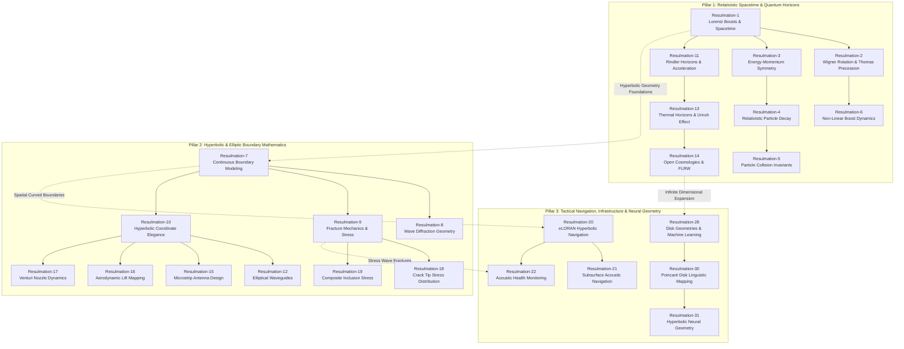

# Vector Field Singularities and Stokes' Theorem

## R1-The Geometry of Spacetime and Lorentz Transformations

> The analysis details the visualization of a **Lorentz boost** as a **hyperbolic rotation** of spacetime, where a square coordinate grid transforms into a skewed diamond-like structure as the velocity ratio ($\beta$) increases,. By calculating relativistic parameters such as the **Lorentz factor ($\gamma$)** and **rapidity ($\psi$)**, a Minkowski Spacetime Diagram can illustrate the **"Scissors Effect"**, where the temporal and spatial axes of a moving frame tilt toward the fixed 45° light cone,. This geometric warping highlights the **relativity of simultaneity**, demonstrating that events occurring at the same time in a stationary frame appear scattered across different times for a moving observer. Dynamic animations further reveal that while the grid is compressed symmetrically toward the light cone—a phenomenon described as the **squeeze vector**—the **hyperbolic area** of each grid block remains perfectly preserved, representing the mathematical conservation of the spacetime interval ($s^2$),. Finally, the visualization shows that as speeds approach the speed of light, the Lorentz factor spikes dramatically, mapping the exponential energy requirements for near-light-speed acceleration.

- https://youtu.be/vloieBeZXAc

---

## R2-Visualizing Wigner Rotation and Thomas Precession

> The analysis details a Python-based visualization of **Wigner Rotation** and its physical manifestation as **Thomas Precession**, which occurs when two non-collinear Lorentz boosts—such as one along the x-axis followed by one along the y-axis—result in a frame that is both moving diagonally and physically rotated relative to the starting frame. This phenomenon is illustrated through static and animated coordinate triads where the crimson X' axis is shown to warp and tilt toward the Y domain, while the royalblue Y' axis remains parallel to the grid lines even as the entire origin drifts diagonally. Ultimately, these visualizations demonstrate the "frame twisting" experienced by an accelerating electron in an atom, which accounts for a 1/2 factor correction in its spin energy levels compared to classical predictions.

- https://youtu.be/G6W8Py3oRGI

---

## R3-The Geometric Mirror of Spacetime and Energy-Momentum

> The analysis demonstrates a profound physical symmetry between spacetime and energy-momentum coordinates, illustrating that both systems warp in an identical, mirror-image fashion when subjected to a Lorentz boost,. Because both frameworks share the same underlying mathematical structure, energy effectively behaves like a temporal coordinate while momentum acts like a spatial coordinate, resulting in matching grid tilts and diamond-like shearing in visual simulations,. These visualizations highlight how rest mass remains strictly invariant, as seen by momentum grid elements sliding precisely along static curved boundaries even as velocity increases. Finally, the 45-degree diagonal serves as a unified limit for both systems, representing the light cone in spacetime and the fixed path of massless particles in energy-momentum space, proving that light-speed barriers remain consistent across both perspectives.

- https://youtu.be/5Sc5wFXLT1w

---

## R4-Invariance and Symmetry in Relativistic Particle Decay

> The visualization of a Higgs boson decaying into two photons demonstrates how fundamental physical laws remain invariant across different relativistic reference frames. While a stationary observer sees the decay products move in opposite directions with equal energy, an observer in motion witnesses a significant shift where the forward-emitted photon gains energy and momentum through blue-shifting while the backward-moving photon loses energy due to red-shifting. Dynamic simulations of this event show that even as these individual energies fluctuate based on the observer's speed, the system's total momentum is perfectly conserved and its net mass remains constant, represented by a point sliding along a stable hyperbolic boundary. These models further verify the constant speed of light by showing that photons always maintain a fixed diagonal orientation in spacetime plots, regardless of the observer's velocity. Ultimately, the side-by-side mapping of spacetime and energy-momentum highlights a unified geometric relationship where frame-dependent changes are precisely balanced to preserve the integrity of the closed physical system.

- https://youtu.be/njB3-DrbUtM


## R5-Invariant Mass and the Relativistic Geometry of Particle Collisions

> High-energy particle collisions, such as those occurring within the Large Hadron Collider, demonstrate how the efficiency of creating new matter depends heavily on the chosen frame of reference. In the center-of-mass frame, where particles collide with equal and opposite momentum, energy is utilized most effectively to produce heavy particles like the Higgs boson or hypothetical dark matter candidates. However, when viewed from a boosted laboratory frame, the spacetime worldlines of the particles appear sheared and the energy requirements become highly asymmetric, necessitating an exponentially larger amount of energy for one beam to achieve the same physical result. This explains why modern physics favors counter-rotating beam colliders over fixed-target experiments, as the latter faces a severe energy penalty where a significant portion of the beam's energy is wasted as kinetic motion instead of being used to create mass. Regardless of these frame-dependent shifts, the total mass of the system remains perfectly invariant, a principle visually confirmed by the system's momentum state remaining locked to a specific hyperbolic shell throughout the entire collision process.

- https://youtu.be/noUV1eHLAxg

---

## R6-Non-Linear Dynamics of Successive Lorentz Boosts

> Successive Lorentz boosts along different axes demonstrate how relativistic motion creates a curved spatial trajectory rather than the simple straight diagonal lines predicted by classical physics,. When a moving frame's origin undergoes a second perpendicular boost, the resulting path bends non-linearly because the additional velocity introduces further time dilation, which effectively increases the distance traveled along the initial axis during that same interval,. This complex interaction can be visualized through a global vector flow field, which illustrates a relativistic drag or shear that affects the entire environment,. Because these transformations apply uniformly across all of flat spacetime, every point in the coordinate system updates its velocity state identically, highlighting that a Lorentz boost changes the perspective of a global observer without the local twisting of coordinates characteristic of gravitational curvature.

- https://youtu.be/qm1UyULvVsM


---

## Deliverables

- https://payhip.com/b/RpGbc

```
============================================================
 🛠️  HYPERBOLIC COORDINATES & APPLICATIONS
============================================================

─── Mathematical Foundation ───
  🔹 Coordinate Definition (Parametrisation)
  🔹 Geometric Identity (Hyperbolas and Rays)
  🔹 Inverse Transformations
  🔹 Non-Orthogonality and Inner Products
  🔹 Dual Basis Construction and Reciprocity

─── Relativistic Spacetime and Symmetry ───
  🔹 Lorentz Transformations (Hyperbolic Rotation)
  🔹 Rapidity (Hyperbolic Angle)
  🔹 Invariant Spacetime Interval
  🔹 Wigner Rotation and Thomas Precession
  🔹 Symmetry of Four-Momentum and Spacetime

─── Navigation and Remote Sensing ───
  🔹 Hyperbolic Positioning (LORAN/eLORAN)
  🔹 Acoustic Source Localization (TDOA)
  🔹 Ground Penetrating Radar (GPR Hyperbolic Signatures)
  🔹 Seismic and Landslide Monitoring

─── Fluid Dynamics and Aerodynamics ───
  🔹 Boundary Straightening and Coordinate Transformation
  🔹 Potential Flow Theory
  🔹 Aerodynamic Lift (Kutta-Joukowski Theorem)
  🔹 Supersonic Gas Dynamics (Shock Diamonds)

─── Structural Engineering and Fracture Mechanics ───
  🔹 Stress Concentrations at Crack Tips
  🔹 Plastic Deformation Zones (Irwin's Model)
  🔹 Composite Materials and Elliptical Inclusions (Eshelby's Theorem)

─── Advanced Theoretical Physics ───
  🔹 Cosmology and Open FLRW Universes
  🔹 Quantum Field Theory (Unruh Effect and Hawking Radiation)
  🔹 Normally Hyperbolic Invariant Manifolds (NHIMs)
  🔹 Lagrange Points and the Interplanetary Superhighway

─── Information Geometry and Machine Learning ───
  🔹 Poincaré Half-Plane and Disk Models
  🔹 Hierarchical Tree Networks and NLP Embeddings
  🔹 Möbius Vector Addition and Linear Layers
  🔹 Hyperbolic Attention Mechanisms

─── Code Archives & Scripts ───
  📦 Snippets.rar └── 86 Snippets.py
  📦 Snippets.rar └── 4 Scripts

─── Visual Outputs & Media ───
  📦 Plottings.rar └── 41 Plottings.png
  📦 Plottings.rar └── 49 Animated Results.mp4
  📦 Resulmations.rar └── 31 Videos.mp4
============================================================
```

---

## Relationships: Hyperbolic Horizons from Relativistic Spacetime to Neural Topology

The diagram maps the conceptual connections across all 31 Resulmations, organizing them into three core domain pillars and highlighting their interdisciplinary bridges. The dashed connectors in the diagram highlight how mathematical principles transfer across radically different domains.



**Pillar Breakdown**

- **Pillar 1: Relativistic Spacetime & Quantum Horizons**
  - **Core Focus:** Fundamental physics, special/general relativity, particle collision invariants, and accelerated frame horizons.
  - **Internal Structure:** **Resulmation-1** sets up the baseline Lorentz boost geometry, which branches into frame rotation (**Resulmation-2**) and energy-momentum coordinate symmetry (**Resulmation-3**). The decay/collision physics (**Resulmations 4 & 5**) flow directly from energy-momentum conservation, while non-linear boost dynamics (**Resulmation-6**) extend Wigner rotation. Accelerated observers (**Resulmation-11**) lead into quantum Unruh/Hawking thermal horizons (**Resulmation-13**) and open FLRW cosmological geometries (**Resulmation-14**).
- **Pillar 2: Hyperbolic & Elliptic Boundary Mathematics**
  - **Core Focus:** Applied mathematics, continuous coordinate mapping, structural fracture mechanics, and fluid dynamics.
  - **Internal Structure:** **Resulmation-7** establishes continuous boundary modeling, which splits into wave diffraction (**Resulmation-8**), fracture mechanics (**Resulmation-9**), and hyperbolic coordinate systems (**Resulmation-10**). The coordinate principles in **Resulmation-10** feed into wave, antenna, and fluid dynamics applications (**Resulmations 12, 15, 16, & 17**), while the fracture mechanics principles in **Resulmation-9** extend directly into crack tip stress distribution (**Resulmation-18**) and composite material inclusions (**Resulmation-19**).
- **Pillar 3: Tactical Navigation, Infrastructure & Neural Geometry**
  - **Core Focus:** Macro-scale intersection tracking, acoustic monitoring, and non-Euclidean machine learning.
  - **Internal Structure:** **Resulmation-20** establishes hyperbolic Time Difference of Arrival (TDOA) navigation, which extends to subsurface sonar navigation (**Resulmation-21**) and structural acoustic defect tracking (**Resulmation-22**). On the data science side, **Resulmation-28** introduces non-Euclidean machine learning disk geometries, which develop into Poincaré linguistic trees (**Resulmation-30**) and stable hyperbolic layer normalization in neural networks (**Resulmation-31**).
