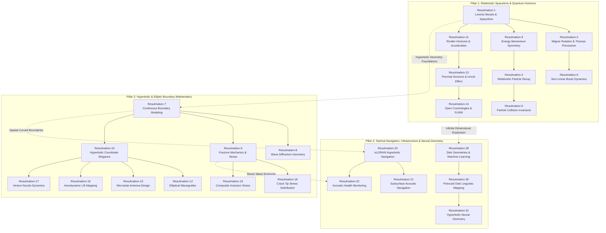

# Vector Field Singularities and Stokes' Theorem

## Deliverables

https://payhip.com/b/RpGbc

### E-Product Hub

https://payhip.com/CDP

## R1: The Geometry of Spacetime and Lorentz Transformations

---

### Lorentz Boost & Minkowski Spacetime Simulator

---

## R2: Visualizing Wigner Rotation and Thomas Precession

---

### Wigner Rotation & Thomas Precession Advanced Visualizer

---

## R3: The Geometric Mirror of Spacetime and Energy-Momentum

---

## R4: Invariance and Symmetry in Relativistic Particle Decay

Primary Focus: Geometric Boundaries & Mass Shell Invariance

---

### Relativistic Higgs Boson Decay Simulation Dashboard

Primary Focus: Time-Evolution & Real-Time Boost Kinematics

---

## R5: Invariant Mass and the Relativistic Geometry of Particle Collisions

Primary Focus: Geometric & structural frame behavior.

---

### Relativistic Particle Collision Simulator

Primary Focus: Quantitative mechanics & decay tracking

---

## R6: Non-Linear Dynamics of Successive Lorentz Boosts

Primary Focus: Observational motion and geometric trajectory behavior.

---

### Relativistic Successive Lorentz Boosts Visualizer

Primary Focus: Formal geometric mechanics and kinematic principles.

---

## R7: Continuity of Hyperbolic Geometry in Boundary Modelling

Primary Focus: Conceptual advantages of curvilinear coordinates over Cartesian grids

---

### Hyperbolic Coordinates Slit Boundary Visualization

Primary Focus: Real-time computational architecture, simulation modalities, and field metrics.

---

## R8: The Geometry of Wave Diffraction through Coordinate Transformation

Primary Focus: Mathematical & Computational Implementation.

---

### Elliptic-Hyperbolic Wave Diffraction Simulator

Primary Focus: Physical Mechanics & Field Dynamics.

---

## R9: Geometric Continuity in Fracture Mechanics and Stress Analysis

Primary Focus: Mathematical and Computational Framework.

---

### Elliptic-Hyperbolic Fracture Mechanics Simulator

Primary Focus: Physics Mechanics and Failure Dynamics

---

## R10: The Elegance of Hyperbolic Coordinate Systems

Primary Focus: Leveraging Hyperbolic Coordinates

---

### Hyperbolic & Schwarz-Christoffel Coordinate Simulator

Primary Focus: Deploying Conformal Mapping Frameworks

---

## R11: The Rindler Horizon and the Mechanics of Constant Acceleration

Primary Focus: Demonstrates the "photon chase" through visual proofs and relative speeds

---

### Rindler Coordinates & Spacetime Horizon Simulator

Primary Focus: Details the mechanics of the Rindler Horizon, coordinate dilation, and permanent causal disconnection.

---

## R12: Electromagnetic Propagation and Mathieu Functions in Elliptical Waveguides

Primary Focus: Uses elliptic-hyperbolic coordinates to resolve geometry, separating the Helmholtz wave equation into angular and radial Mathieu equations

---

### Elliptical Waveguide Mode Simulation

Primary Focus: Relies on elliptic-hyperbolic spatial transformation to define boundaries and support Mathieu function profiles.

---

## R13: Thermal Horizons and the Relativity of the Vacuum

Primary Focus: Theoretical Physical Mechanics & Equivalence Principles

---

### Quantum Horizons Unruh & Hawking Radiation Simulator

Primary Focus: Quantum Field Theory & Vacuum State Relativity.

---

## R14: Hyperbolic Dynamics and the Evolution of Open Cosmologies

Primary Focus: Broader Evolutionary and Interdisciplinary Scope of an Open Universe

---

### Cosmic Hyperbolic Dynamics Dashboard

Primary Focus: Immediate Simulation Mechanics and Spatial-Metric Infrastructure.

---

## R15: Hyperbolic Coordinate Transformations in Microstrip Antenna Design

Primary Focus: Solves electromagnetic challenges

---

### Microstrip Antenna Hyperbolic Coordinate Transformation Visualizer

Primary Focus: Models quasi-static electromagnetic fringing fields

---

## R16: Hyperbolic Coordinate Mapping in Aerodynamic Lift Calculations

Primary Focus: Streamlined, elliptical wing shapes.

---

### Hyperbolic Coordinate Mapping & Airfoil Flow Visualizer

Primary Focus: Custom-configured Joukowsky airfoil.

---

## R17: Hyperbolic Coordinate Mapping in Venturi Nozzle Fluid Dynamics

Primary Focus: Model fluid flow through curved internal structures

---

### Realistic Hyperbolic Coordinate Mapping & Mesh Quality Analyzer

Primary Focus: Model fluid dynamics within a coverging-diverging Venturi nozzle.

---

## R18: Dynamic simulation of mixed-mode fracture mechanics and continuum engineering

Primary Focus: Model how stress concentrates around cracks in materials like steel.

---

### Advanced Fracture Continuum & Conformal Mesh Simulator

Primary Focus: Dynamic simulation of mixed-mode fracture mechanics and continuum engineering.

---

## R19: Structural Stress Distribution in Elliptical Composite Inclusions

Primary Focus: Stress concentration around fibres or inclusions.

---

### Composite Stress & Eshelby Inclusion Simulator

Primary Focus: Model the elastic mechanics of composite materials under a far-field tensile load.

---

## R20: Tactical Precision and Hyperbolic Navigation in eLORAN Systems

Primary Focus: Model ground-based eLORAN systems.

---

### eLORAN Tactical Hyperbolic Navigation Simulator

Primary Focus: Hyperbolic Time Difference of Arrival (TDOA) positioning.

---

## R21: Subsurface Navigation and Signal Propagation Dynamics

Primary Focus: Submarines achieve covert underwater navigation.

---

### Underwater Acoustic & Hyperbolic Navigation Simulator

Primary Focus: Simulation model of passive underwater positioning.

---

## R22: Acoustic Hyperbolic Monitoring of Structural Integrity

Primary Focus: Structural health monitoring for major infrastructure.

---

### Structural Health Monitoring Hyperbolic Acoustic Simulation

Primary Focus: Simulation model of passive hyperbolic acoustic emission structural health monitoring.

---

## R23: Visualizing Subsurface Infrastructure via Ground Penetrating Radar

Primary Focus: Utilizing Ground Penetrating Radar to identify buried infrastructure.

---

### Ground Penetrating Radar Simulation & Hyperbolic Transform Visualization

Primary Focus: Modelling the subsurface mechanics of Ground Penetrating Radar and its coordinate localization pipelines within a dynamic, multi-layered stratigraphy.

---

## R24: Seismic Triangulation and Subterranean Structural Monitoring

Primary Focus: Providing early warnings of landslides and sinkholes near critical infrastructure through passive monitoring of subterranean shifts.

---

### Passive Seismic Sensor Array Telemetry Dashboard

Primary Focus: Modelling and simulating progressive mechanical failure within a subterranean bedrock matrix.

---

## R25: The Hyperbolic Geometry of Spacetime Invariance

Primary Focus: How the spacetime interval remains perfectly preserved (invariant) through hyperbolic geometry.

---

### Special Relativity Spacetime & Hyperbolic Geometry Simulator

Primary Focus: The relativity of simultaneity and coordinate measurements alongside the invariance of the spacetime interval.

## R26: Stability and Persistence of Normally Hyperbolic Invariant Manifolds

Primary Focus: Geometric Balance and Structural Stability.

---

### Normally Hyperbolic Invariant Manifold (NHIM) Simulation

Primary Focus: Dynamic Simulation of Structural Persistence.

---

## R27: Chemical Dividing Surfaces and NHIM Stability

Primary Focus: Normally Hyperbolic Invariant Manifolds.

---

### NHIM Phase Space Explorer & Reaction Boundary Simulator

Primary Focus: Model NHIM governing particle transport across high-energy barriers.

---

## Relationships: Hyperbolic Horizons from Relativistic Spacetime to Neural Topology

The diagram maps the conceptual connections across all 31 Resulmations, organizing them into three core domain pillars and highlighting their interdisciplinary bridges. The dashed connectors in the diagram highlight how mathematical principles transfer across radically different domains.

**Pillar Breakdown**

- **Pillar 1: Relativistic Spacetime & Quantum Horizons**
  - **Core Focus:** Fundamental physics, special/general relativity, particle collision invariants, and accelerated frame horizons.
  - **Internal Structure:** **Resulmation-1** sets up the baseline Lorentz boost geometry, which branches into frame rotation (**Resulmation-2**) and energy-momentum coordinate symmetry (**Resulmation-3**). The decay/collision physics (**Resulmations 4 & 5**) flow directly from energy-momentum conservation, while non-linear boost dynamics (**Resulmation-6**) extend Wigner rotation. Accelerated observers (**Resulmation-11**) lead into quantum Unruh/Hawking thermal horizons (**Resulmation-13**) and open FLRW cosmological geometries (**Resulmation-14**).
- **Pillar 2: Hyperbolic & Elliptic Boundary Mathematics**
  - **Core Focus:** Applied mathematics, continuous coordinate mapping, structural fracture mechanics, and fluid dynamics.
  - **Internal Structure:** **Resulmation-7** establishes continuous boundary modeling, which splits into wave diffraction (**Resulmation-8**), fracture mechanics (**Resulmation-9**), and hyperbolic coordinate systems (**Resulmation-10**). The coordinate principles in **Resulmation-10** feed into wave, antenna, and fluid dynamics applications (**Resulmations 12, 15, 16, & 17**), while the fracture mechanics principles in **Resulmation-9** extend directly into crack tip stress distribution (**Resulmation-18**) and composite material inclusions (**Resulmation-19**).
- **Pillar 3: Tactical Navigation, Infrastructure & Neural Geometry**
  - **Core Focus:** Macro-scale intersection tracking, acoustic monitoring, and non-Euclidean machine learning.
  - **Internal Structure:** **Resulmation-20** establishes hyperbolic Time Difference of Arrival (TDOA) navigation, which extends to subsurface sonar navigation (**Resulmation-21**) and structural acoustic defect tracking (**Resulmation-22**). On the data science side, **Resulmation-28** introduces non-Euclidean machine learning disk geometries, which develop into Poincaré linguistic trees (**Resulmation-30**) and stable hyperbolic layer normalization in neural networks (**Resulmation-31**).
