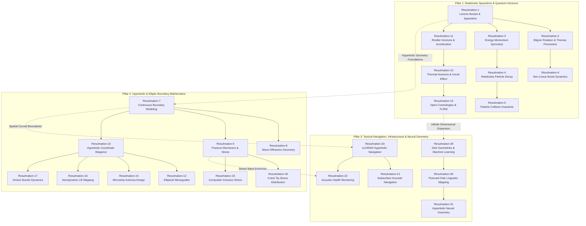

# The Geometry of Spacetime and Lorentz Transformations

> The analysis details the visualization of a **Lorentz boost** as a **hyperbolic rotation** of spacetime, where a square coordinate grid transforms into a skewed diamond-like structure as the velocity ratio ($\beta$) increases,. By calculating relativistic parameters such as the **Lorentz factor ($\gamma$)** and **rapidity ($\psi$)**, a Minkowski Spacetime Diagram can illustrate the **"Scissors Effect"**, where the temporal and spatial axes of a moving frame tilt toward the fixed 45° light cone,. This geometric warping highlights the **relativity of simultaneity**, demonstrating that events occurring at the same time in a stationary frame appear scattered across different times for a moving observer. Dynamic animations further reveal that while the grid is compressed symmetrically toward the light cone—a phenomenon described as the **squeeze vector**—the **hyperbolic area** of each grid block remains perfectly preserved, representing the mathematical conservation of the spacetime interval ($s^2$),. Finally, the visualization shows that as speeds approach the speed of light, the Lorentz factor spikes dramatically, mapping the exponential energy requirements for near-light-speed acceleration.

- https://youtu.be/vloieBeZXAc

## Deliverables

- https://payhip.com/b/RpGbc

```
============================================================
 🛠️  HYPERBOLIC COORDINATES & APPLICATIONS
============================================================

─── Mathematical Foundation ───
  🔹 Coordinate Definition (Parametrisation)
  🔹 Geometric Identity (Hyperbolas and Rays)
  🔹 Inverse Transformations
  🔹 Non-Orthogonality and Inner Products
  🔹 Dual Basis Construction and Reciprocity

─── Relativistic Spacetime and Symmetry ───
  🔹 Lorentz Transformations (Hyperbolic Rotation)
  🔹 Rapidity (Hyperbolic Angle)
  🔹 Invariant Spacetime Interval
  🔹 Wigner Rotation and Thomas Precession
  🔹 Symmetry of Four-Momentum and Spacetime

─── Navigation and Remote Sensing ───
  🔹 Hyperbolic Positioning (LORAN/eLORAN)
  🔹 Acoustic Source Localization (TDOA)
  🔹 Ground Penetrating Radar (GPR Hyperbolic Signatures)
  🔹 Seismic and Landslide Monitoring

─── Fluid Dynamics and Aerodynamics ───
  🔹 Boundary Straightening and Coordinate Transformation
  🔹 Potential Flow Theory
  🔹 Aerodynamic Lift (Kutta-Joukowski Theorem)
  🔹 Supersonic Gas Dynamics (Shock Diamonds)

─── Structural Engineering and Fracture Mechanics ───
  🔹 Stress Concentrations at Crack Tips
  🔹 Plastic Deformation Zones (Irwin's Model)
  🔹 Composite Materials and Elliptical Inclusions (Eshelby's Theorem)

─── Advanced Theoretical Physics ───
  🔹 Cosmology and Open FLRW Universes
  🔹 Quantum Field Theory (Unruh Effect and Hawking Radiation)
  🔹 Normally Hyperbolic Invariant Manifolds (NHIMs)
  🔹 Lagrange Points and the Interplanetary Superhighway

─── Information Geometry and Machine Learning ───
  🔹 Poincaré Half-Plane and Disk Models
  🔹 Hierarchical Tree Networks and NLP Embeddings
  🔹 Möbius Vector Addition and Linear Layers
  🔹 Hyperbolic Attention Mechanisms

─── Code Archives & Scripts ───
  📦 Snippets.rar └── 86 Snippets.py
  📦 Snippets.rar └── 4 Scripts

─── Visual Outputs & Media ───
  📦 Plottings.rar └── 41 Plottings.png
  📦 Plottings.rar └── 49 Animated Results.mp4
  📦 Resulmations.rar └── 31 Videos.mp4
============================================================
```

---

## Relationships: Hyperbolic Horizons from Relativistic Spacetime to Neural Topology

The diagram maps the conceptual connections across all 31 Resulmations, organizing them into three core domain pillars and highlighting their interdisciplinary bridges. The dashed connectors in the diagram highlight how mathematical principles transfer across radically different domains.



